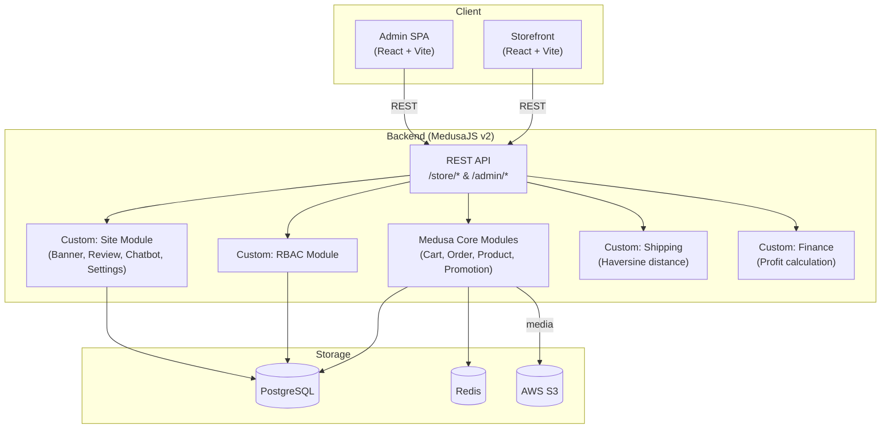
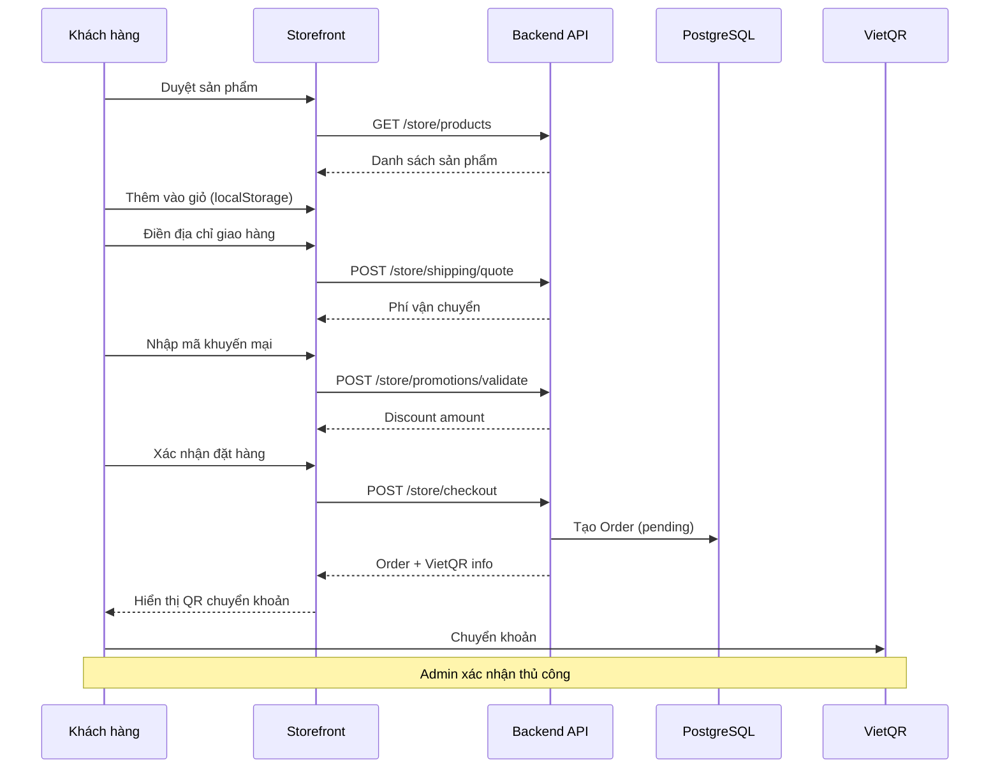
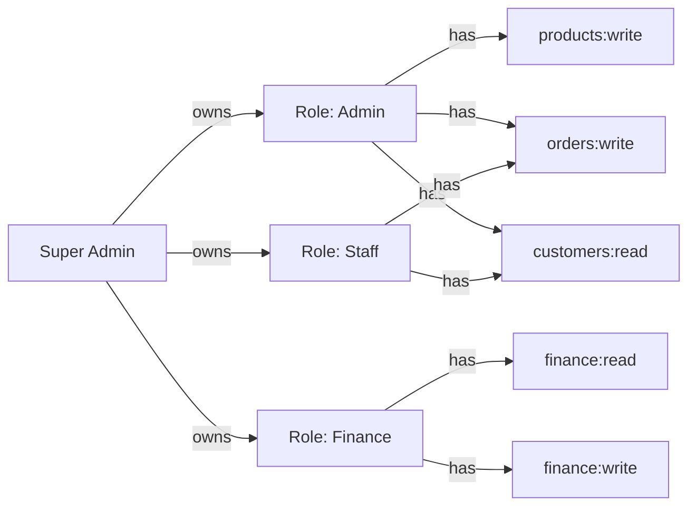

# 00 · Tổng quan hệ thống — Mong Fruitboxz

> **Phiên bản tài liệu**: 1.0 · Cập nhật: 2026-06-06

---

## 1. Giới thiệu

**Mong Fruitboxz** là nền tảng thương mại điện tử chuyên về hộp trái cây tươi theo yêu cầu, cho phép khách hàng đặt hộp trái cây tiêu chuẩn hoặc tự tạo hộp trái cây custom. Hệ thống vận hành theo mô hình **COD + VietQR** — khách hàng thanh toán qua chuyển khoản ngân hàng, không tích hợp cổng thanh toán trực tuyến.

---

## 2. Tech Stack

| Tầng | Công nghệ |
|---|---|
| **Backend** | MedusaJS v2 (Node.js) |
| **Database** | PostgreSQL |
| **Cache / Queue** | Redis |
| **File Storage** | AWS S3 (hoặc tương thích S3) |
| **Frontend Storefront** | React + Vite |
| **Frontend Admin** | React SPA (MedusaJS Admin + custom) |
| **Authentication** | JWT (customer) / Session Bearer (admin) |

---

## 3. Kiến trúc tổng thể

---

## 4. Các Module chính

| # | Module | Mô tả |
|---|---|---|
| 01 | **AUTH** | Đăng ký / đăng nhập customer & admin, JWT / session |
| 02 | **PRODUCTS** | Quản lý sản phẩm, variant, category, ảnh, tìm kiếm |
| 03 | **CART & CHECKOUT** | Giỏ hàng localStorage, tính phí ship, promotion, đặt hàng |
| 04 | **ORDERS** | Quản lý đơn hàng, trạng thái, lịch sử |
| 05 | **ADMIN** | Dashboard admin, RBAC, quản trị hệ thống |
| 06 | **MARKETING** | Promotion, banner, blog |
| 07 | **FINANCE** | Doanh thu, lợi nhuận, cost tracking |
| 08 | **SYSTEM** | Cài đặt hệ thống, site settings, chatbot log |
| 09 | **TESTING** | Test plan, E2E scenarios |

---

## 5. Luồng nghiệp vụ tổng thể

---

## 6. Mô hình phân quyền

---

## 7. Kho hàng & Vận chuyển

- **Địa chỉ kho**: Hà Nội (lat: `21.012805`, lng: `105.836483`)
- **Thuật toán tính phí**: Haversine Formula (tính khoảng cách theo đường chim bay)
- **Debounce**: 260ms khi user nhập địa chỉ
- **Fallback**: Nếu API shipping lỗi → tính local bằng Haversine trên client

---

## 8. Thanh toán

| Phương thức | Mô tả |
|---|---|
| **COD** | Thu tiền mặt khi giao hàng |
| **VietQR** | Chuyển khoản ngân hàng qua QR code sau khi đặt hàng |

> ⚠️ Hệ thống **không tích hợp** cổng thanh toán trực tuyến (VNPay, Momo, v.v.). Xác nhận thanh toán là thủ công từ Admin.

---

## 9. Liên kết tài liệu

- [01 · Authentication](./01-auth/README.md)
- [02 · Products](./02-products/README.md)
- [03 · Cart & Checkout](./03-cart-checkout/README.md)
- [04 · Orders](./04-orders/README.md)
- [05 · Admin & RBAC](./05-admin/README.md)
- [06 · Marketing](./06-marketing/README.md)
- [07 · Finance](./07-finance/README.md)
- [08 · System](./08-system/README.md)
- [09 · Testing](./09-testing/test-plan.md)
