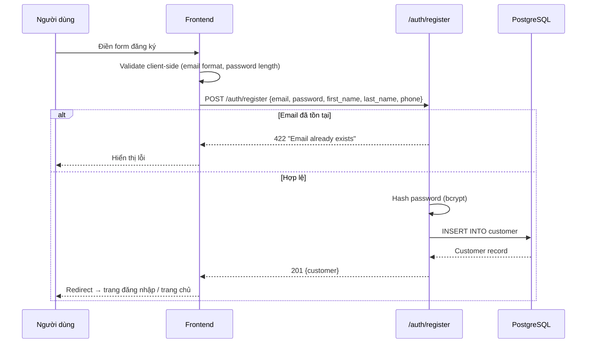
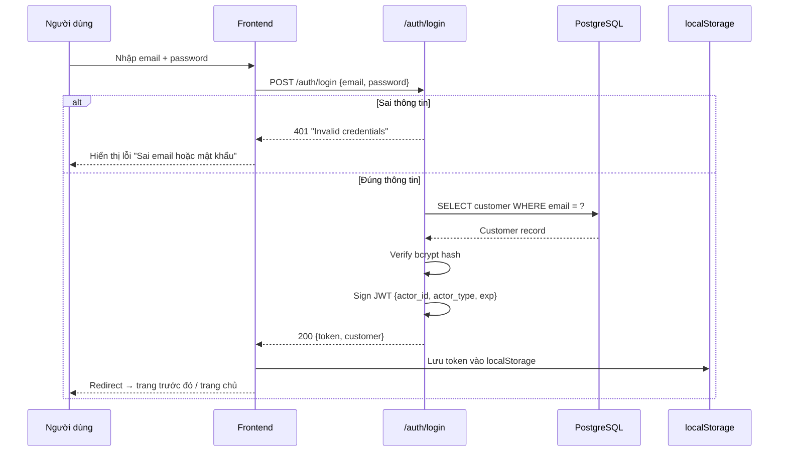
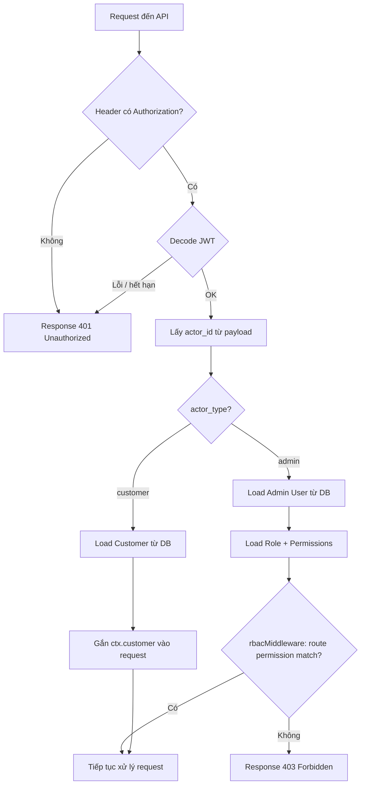
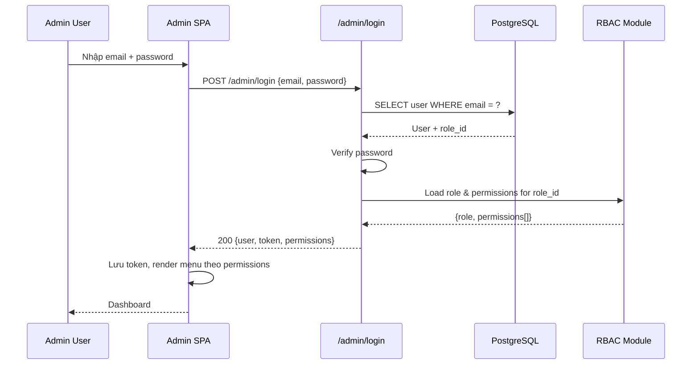
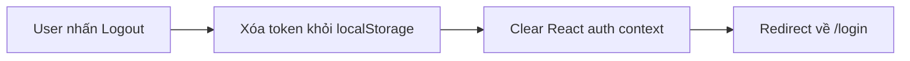

# 01 · Authentication — Luồng xác thực chi tiết

---

## 1. Luồng đăng ký Customer

---

## 2. Luồng đăng nhập Customer

---

## 3. Luồng xác thực request có token

---

## 4. Luồng đăng nhập Admin

---

## 5. Luồng logout

> **Lưu ý**: Hệ thống chưa có token blacklist. JWT hết hạn tự nhiên sau thời gian cấu hình.

---

## 6. Token refresh (nếu được implement)

> Hiện tại chưa implement refresh token. Khi JWT hết hạn, user phải đăng nhập lại.

**Khuyến nghị tương lai**:
- Implement `/auth/refresh` với refresh token (httpOnly cookie)
- Thời gian access token: 1 giờ
- Thời gian refresh token: 7 ngày

---

## 7. Bảo mật

| Biện pháp | Mô tả |
|---|---|
| Password hashing | bcrypt với salt rounds ≥ 10 |
| JWT signing | HS256 với secret key từ env |
| HTTPS | Bắt buộc trong production |
| Rate limiting | Giới hạn request login (tránh brute force) |
| Input sanitization | Validate & sanitize tất cả input |

---

## Liên kết

- [Auth README](./README.md)
- [RBAC](../05-admin/rbac.md)
