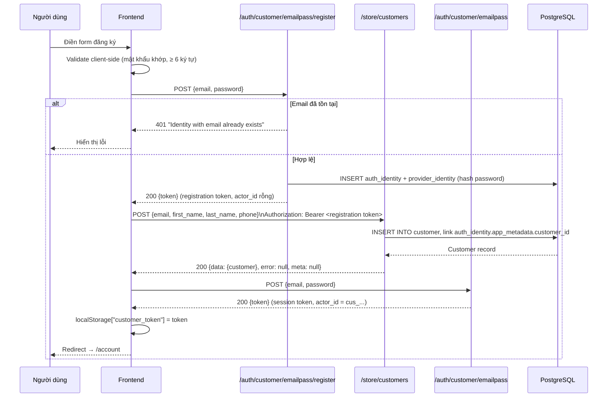
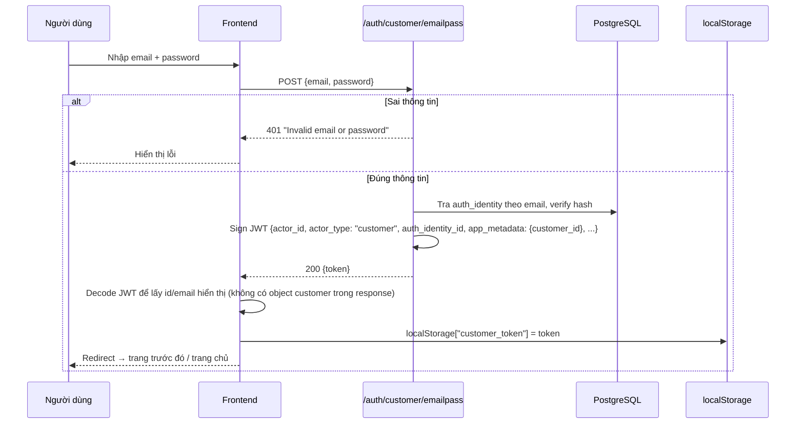
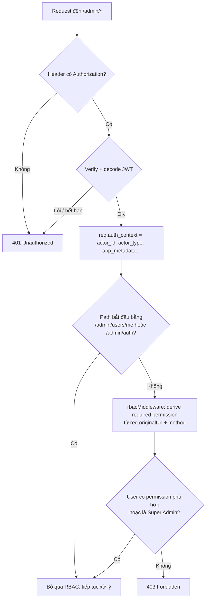
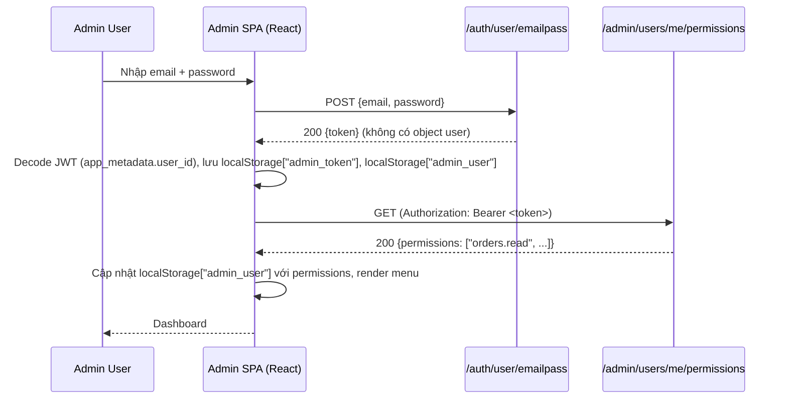
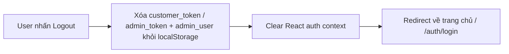

# 01 · Authentication — Luồng xác thực chi tiết

---

## 1. Luồng đăng ký Customer

Medusa v2 tách làm 3 lời gọi tuần tự (không phải 1 endpoint duy nhất như doc cũ mô tả).

```mermaid
sequenceDiagram
    participant U as Người dùng
    participant SF as Frontend
    participant AUTH as /auth/customer/emailpass/register
    participant CUST as /store/customers
    participant LOGIN as /auth/customer/emailpass
    participant DB as PostgreSQL

    U->>SF: Điền form đăng ký
    SF->>SF: Validate client-side (mật khẩu khớp, ≥ 6 ký tự)
    SF->>AUTH: POST {email, password}

    alt Email đã tồn tại
        AUTH-->>SF: 401 "Identity with email already exists"
        SF-->>U: Hiển thị lỗi
    else Hợp lệ
        AUTH->>DB: INSERT auth_identity + provider_identity (hash password)
        AUTH-->>SF: 200 {token} (registration token, actor_id rỗng)
        SF->>CUST: POST {email, first_name, last_name, phone}\nAuthorization: Bearer <registration token>
        CUST->>DB: INSERT INTO customer, link auth_identity.app_metadata.customer_id
        DB-->>CUST: Customer record
        CUST-->>SF: 200 {data: {customer}, error: null, meta: null}
        SF->>LOGIN: POST {email, password}
        LOGIN-->>SF: 200 {token} (session token, actor_id = cus_...)
        SF->>SF: localStorage["customer_token"] = token
        SF-->>U: Redirect → /account
    end
```

**Lưu ý**: gọi thẳng `POST /store/customers` với `password` trong body mà bỏ qua bước đăng ký danh tính sẽ luôn trả `401` — endpoint này bắt buộc `Authorization: Bearer <registration token>` từ bước 1.

---

## 2. Luồng đăng nhập Customer

```mermaid
sequenceDiagram
    participant U as Người dùng
    participant SF as Frontend
    participant API as /auth/customer/emailpass
    participant DB as PostgreSQL
    participant LS as localStorage

    U->>SF: Nhập email + password
    SF->>API: POST {email, password}

    alt Sai thông tin
        API-->>SF: 401 "Invalid email or password"
        SF-->>U: Hiển thị lỗi
    else Đúng thông tin
        API->>DB: Tra auth_identity theo email, verify hash
        API->>API: Sign JWT {actor_id, actor_type: "customer", auth_identity_id, app_metadata: {customer_id}, ...}
        API-->>SF: 200 {token}
        SF->>SF: Decode JWT để lấy id/email hiển thị (không có object customer trong response)
        SF->>LS: localStorage["customer_token"] = token
        SF-->>U: Redirect → trang trước đó / trang chủ
    end
```

---

## 3. Luồng xác thực request có token

```mermaid
flowchart TD
    A[Request đến /admin/*] --> B{Header có Authorization?}
    B -- Không --> C[401 Unauthorized]
    B -- Có --> D{Verify + decode JWT}
    D -- Lỗi / hết hạn --> C
    D -- OK --> E[req.auth_context = actor_id, actor_type, app_metadata...]
    E --> F{Path bắt đầu bằng\n/admin/users/me hoặc /admin/auth?}
    F -- Có --> M[Bỏ qua RBAC, tiếp tục xử lý]
    F -- Không --> G[rbacMiddleware: derive required permission\ntừ req.originalUrl + method]
    G --> H{User có permission phù hợp\nhoặc là Super Admin?}
    H -- Không --> L[403 Forbidden]
    H -- Có --> M
```

`/store/*` không có middleware auth toàn cục — mỗi route tự khai báo `authenticate("customer", ...)` nếu cần (ví dụ `/store/checkout`, `POST /store/reviews/:handle`); phần lớn route store là public.

---

## 4. Luồng đăng nhập Admin

```mermaid
sequenceDiagram
    participant ADM as Admin User
    participant UI as Admin SPA (React)
    participant API as /auth/user/emailpass
    participant PERM as /admin/users/me/permissions

    ADM->>UI: Nhập email + password
    UI->>API: POST {email, password}
    API-->>UI: 200 {token} (không có object user)
    UI->>UI: Decode JWT (app_metadata.user_id), lưu localStorage["admin_token"], localStorage["admin_user"]
    UI->>PERM: GET (Authorization: Bearer <token>)
    PERM-->>UI: 200 {permissions: ["orders.read", ...]}
    UI->>UI: Cập nhật localStorage["admin_user"] với permissions, render menu
    UI-->>ADM: Dashboard
```

Không có endpoint `/admin/login` — đây là quy ước Medusa v1 cũ, v2 dùng `/auth/user/emailpass` giống hệt customer (chỉ khác `actor_type`).

---

## 5. Luồng logout

```mermaid
flowchart LR
    A[User nhấn Logout] --> B["Xóa customer_token / admin_token + admin_user khỏi localStorage"]
    B --> C[Clear React auth context]
    C --> D[Redirect về trang chủ / /auth/login]
```

> **Lưu ý**: Hệ thống chưa có token blacklist / revoke phía server. JWT hết hạn tự nhiên sau thời gian cấu hình (`JWT_SECRET`/mặc định của Medusa).

---

## 6. Token refresh

> Hiện tại **chưa implement** refresh token. Khi JWT hết hạn, user phải đăng nhập lại. Medusa v2 core có sẵn route `POST /auth/token/refresh`, nhưng frontend project này chưa gọi tới.

---

## 7. Bảo mật

| Biện pháp | Mô tả |
|---|---|
| Password hashing | Do module Auth của Medusa xử lý (provider `emailpass`), không tự implement |
| JWT signing | HS256, secret từ `JWT_SECRET` env |
| HTTPS | Bắt buộc trong production |
| Rate limiting | Chỉ áp dụng riêng cho `/store/chatbot/message` (IP-based qua Redis) — **không** có rate limit chung cho login/register |
| Input sanitization | Validate qua zod schema ở các route custom; route auth dùng validation nội bộ của Medusa |

---

## Liên kết

- [Auth README](./README.md)
- [RBAC](../05-admin/rbac.md)
