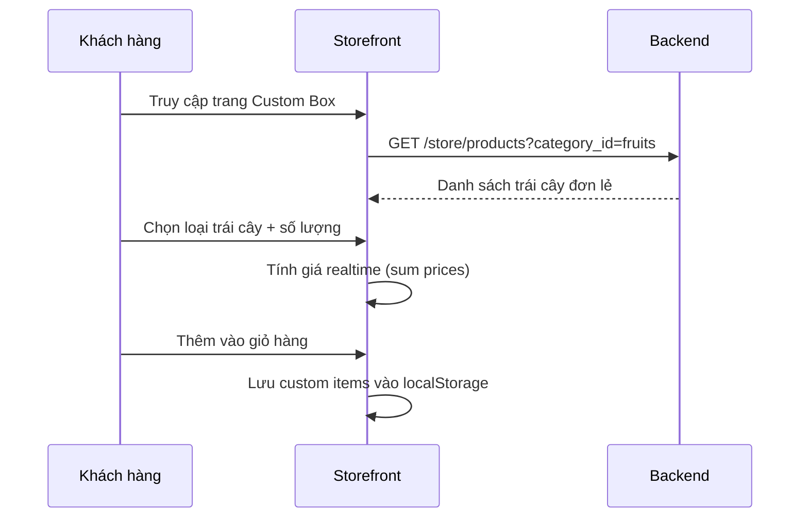
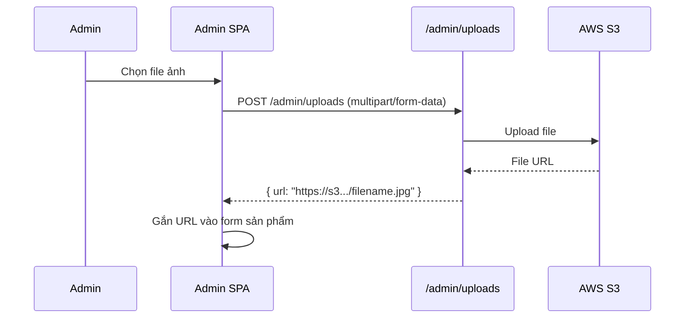

# 02 · Products — Tổng quan

> Module quản lý sản phẩm bao gồm hai phần: **Storefront** (khách hàng xem) và **Admin** (quản trị viên CRUD).

---

## 1. Tổng quan

Hệ thống sản phẩm của Mong Fruitboxz có các loại:
- **Hộp tiêu chuẩn**: Hộp trái cây định sẵn (VD: Hộp 5 loại, Hộp Premium)
- **Custom Box**: Khách tự chọn các loại trái cây theo ý muốn

---

## 2. Data Models

### Product

| Trường | Kiểu | Mô tả |
|---|---|---|
| `id` | string | PK, format `prod_XXXX` |
| `title` | string | Tên sản phẩm |
| `subtitle` | string | Mô tả ngắn |
| `description` | text | Mô tả đầy đủ (HTML) |
| `handle` | string | Slug URL, unique |
| `status` | enum | `draft`, `published`, `archived` |
| `thumbnail` | string | URL ảnh đại diện |
| `category_id` | string | FK → ProductCategory |
| `tags` | string[] | Mảng tags |
| `metadata` | jsonb | Dữ liệu mở rộng |
| `created_at` | timestamp | |
| `updated_at` | timestamp | |

### ProductVariant

| Trường | Kiểu | Mô tả |
|---|---|---|
| `id` | string | PK, format `variant_XXXX` |
| `product_id` | string | FK → Product |
| `title` | string | Tên variant (VD: "Hộp nhỏ 500g") |
| `sku` | string | Mã SKU, unique |
| `price` | number | Giá bán (VND) |
| `inventory_quantity` | number | Tồn kho |
| `metadata` | jsonb | Chứa `cost_price` |
| `allow_backorder` | boolean | Cho phép đặt khi hết hàng |

> **Quan trọng**: `metadata.cost_price` lưu giá vốn để tính lợi nhuận

### ProductImage

| Trường | Kiểu | Mô tả |
|---|---|---|
| `id` | string | PK |
| `product_id` | string | FK → Product |
| `url` | string | URL ảnh từ S3 |
| `rank` | number | Thứ tự hiển thị |

### ProductCategory

| Trường | Kiểu | Mô tả |
|---|---|---|
| `id` | string | PK |
| `name` | string | Tên danh mục |
| `handle` | string | Slug URL |
| `description` | string | Mô tả |
| `parent_category_id` | string | FK (nested categories) |
| `rank` | number | Thứ tự hiển thị |

---

## 3. API Endpoints — Storefront

| Method | Path | Mô tả |
|---|---|---|
| `GET` | `/store/products` | Danh sách sản phẩm (phân trang, filter) |
| `GET` | `/store/products/:id` | Chi tiết sản phẩm |
| `GET` | `/store/products?q=keyword` | Tìm kiếm fulltext |
| `GET` | `/store/product-categories` | Danh sách danh mục |
| `GET` | `/store/products?category_id=xxx` | Lọc theo danh mục |

### Query Parameters cho `/store/products`

| Param | Kiểu | Mô tả |
|---|---|---|
| `q` | string | Tìm kiếm fulltext |
| `category_id` | string | Filter theo danh mục |
| `limit` | number | Số lượng / trang (default: 12) |
| `offset` | number | Offset phân trang |
| `order` | string | Sắp xếp: `created_at`, `price` |

### Response `/store/products`

```json
{
  "products": [
    {
      "id": "prod_01XXXXX",
      "title": "Hộp Trái Cây Premium",
      "handle": "hop-trai-cay-premium",
      "thumbnail": "https://s3.../thumbnail.jpg",
      "status": "published",
      "variants": [
        {
          "id": "variant_01XXXXX",
          "title": "Hộp nhỏ",
          "price": 150000,
          "inventory_quantity": 50
        }
      ],
      "images": [...],
      "category": {...}
    }
  ],
  "count": 100,
  "offset": 0,
  "limit": 12
}
```

---

## 4. API Endpoints — Admin

| Method | Path | Mô tả | Permission |
|---|---|---|---|
| `GET` | `/admin/products` | Danh sách (bao gồm draft) | `products:read` |
| `POST` | `/admin/products` | Tạo sản phẩm mới | `products:write` |
| `PUT` | `/admin/products/:id` | Cập nhật sản phẩm | `products:write` |
| `DELETE` | `/admin/products/:id` | Xóa sản phẩm | `products:delete` |
| `POST` | `/admin/products/:id/variants` | Thêm variant | `products:write` |
| `PUT` | `/admin/products/:id/variants/:vid` | Cập nhật variant | `products:write` |
| `DELETE` | `/admin/products/:id/variants/:vid` | Xóa variant | `products:delete` |
| `POST` | `/admin/uploads` | Upload ảnh lên S3 | `products:write` |

### Request Body — Tạo sản phẩm

```json
{
  "title": "Hộp Trái Cây Premium",
  "subtitle": "Tuyển chọn trái cây nhập khẩu cao cấp",
  "description": "<p>Mô tả chi tiết...</p>",
  "handle": "hop-trai-cay-premium",
  "status": "published",
  "category_id": "cat_01XXXXX",
  "images": [{ "url": "https://s3.../img.jpg" }],
  "variants": [
    {
      "title": "Hộp nhỏ 500g",
      "sku": "FRB-PREMIUM-S",
      "prices": [{ "amount": 150000, "currency_code": "vnd" }],
      "inventory_quantity": 100,
      "metadata": { "cost_price": 80000 }
    }
  ]
}
```

---

## 5. Custom Box Flow



---

## 6. Upload ảnh lên S3



---

## 7. Trang chủ Storefront

| Component | Data source |
|---|---|
| Banner slider | `GET /store/banners` (Site module) |
| Featured products | `GET /store/products?is_featured=true` |
| Danh mục nhanh | `GET /store/product-categories` |

---

## 8. Tìm kiếm

- Sử dụng **PostgreSQL fulltext search** (tsvector)
- Đánh index trên `title`, `description`, `tags`
- Query: `GET /store/products?q=xoài`

---

## 9. Edge Cases & Validation

| Tình huống | Xử lý |
|---|---|
| Sản phẩm `draft` | Không hiển thị ở storefront |
| Sản phẩm `archived` | Không hiển thị, không thể đặt hàng |
| Hết tồn kho | Hiển thị "Hết hàng", disable nút thêm giỏ |
| Ảnh upload > 5MB | Reject, trả về lỗi |
| Handle trùng lặp | HTTP 422 "Handle already exists" |
| Variant không có giá | Không publish được |

---

## 10. Liên kết

- [Status Machine](./status-machine.md)
- [Cart & Checkout](../03-cart-checkout/README.md)
- [Finance (cost_price)](../07-finance/README.md)
