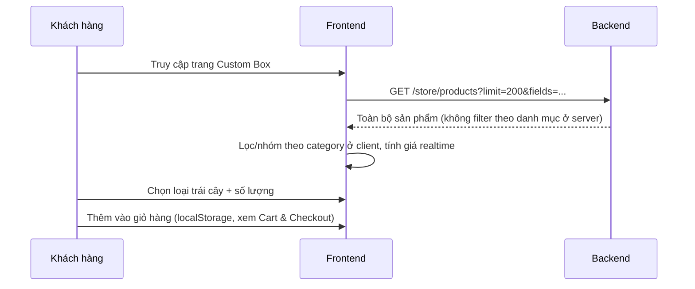

# 02 · Products — Tổng quan

> Module quản lý sản phẩm bao gồm **Frontend** (khách hàng xem) và **Admin** (quản trị viên CRUD). Phần Admin CRUD sản phẩm (`/admin/products*`) là route **core Medusa**, chưa được test trực tiếp trong đợt soát tài liệu này — các phần đánh dấu "core Medusa, chưa verify" nên được coi là mô tả tổng quát theo quy ước Medusa v2, không phải đã xác nhận 100% khớp version cụ thể của dự án.

---

## 1. Tổng quan

- **Hộp tiêu chuẩn**: sản phẩm định sẵn, CRUD qua `/admin/products` (core Medusa)
- **Custom Box**: khách tự chọn trái cây lẻ — dùng chung dữ liệu sản phẩm, không phải model riêng

**Quan trọng**: dự án dùng **3 cơ chế đọc sản phẩm song song** cho các mục đích khác nhau, không phải 1 endpoint duy nhất như tài liệu cũ mô tả:

| Cơ chế | Dùng ở đâu (frontend) | Nguồn dữ liệu |
|---|---|---|
| `GET /store/products` (core Medusa) | Trang chủ (sản phẩm nổi bật theo danh mục), trang Custom Box | Query trực tiếp DB, không cache |
| `GET /store/catalog/products/:handle`, `GET /store/catalog/categories` (custom) | Trang chi tiết sản phẩm, danh sách danh mục | Có cache (30 phút cho sản phẩm, 1 giờ cho danh mục, tồn kho cache riêng 30s) |
| `GET /store/search` (custom, **Meilisearch**) | Trang "Sản phẩm" (browse/tìm kiếm chính) | Meilisearch, fallback sang query DB trực tiếp nếu Meilisearch lỗi |

---

## 2. Data Models

Product/ProductVariant/ProductCategory là entity **core Medusa** — bảng dưới liệt kê field hay dùng trong dự án này, không phải toàn bộ schema Medusa.

### ProductVariant.metadata — field tuỳ biến quan trọng

| Key | Mô tả |
|---|---|
| `cost_price` | Giá vốn, dùng tính lợi nhuận ở dashboard (`/admin/custom?mode=dashboard`) — nếu thiếu, dashboard tự ước tính bằng `default_cost_percent` × giá bán |

### Ingredient / recipe_item (module `ingredients`, không phải core Medusa)

Sản phẩm có công thức nguyên liệu (BOM) liên kết qua `recipe_item` (`variant_id` → `ingredient_id` + `quantity`) — đây là cơ sở để tính tồn kho thật (mục 8), không dùng trực tiếp `variant.inventory_quantity` cho sản phẩm có công thức. Xem `.claude/agents/db-schema-reviewer.md` cho chi tiết schema.

---

## 3. API Endpoints — Frontend (custom routes, đã verify)

### `GET /store/catalog/categories`

Trả `{ categories: [{id, name, slug, description, image}] }` — `image` ưu tiên lấy từ `metadata.image` của category, fallback sang ảnh sản phẩm đầu tiên trong danh mục đó. Cache 1 giờ.

### `GET /store/catalog/products/:handle`

Trả `{ product: {...} }` — 404 nếu không tìm thấy handle. `product.variants[].in_stock`/`.purchasable_quantity` tính theo công thức nguyên liệu, cache riêng 30 giây (tách khỏi cache 30 phút của phần còn lại sản phẩm).

### `GET /store/search`

Dùng **Meilisearch** làm engine chính (không phải PostgreSQL tsvector như tài liệu cũ), fallback query DB trực tiếp nếu Meilisearch không phản hồi. Kết quả cache 5 phút, tồn kho enrich riêng mỗi lần gọi (không cache — xem mục 7 để biết vì sao chưa cache được an toàn).

Query params thật: `q`, `category`, `price_range` (`under-100`/`100-300`/`300-500`/`over-500`), `sort` (`price:asc`/`price:desc`/`created_at:desc`/`sales_count:desc`), `limit` (≤24), `offset` (≤10000).

### `GET /store/products` (core Medusa, dùng ở trang chủ + Custom Box)

Query params thường dùng trong dự án: `limit`, `fields` (chọn field trả về, hỗ trợ `*variants`, `+variants.inventory_quantity` — cú pháp field-selection của Medusa v2), `category_id[]`, `q`. Response theo format chuẩn Medusa core (`{products: [...], count, offset, limit}`), **không đi qua envelope `{data,error,meta}`** của dự án vì đây là route core.

---

## 4. API Endpoints — Admin (core Medusa `/admin/products*`, chưa verify sâu)

| Method | Path | Mô tả |
|---|---|---|
| `GET` | `/admin/products` | Danh sách (bao gồm draft) |
| `POST` | `/admin/products` | Tạo sản phẩm mới |
| `POST` | `/admin/products/:id` | Cập nhật (Medusa v2 core cũng dùng `POST` cho update, không phải `PUT`) |
| `DELETE` | `/admin/products/:id` | Xóa sản phẩm |

**Về permission**: `/admin/products*` **có** trong `protectedModules` của RBAC middleware tùy biến (`products.read/create/edit/delete`) — khác với `/admin/promotions*`/`/admin/campaigns*` (core Medusa nhưng KHÔNG được RBAC tùy biến bảo vệ). Xem [RBAC](../05-admin/rbac.md).

### Upload ảnh — **không phải `/admin/uploads`**

`POST /admin/media/upload` — nhận **JSON body `{filename, data}`** với `data` là ảnh **base64** (`≤14MB` sau decode), **không phải `multipart/form-data`**:
```json
{ "filename": "hop-qua.jpg", "data": "data:image/jpeg;base64,/9j/4AAQ..." }
```
Response: `{ url: "..." }`. Permission: `media.create`.

---

## 5. Custom Box Flow


```mermaid
sequenceDiagram
    participant U as Khách hàng
    participant SF as Frontend
    participant API as Backend

    U->>SF: Truy cập trang Custom Box
    SF->>API: GET /store/products?limit=200&fields=...
    API-->>SF: Toàn bộ sản phẩm (không filter theo danh mục ở server)
    SF->>SF: Lọc/nhóm theo category ở client, tính giá realtime
    U->>SF: Chọn loại trái cây + số lượng
    U->>SF: Thêm vào giỏ hàng (localStorage, xem Cart & Checkout)
```

---

## 6. Trang chủ Frontend (sửa nguồn dữ liệu sai)

| Component | Data source thật |
|---|---|
| Banner slider | `GET /store/custom?mode=homepage` → `data.banners` (**không phải** `GET /store/banners` — route này không tồn tại) |
| Sản phẩm nổi bật theo danh mục | `GET /store/catalog/categories` rồi `GET /store/products?category_id[]=...` cho từng danh mục |
| Danh mục nhanh | `GET /store/catalog/categories` (**không phải** `/store/product-categories`) |

---

## 7. Tìm kiếm (sửa hoàn toàn — tài liệu cũ mô tả sai cơ chế)

- Engine chính: **Meilisearch** (index đồng bộ qua subscriber khi product được tạo/sửa/xóa), **không phải** PostgreSQL tsvector
- Nếu Meilisearch không phản hồi: fallback tự động sang query trực tiếp Postgres (không dùng fulltext index riêng, so khớp đơn giản hơn)
- Endpoint: `GET /store/search?q=xoài`

---

## 8. Tồn kho — theo công thức nguyên liệu, không phải `inventory_quantity` trực tiếp

Với sản phẩm có liên kết `recipe_item`, tồn kho hiển thị (`in_stock`, `purchasable_quantity`) được tính từ tồn kho **nguyên liệu** (cộng dồn qua **mọi location**), không đọc trực tiếp `variant.inventory_quantity`. Sản phẩm không có công thức mới dùng `inventory_quantity` như bình thường. Logic dùng chung ở `backend/src/lib/inventory.ts`'s `enrichWithIngredientStock`, áp dụng cho cả `/store/search`, `/store/catalog/products/:handle`, và `/store/cart/validate`.

---

## 9. Edge Cases & Validation

| Tình huống | Xử lý |
|---|---|
| Sản phẩm `draft`/`archived` | Không hiển thị ở các route store custom (`catalog/*`, `search`) |
| Hết tồn kho theo công thức nguyên liệu | `in_stock: false`, `purchasable_quantity` giảm tương ứng — không phải chỉ dựa `inventory_quantity` |
| Ảnh upload qua `/admin/media/upload` | Giới hạn ~14MB sau decode base64, **không phải giới hạn 5MB** như tài liệu cũ |
| Handle trùng lặp khi tạo sản phẩm | Hành vi thật của route core Medusa — **chưa verify** mã lỗi cụ thể trong dự án này, tài liệu cũ ghi `422` chưa được xác nhận |

---

## 10. Liên kết

- [Status Machine](./status-machine.md)
- [Cart & Checkout](../03-cart-checkout/README.md)
