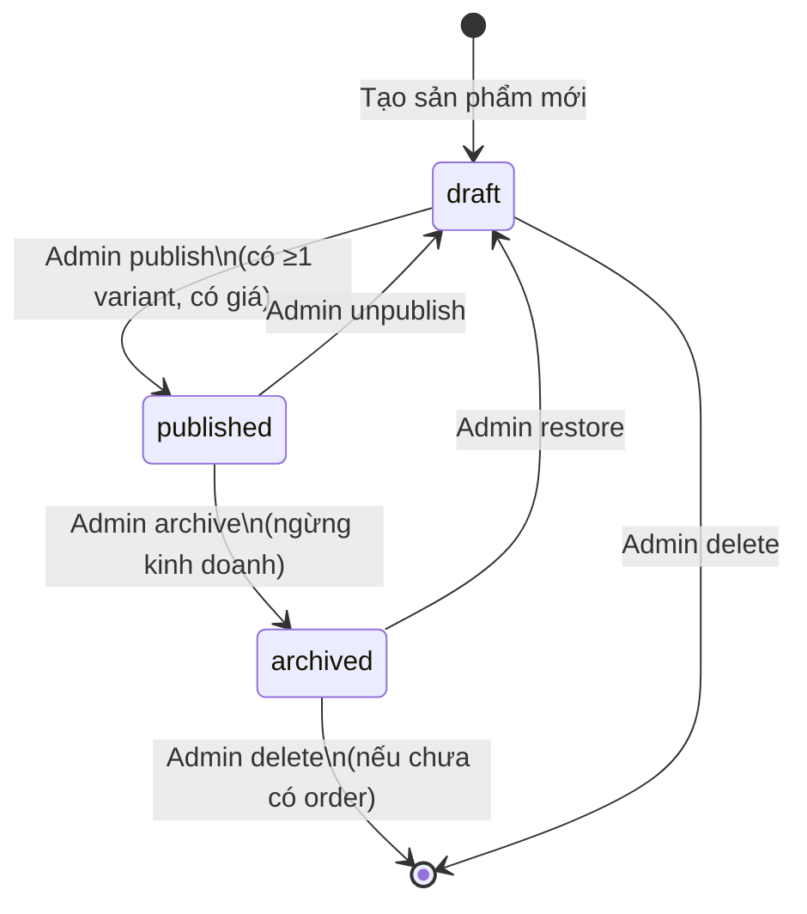
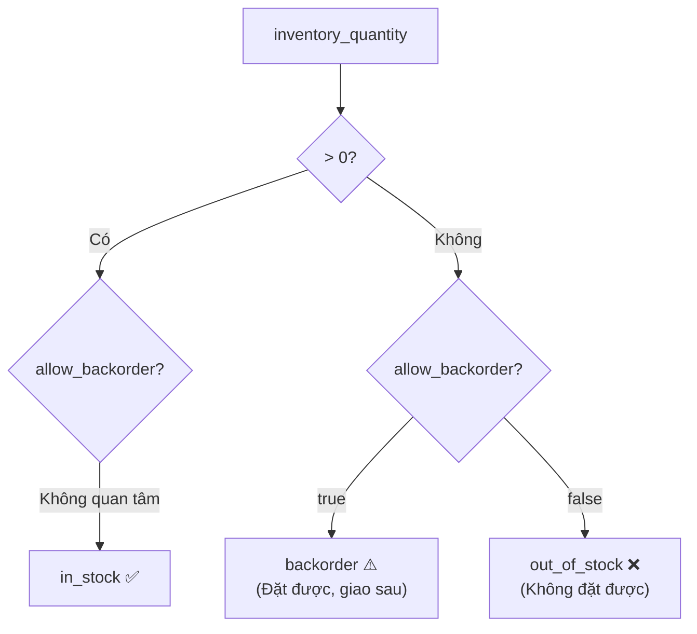
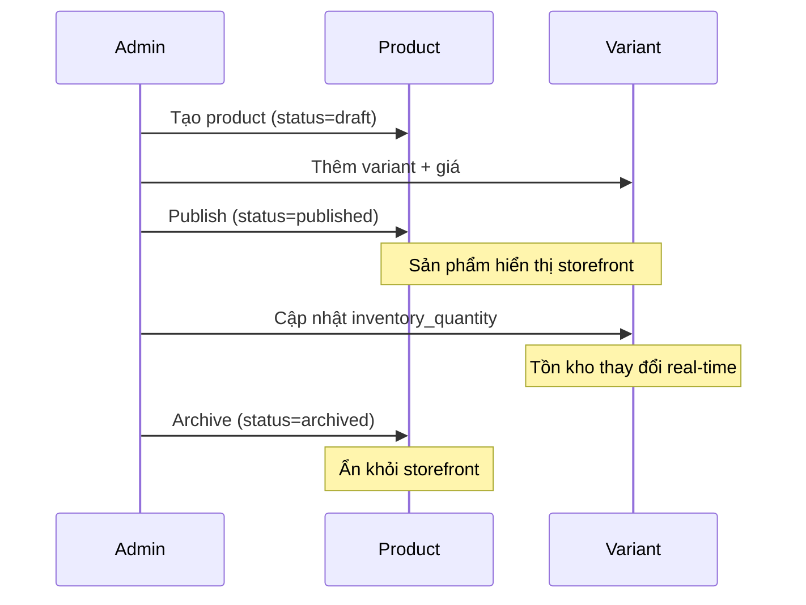
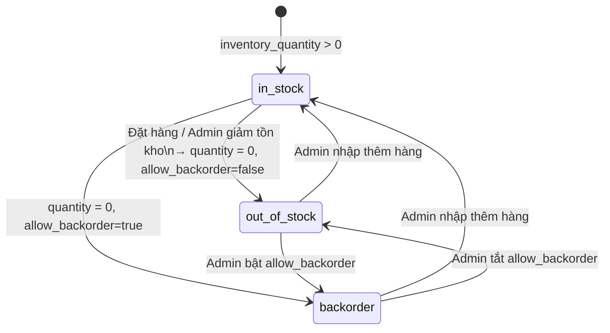

# 02 · Products — State Machine

> Mô tả các trạng thái của sản phẩm và transition rules.

---

## 1. Product Status

### Trạng thái

| Status | Mô tả | Hiển thị Storefront | Có thể đặt hàng |
|---|---|---|---|
| `draft` | Đang soạn thảo, chưa phát hành | ❌ | ❌ |
| `published` | Đang bán, công khai | ✅ | ✅ |
| `archived` | Ngừng kinh doanh | ❌ | ❌ |

### State Diagram

---

## 2. Inventory Status (Variant Level)

### Logic tính trạng thái tồn kho

### Bảng trạng thái tồn kho

| Tình huống | `inventory_quantity` | `allow_backorder` | Trạng thái hiển thị |
|---|---|---|---|
| Còn hàng | > 0 | any | ✅ Còn hàng |
| Hết hàng, không backorder | 0 | false | ❌ Hết hàng |
| Hết hàng, có backorder | 0 | true | ⚠️ Đặt trước |

---

## 3. Product → Variant Lifecycle

---

## 4. Transition Rules

### Điều kiện để Publish

Sản phẩm chỉ có thể chuyển sang `published` khi:
1. Có ít nhất **1 variant**
2. Mỗi variant có ít nhất **1 giá** hợp lệ
3. Có **thumbnail** hoặc ít nhất 1 ảnh
4. `title` không rỗng

### Điều kiện để Delete

Sản phẩm chỉ có thể xóa hoàn toàn khi:
- Không có **order item** nào tham chiếu đến variant của sản phẩm này
- Hoặc admin có quyền `products:force_delete`

Nếu đã có order → chỉ được **archive**, không được xóa.

---

## 5. Inventory Adjustment

---

## 6. Liên kết

- [Products README](./README.md)
- [Orders (fulfillment status)](../04-orders/status-machine.md)
