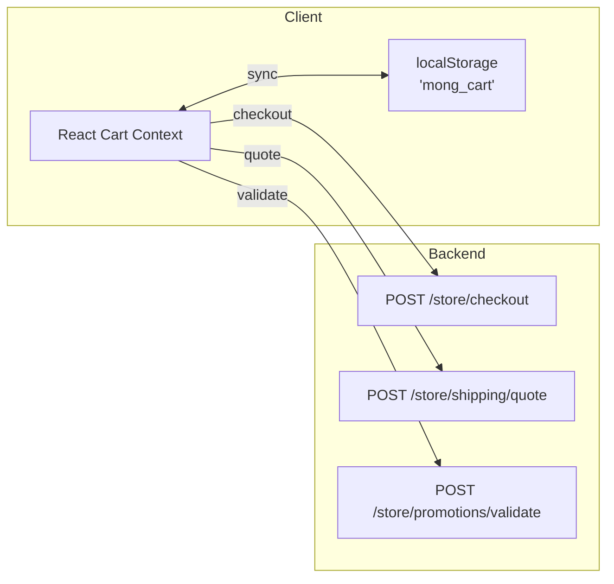
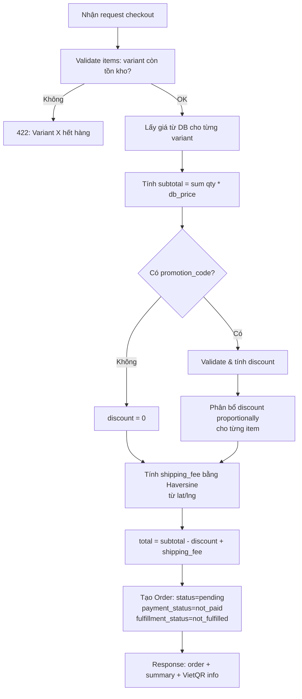

# 03 · Cart & Checkout — Tổng quan

> Giỏ hàng được lưu hoàn toàn tại **client (localStorage)**, không sync với backend. Checkout mới gửi toàn bộ dữ liệu lên server.

---

## 1. Tổng quan kiến trúc Cart



---

## 2. Cart Item Structure

```typescript
interface CartItem {
  id: string;           // UUID client-side
  variantId: string;    // variant_XXXX
  productId: string;    // prod_XXXX
  title: string;        // Tên sản phẩm + variant
  price: number;        // Giá (VND) - chỉ dùng hiển thị, server sẽ lấy lại từ DB
  quantity: number;     // Số lượng
  image: string;        // URL ảnh thumbnail
}
```

> ⚠️ **Bảo mật**: `price` trong CartItem chỉ để hiển thị UI. Server **không tin** giá từ client và sẽ tự lấy từ database khi checkout.

---

## 3. Shipping Quote

### Endpoint

`POST /store/shipping/quote`

**Request**:
```json
{
  "address": "123 Phố Huế, Hai Bà Trưng",
  "city": "Hà Nội",
  "district": "Hai Bà Trưng",
  "lat": 21.0245,
  "lng": 105.8412
}
```

**Response**:
```json
{
  "fee": 25000,
  "distance_km": 3.2,
  "estimated_time": "30-45 phút"
}
```

### Thuật toán tính phí

```
Kho: (21.012805, 105.836483) - Hà Nội
Haversine(lat1, lng1, lat2, lng2) → distance_km

if distance_km <= 5:   fee = 15,000 VND
elif distance_km <= 10: fee = 25,000 VND
elif distance_km <= 20: fee = 35,000 VND
else:                   fee = 50,000 VND
```

### Fallback Client-Side

Nếu API `/store/shipping/quote` thất bại:
1. Frontend tự tính Haversine bằng lat/lng đã có
2. Áp dụng bảng phí tương tự
3. Hiển thị "(ước tính)" bên cạnh phí ship

**Debounce**: 260ms sau lần nhập địa chỉ cuối cùng mới gọi API.

---

## 4. Promotion Validation

### Endpoint

`POST /store/promotions/validate`

**Request**:
```json
{
  "code": "SUMMER20",
  "subtotal": 500000
}
```

**Response (valid)**:
```json
{
  "valid": true,
  "promotion": {
    "id": "promo_01XXXXX",
    "code": "SUMMER20",
    "type": "percentage",
    "value": 20,
    "discount_amount": 100000,
    "min_subtotal": 200000
  }
}
```

**Response (invalid)**:
```json
{
  "valid": false,
  "reason": "Mã không tồn tại" | "Mã đã hết hạn" | "Không đủ điều kiện"
}
```

---

## 5. Checkout

### Endpoint

`POST /store/checkout`

**Request Body** (đầy đủ):
```json
{
  "items": [
    {
      "variant_id": "variant_01XXXXX",
      "product_id": "prod_01XXXXX",
      "quantity": 2,
      "title": "Hộp Premium - Nhỏ",
      "image": "https://s3.../img.jpg"
    }
  ],
  "shipping": {
    "name": "Nguyễn Văn A",
    "phone": "0901234567",
    "email": "customer@example.com",
    "address": "123 Phố Huế",
    "city": "Hà Nội",
    "district": "Hai Bà Trưng",
    "lat": 21.0245,
    "lng": 105.8412,
    "note": "Gọi trước 30 phút"
  },
  "promotion_code": "SUMMER20"
}
```

### Server-Side Processing



### Response

```json
{
  "order": {
    "id": "order_01XXXXX",
    "display_id": 1042,
    "status": "pending",
    "payment_status": "not_paid",
    "fulfillment_status": "not_fulfilled",
    "items": [...],
    "shipping_address": {...}
  },
  "summary": {
    "subtotal": 500000,
    "discount": 100000,
    "shipping": 25000,
    "total": 425000
  },
  "vietqr": {
    "bank": "Vietcombank",
    "account_number": "1234567890",
    "account_name": "MONG FRUITBOXZ",
    "amount": 425000,
    "description": "Thanh toan don hang #1042",
    "qr_url": "https://img.vietqr.io/image/..."
  }
}
```

---

## 6. Validation Rules tại Checkout

| Rule | Mô tả |
|---|---|
| `items` không rỗng | Giỏ hàng phải có ít nhất 1 sản phẩm |
| Variant tồn tại | Mỗi `variant_id` phải tồn tại trong DB |
| Variant còn hàng | `inventory_quantity >= quantity` (hoặc allow_backorder) |
| Sản phẩm published | Product phải có `status=published` |
| Shipping address | `name`, `phone`, `address`, `city` bắt buộc |
| `lat`, `lng` | Phải là số thực hợp lệ |
| `phone` | Định dạng số điện thoại Việt Nam |
| Promotion code | Chỉ apply nếu hợp lệ và đủ điều kiện |

---

## 7. Edge Cases

| Tình huống | Xử lý |
|---|---|
| Giá thay đổi sau khi thêm vào giỏ | Server dùng giá mới từ DB |
| Sản phẩm bị archive sau khi thêm giỏ | Checkout trả lỗi 422 |
| Hai user checkout cùng lúc, hết hàng | Server kiểm tra tồn kho và trả lỗi cho user thứ 2 |
| API shipping lỗi | Client fallback Haversine, gửi fee_estimated trong request |
| Promotion hết hạn sau validate | Server validate lại tại checkout |
| Địa chỉ không có lat/lng | Dùng phí mặc định hoặc báo lỗi nhập địa chỉ |

---

## 8. Liên kết

- [Data Flow](./data-flow.md)
- [Orders](../04-orders/README.md)
- [Marketing (Promotions)](../06-marketing/README.md)
