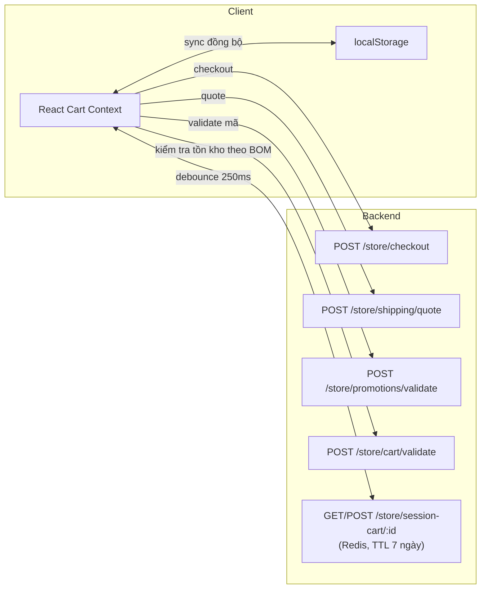
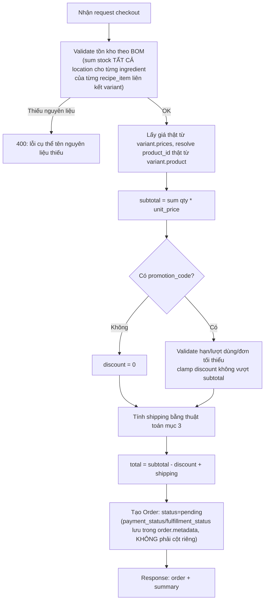

# 03 · Cart & Checkout — Tổng quan

> Giỏ hàng lưu tại `localStorage` (key `mong_fruitbox_cart`) là **nguồn dữ liệu chính**, nhưng **có** đồng bộ hai chiều với backend qua `/store/session-cart/:id` (lưu ở Redis, TTL 7 ngày, khóa theo `mong_fruitbox_cart_session` — một id ngẫu nhiên riêng của trình duyệt) — khác với mô tả "không sync" của tài liệu cũ. Debounce 250ms mỗi khi cart đổi; nếu backend lỗi, cart local vẫn là nguồn dữ liệu chủ (fail-open, không chặn UI). Mọi response custom store route (bao gồm 3 endpoint dưới đây) đều được bọc trong envelope `{ data, error, meta }` — phần response mẫu dưới đây chỉ hiện phần `data` cho gọn, response thật luôn có thêm lớp bọc này.

---

## 1. Tổng quan kiến trúc Cart


```mermaid
graph LR
    subgraph Client
        LS["localStorage"]
        RCT["React Cart Context"]
    end
    subgraph Backend
        API["POST /store/checkout"]
        SHIP["POST /store/shipping/quote"]
        PROMO["POST /store/promotions/validate"]
        VAL["POST /store/cart/validate"]
        SESS["GET/POST /store/session-cart/:id\n(Redis, TTL 7 ngày)"]
    end

    RCT <-->|sync đồng bộ| LS
    RCT <-->|debounce 250ms| SESS
    RCT -->|checkout| API
    RCT -->|quote| SHIP
    RCT -->|validate mã| PROMO
    RCT -->|kiểm tra tồn kho theo BOM| VAL
```

---

## 2. Cart Item Structure

`price` trong cart item chỉ để hiển thị UI — server không tin giá từ client, tự tính lại từ variant thật khi checkout (xem mục 5).

---

## 3. Shipping Quote

### Endpoint

`POST /store/shipping/quote`

**Request** (tất cả field optional, nhưng cần ít nhất district/city hoặc lat/lng để có kết quả hữu ích):
```json
{
  "address": "123 Phố Huế",
  "city": "Hà Nội",
  "district": "Hai Bà Trưng",
  "lat": 21.0245,
  "lng": 105.8412
}
```

**Response thật** (khác hoàn toàn field name so với tài liệu cũ):
```json
{
  "shipping": 0,
  "mode": "district-free",
  "distance_km": 3.01,
  "matched_location": { "city": "Ha Noi", "district": "Hai Ba Trung", "lat": 21.0059, "lng": 105.8575 }
}
```
- Field phí là **`shipping`**, không phải `fee`
- Không có `estimated_time`
- `mode` là một trong: `"fallback-empty"` (không có input gì), `"static-non-hanoi"` (ngoài Hà Nội — phí cố định), `"district-free"` (quận miễn phí ship), `"distance-estimate"` (tính theo khoảng cách), `"static-hanoi"` (trong Hà Nội nhưng không xác định được quận cụ thể)

### Thuật toán tính phí (thật, khác công thức "theo bậc" của tài liệu cũ)

Không dùng bảng bậc thang cố định (`<=5km: 15k, <=10km: 25k...`). Công thức thật:
```
exactFee = baseFee + (distance_km * perKmFee)
fee = clamp(ceil(exactFee / 1000) * 1000, minFee, maxFee)
```
Mặc định (chỉnh được qua Site Settings): `baseFee = 18000`, `perKmFee = 2200`, `minFee = 18000`, `maxFee = 60000`. Quận trong danh sách miễn phí (`free_shipping_districts`, mặc định gồm Hoàn Kiếm/Ba Đình/Đống Đa/Hai Bà Trưng/Cầu Giấy/Tây Hồ) → `shipping = 0`.

Toạ độ chỉ được công nhận là "trong Hà Nội" nếu nằm trong bán kính 15km quanh một quận Hà Nội đã biết — toạ độ ở tỉnh/thành khác luôn nhận `static-non-hanoi` (đây là fix cho một bug thật: trước đây bất kỳ toạ độ nào cũng bị coi là Hà Nội).

### Fallback Client-Side

Nếu API `/store/shipping/quote` thất bại, frontend tự tính Haversine bằng lat/lng đã có và hiển thị ước tính — không đảm bảo khớp chính xác công thức phía server ở trên.

---

## 4. Promotion Validation

### Endpoint

`POST /store/promotions/validate`

**Request**:
```json
{ "code": "SUMMER20", "subtotal": 500000 }
```

**Response hợp lệ** — **shape phẳng**, không lồng trong object `promotion` như tài liệu cũ:
```json
{
  "valid": true,
  "code": "SUMMER20",
  "type": "percentage",
  "discount_amount": 100000,
  "remaining_usages": 5
}
```

**Response không hợp lệ** — **không có field `valid: false` / `reason`**. Lỗi trả qua envelope `error` với status code thật:

| Tình huống | Status | `error.message` |
|---|---|---|
| Mã không tồn tại / hết hạn | `404` | "Mã giảm giá không tồn tại hoặc đã hết hạn" |
| Chưa đủ điều kiện đơn tối thiểu | `400` | "Đơn hàng chưa đạt giá trị tối thiểu..." |
| Hết lượt dùng | `400` | tùy thông điệp |

Frontend phải bắt lỗi qua HTTP status + `error.message`, **không** check `response.valid === false`.

---

## 5. Checkout

### Endpoint

`POST /store/checkout`

**Request Body** (theo đúng `CheckoutBodySchema`):
```json
{
  "items": [
    {
      "variant_id": "variant_01XXXXX",
      "quantity": 2,
      "title": "Hộp Premium - Nhỏ",
      "product_id": "prod_01XXXXX",
      "image": "https://.../img.jpg"
    }
  ],
  "shipping": {
    "name": "Nguyễn Văn A",
    "phone": "0901234567",
    "address": "123 Phố Huế",
    "city": "Hà Nội",
    "district": "Hai Bà Trưng",
    "email": "customer@example.com",
    "lat": 21.0245,
    "lng": 105.8412,
    "note": "Gọi trước 30 phút"
  },
  "promotion_code": "SUMMER20",
  "idempotency_key": "một-chuỗi-≥8-ký-tự-do-client-tự-sinh"
}
```

Khác tài liệu cũ:
- `city`/`district` là **optional**, không bắt buộc
- `product_id` trong item **không được tin cậy trực tiếp** — server tự resolve lại `product_id` thật từ `variant.product.id`, không dùng giá trị client gửi (xem [Orders](../04-orders/README.md) — đây là chỗ từng có lỗ hổng cho phép review giả mạo, đã vá bằng cách resolve lại)
- `idempotency_key` (optional, ≥8 ký tự) để tránh tạo trùng đơn khi client gọi lại — **không được ghi trong tài liệu cũ**

### Server-Side Processing (thật)


```mermaid
flowchart TD
    A[Nhận request checkout] --> B["Validate tồn kho theo BOM\n(sum stock TẤT CẢ location cho từng ingredient\ncủa từng recipe_item liên kết variant)"]
    B -- Thiếu nguyên liệu --> ERR1["400: lỗi cụ thể tên nguyên liệu thiếu"]
    B -- OK --> C[Lấy giá thật từ variant.prices, resolve product_id thật từ variant.product]
    C --> D[subtotal = sum qty * unit_price]
    D --> E{Có promotion_code?}
    E -- Không --> F[discount = 0]
    E -- Có --> G["Validate hạn/lượt dùng/đơn tối thiểu\nclamp discount không vượt subtotal"]
    F --> I[Tính shipping bằng thuật toán mục 3]
    G --> I
    I --> J[total = subtotal - discount + shipping]
    J --> K["Tạo Order: status=pending\n(payment_status/fulfillment_status lưu trong order.metadata, KHÔNG phải cột riêng)"]
    K --> L[Response: order + summary]
```

**Quan trọng**: bước validate tồn kho là theo **công thức nguyên liệu (BOM)** qua `recipe_item`, không phải kiểm tra trực tiếp `variant.inventory_quantity` như tài liệu cũ mô tả — sản phẩm không gắn công thức mới rơi về kiểm tra tồn kho đơn giản.

### Response thật

```json
{
  "order": {
    "id": "order_01XXXXX",
    "display_id": 2,
    "status": "pending",
    "email": "customer@example.com",
    "currency_code": "vnd",
    "metadata": {
      "payment_status": "not_paid",
      "fulfillment_status": "not_fulfilled",
      "shipping_fee": 0,
      "discount_total": 0,
      "promotion_code": null,
      "original_subtotal": 520000,
      "shipping_quote_mode": "district-free",
      "order_code": "MONG-20260903-XXXXXX"
    },
    "shipping_address": { "id": "ordaddr_..." },
    "created_at": "..."
  },
  "summary": {
    "original_subtotal": 520000,
    "subtotal": 520000,
    "discount": 0,
    "shipping": 0,
    "total": 520000
  }
}
```

**Không có field `vietqr`** — QR VietQR được frontend tự dựng ở client từ một tài khoản ngân hàng cấu hình sẵn (`frontend/src/pages/Checkout.jsx`), backend không sinh hay trả về thông tin này.

**`payment_status`/`fulfillment_status` không phải cột riêng trên `order`** — cả hai nằm trong `order.metadata`, vì đây là field tùy biến của dự án, không phải field gốc Medusa. Xem thêm [Orders — Status Machine](../04-orders/status-machine.md).

---

## 6. Validation Rules tại Checkout (thật, theo `CheckoutBodySchema`)

| Rule | Mô tả |
|---|---|
| `items` không rỗng | ít nhất 1 item |
| `quantity` mỗi item | số nguyên ≥ 1 |
| `shipping.name` | bắt buộc, không rỗng |
| `shipping.phone` | regex số Việt Nam (đầu số hợp lệ) **hoặc** dạng chung `84/0 + 9-10 chữ số` |
| `shipping.address` | bắt buộc, ≥ 5 ký tự |
| `shipping.city`/`district` | **optional** |
| `shipping.email` | optional, phải đúng định dạng email nếu có |
| `shipping.lat`/`lng` | optional, trong khoảng [-90,90]/[-180,180] nếu có |
| `promotion_code` | optional, validate riêng khi áp dụng |
| `idempotency_key` | optional, ≥8 ký tự |

Tồn kho được kiểm tra theo **công thức nguyên liệu** (mục 5), không phải `inventory_quantity >= quantity` đơn giản. **Không có bước kiểm tra `product.status === "published"`** ở checkout — đây là giả định của tài liệu cũ, chưa xác nhận trong code.

---

## 7. Edge Cases

| Tình huống | Xử lý thật |
|---|---|
| Giá thay đổi sau khi thêm vào giỏ | Server luôn dùng giá variant hiện tại từ DB, không tin `price` client gửi |
| `product_id` client gửi sai lệch với `variant_id` | Bị bỏ qua — server tự resolve `product_id` thật từ variant |
| Hết nguyên liệu (BOM) | `400` với message nêu rõ tên nguyên liệu thiếu, số cần/số còn |
| API shipping lỗi | Client tự fallback Haversine ở phía UI (không phải phần request checkout) |
| Mã khuyến mãi hết hạn giữa lúc validate và lúc checkout | `processCheckoutPromotions` validate lại từ đầu tại thời điểm checkout, không tin kết quả validate trước đó |
| Giảm giá % bị cấu hình sai (vd >100%) | Bị clamp không vượt quá subtotal đơn hàng |
| Gọi lại checkout với cùng `idempotency_key` | Tránh tạo đơn trùng (nếu client có gửi field này) |

---

## 8. Liên kết

- [Data Flow](./data-flow.md)
- [Orders](../04-orders/README.md)
- [Marketing (Promotions)](../06-marketing/README.md)
