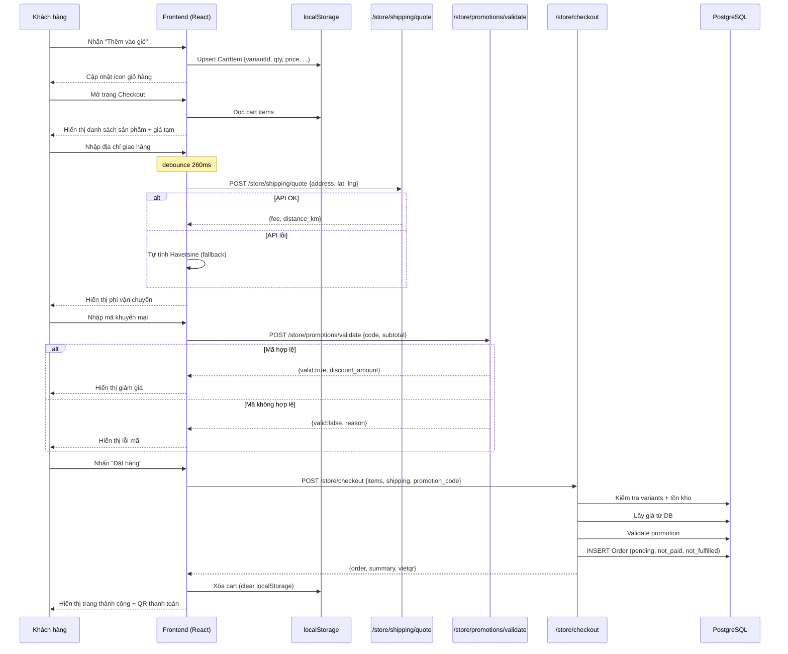
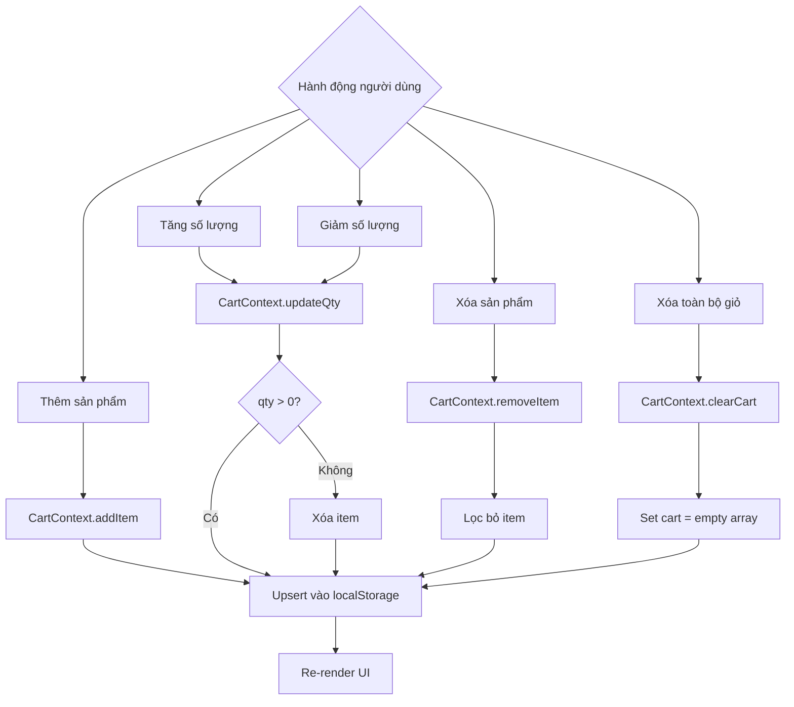
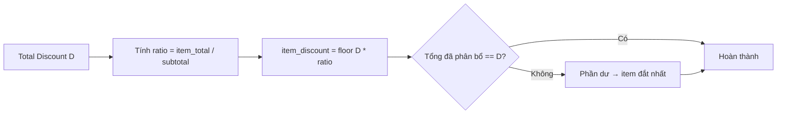
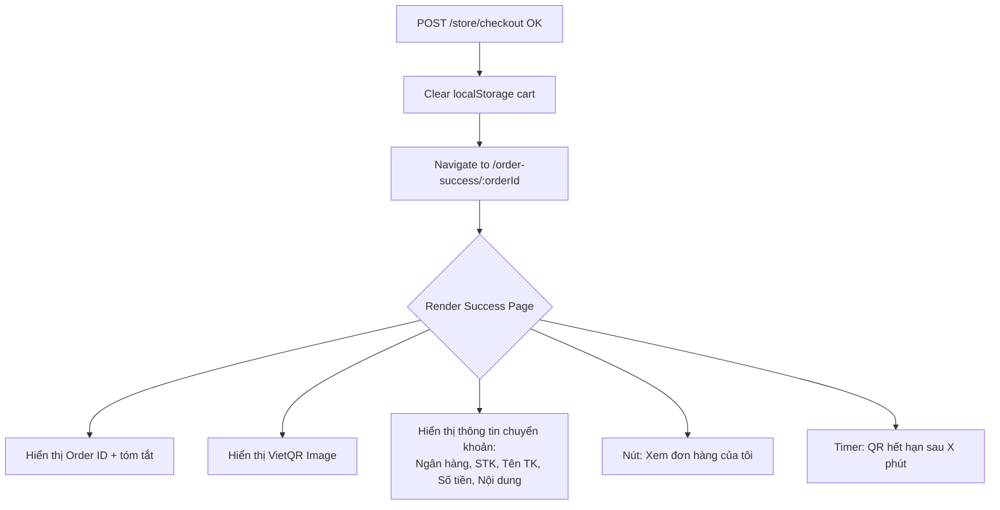

# 03 · Cart & Checkout — Data Flow

> Sơ đồ luồng dữ liệu chi tiết từ khi thêm sản phẩm đến khi hoàn thành đặt hàng.

---

## 1. Luồng đầy đủ Cart → Checkout



---

## 2. Luồng cập nhật Cart



---

## 3. Luồng tính Shipping Fee (Chi tiết)

```mermaid
flowchart TD
    A[User nhập địa chỉ] --> B{Có lat/lng chính xác?}
    B -- Không --> C[Geocoding: Gọi Maps API\nhoặc yêu cầu chọn trên map]
    B -- Có --> D[Debounce 260ms]
    C --> D
    D --> E[POST /store/shipping/quote]
    E --> F{API response?}
    F -- Success --> G[Hiển thị fee chính xác]
    F -- Error/Timeout --> H[Tính Haversine client-side]
    H --> I[Hiển thị fee + label '(ước tính)']

    G --> J[Lưu fee vào checkout state]
    I --> J
```

---

## 4. Luồng phân bổ Discount

Server phân bổ discount tỷ lệ theo giá trị từng item:

```
Ví dụ:
  Item A: 300,000 VND (60%)
  Item B: 200,000 VND (40%)
  Subtotal: 500,000 VND
  Discount: 100,000 VND

  → Item A discount: 60,000 VND
  → Item B discount: 40,000 VND

  Công thức: item_discount = discount * (item_total / subtotal)
  Làm tròn: item_discount = floor(item_discount)
  Remainder: phân bổ cho item đắt nhất
```



---

## 5. State Management Cart (React)

```typescript
// Cart Context State
interface CartState {
  items: CartItem[];
  shippingFee: number | null;
  shippingEstimated: boolean;
  promotionCode: string | null;
  promotionDiscount: number;
  shippingAddress: ShippingAddress | null;
}

// Computed values (derived state)
const subtotal = items.reduce((sum, item) => sum + item.price * item.quantity, 0);
const total = subtotal - promotionDiscount + (shippingFee ?? 0);
const itemCount = items.reduce((sum, item) => sum + item.quantity, 0);
```

---

## 6. Trang xác nhận đặt hàng thành công



---

## 7. Cấu trúc localStorage

```
Key: "mong_cart"
Value: JSON string

{
  "items": [
    {
      "id": "uuid-v4",
      "variantId": "variant_01XXX",
      "productId": "prod_01XXX",
      "title": "Hộp Premium - Nhỏ",
      "price": 150000,
      "quantity": 2,
      "image": "https://s3.../img.jpg"
    }
  ],
  "updatedAt": "2026-06-06T10:00:00Z"
}
```

---

## 8. Liên kết

- [Cart Checkout README](./README.md)
- [Orders](../04-orders/README.md)
