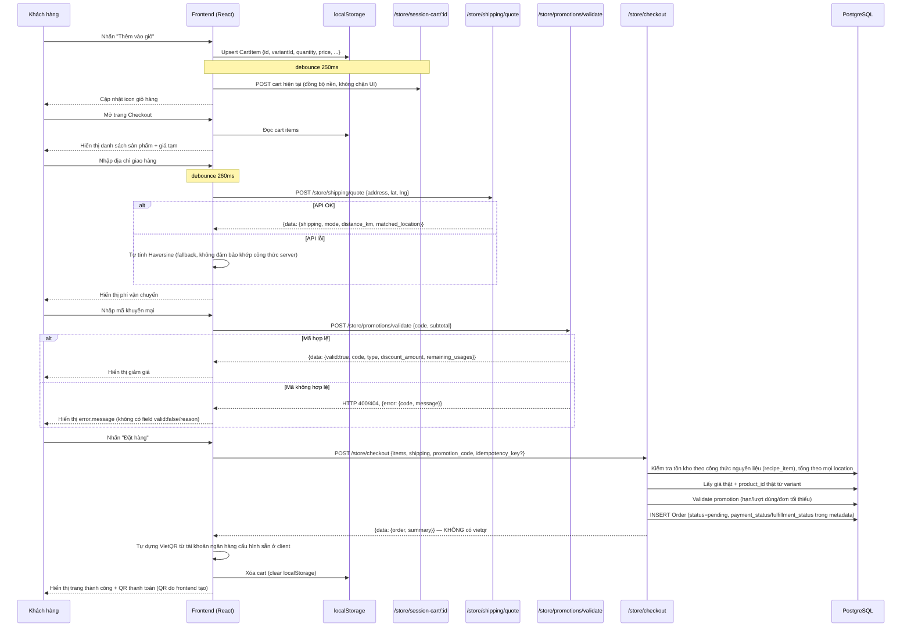
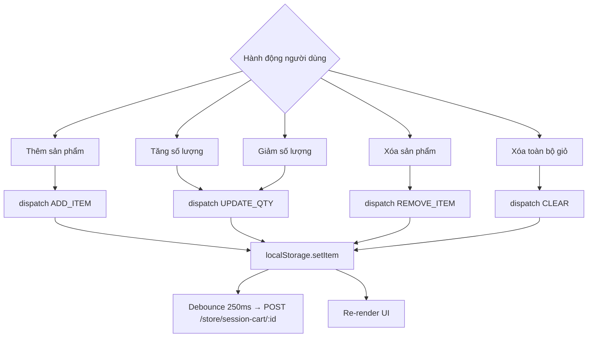
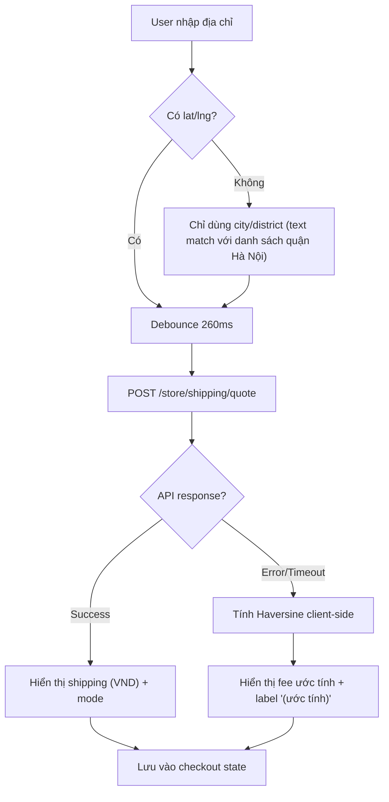
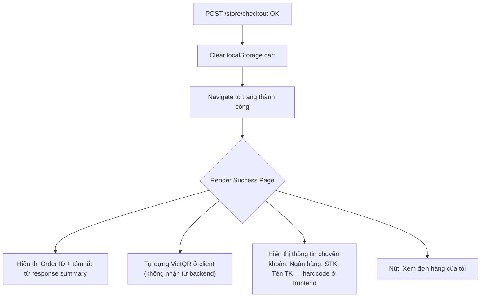

# 03 · Cart & Checkout — Data Flow

> Sơ đồ luồng dữ liệu chi tiết từ khi thêm sản phẩm đến khi hoàn thành đặt hàng.

---

## 1. Luồng đầy đủ Cart → Checkout


```mermaid
sequenceDiagram
    participant U as Khách hàng
    participant SF as Frontend (React)
    participant LS as localStorage
    participant SESS as /store/session-cart/:id
    participant SHIP as /store/shipping/quote
    participant PROMO as /store/promotions/validate
    participant CHK as /store/checkout
    participant DB as PostgreSQL

    U->>SF: Nhấn "Thêm vào giỏ"
    SF->>LS: Upsert CartItem {id, variantId, quantity, price, ...}
    Note over SF,SESS: debounce 250ms
    SF->>SESS: POST cart hiện tại (đồng bộ nền, không chặn UI)
    SF-->>U: Cập nhật icon giỏ hàng

    U->>SF: Mở trang Checkout
    SF->>LS: Đọc cart items
    SF-->>U: Hiển thị danh sách sản phẩm + giá tạm

    U->>SF: Nhập địa chỉ giao hàng
    Note over SF: debounce 260ms
    SF->>SHIP: POST /store/shipping/quote {address, lat, lng}
    alt API OK
        SHIP-->>SF: {data: {shipping, mode, distance_km, matched_location}}
    else API lỗi
        SF->>SF: Tự tính Haversine (fallback, không đảm bảo khớp công thức server)
    end
    SF-->>U: Hiển thị phí vận chuyển

    U->>SF: Nhập mã khuyến mại
    SF->>PROMO: POST /store/promotions/validate {code, subtotal}
    alt Mã hợp lệ
        PROMO-->>SF: {data: {valid:true, code, type, discount_amount, remaining_usages}}
        SF-->>U: Hiển thị giảm giá
    else Mã không hợp lệ
        PROMO-->>SF: HTTP 400/404, {error: {code, message}}
        SF-->>U: Hiển thị error.message (không có field valid:false/reason)
    end

    U->>SF: Nhấn "Đặt hàng"
    SF->>CHK: POST /store/checkout {items, shipping, promotion_code, idempotency_key?}
    CHK->>DB: Kiểm tra tồn kho theo công thức nguyên liệu (recipe_item), tổng theo mọi location
    CHK->>DB: Lấy giá thật + product_id thật từ variant
    CHK->>DB: Validate promotion (hạn/lượt dùng/đơn tối thiểu)
    CHK->>DB: INSERT Order (status=pending, payment_status/fulfillment_status trong metadata)
    CHK-->>SF: {data: {order, summary}} — KHÔNG có vietqr
    SF->>SF: Tự dựng VietQR từ tài khoản ngân hàng cấu hình sẵn ở client
    SF->>LS: Xóa cart (clear localStorage)
    SF-->>U: Hiển thị trang thành công + QR thanh toán (QR do frontend tạo)
```

---

## 2. Luồng cập nhật Cart


```mermaid
flowchart TD
    A{Hành động người dùng} --> B[Thêm sản phẩm]
    A --> C[Tăng số lượng]
    A --> D[Giảm số lượng]
    A --> E[Xóa sản phẩm]
    A --> F[Xóa toàn bộ giỏ]

    B --> G[dispatch ADD_ITEM]
    C --> H[dispatch UPDATE_QTY]
    D --> H
    E --> I[dispatch REMOVE_ITEM]
    F --> J[dispatch CLEAR]

    G --> K[localStorage.setItem]
    H --> K
    I --> K
    J --> K

    K --> L["Debounce 250ms → POST /store/session-cart/:id"]
    K --> P[Re-render UI]
```

---

## 3. Luồng tính Shipping Fee (Chi tiết)


```mermaid
flowchart TD
    A[User nhập địa chỉ] --> B{Có lat/lng?}
    B -- Không --> C["Chỉ dùng city/district (text match với danh sách quận Hà Nội)"]
    B -- Có --> D[Debounce 260ms]
    C --> D
    D --> E[POST /store/shipping/quote]
    E --> F{API response?}
    F -- Success --> G["Hiển thị shipping (VND) + mode"]
    F -- Error/Timeout --> H[Tính Haversine client-side]
    H --> I["Hiển thị fee ước tính + label '(ước tính)'"]

    G --> J[Lưu vào checkout state]
    I --> J
```

Toạ độ chỉ được nhận là "trong Hà Nội" khi nằm trong bán kính 15km quanh một quận Hà Nội đã biết — nếu chỉ có `city`/`district` không khớp tên quận nào và không có toạ độ hợp lệ, kết quả rơi vào `static-non-hanoi` (phí cố định) chứ không báo lỗi.

---

## 4. Luồng phân bổ Discount (thật, khác tài liệu cũ)

Server phân bổ discount tỷ lệ theo giá trị từng item, **làm tròn bằng `Math.round`** (không phải `floor`), và phần dư dồn về **item cuối cùng trong mảng** (không phải "item đắt nhất" — thứ tự là thứ tự client gửi lên):

```
Với mỗi item TRỪ item cuối:
  itemTotalDiscount = round(unit_price * quantity * (discountAmount / originalSubtotal))
  discountPerUnit    = round(itemTotalDiscount / quantity)
  unit_price         = max(0, unit_price - discountPerUnit)
  totalAllocated    += discountPerUnit * quantity

Item cuối cùng (nhận toàn bộ phần còn lại, tránh lệch làm tròn):
  remainingDiscount = discountAmount - totalAllocated
  discountPerUnit    = round(remainingDiscount / quantity)
  unit_price         = max(0, unit_price - discountPerUnit)
```

Khuyến mãi kiểu phần trăm luôn được **clamp không vượt quá `originalSubtotal`** trước khi phân bổ, kể cả khi promotion bị cấu hình sai (value >100% và không có `max_discount`).

---

## 5. State Management Cart (React) — thật

```javascript
// frontend/src/context/CartContext.jsx — cartReducer state thật
{
  items: [],   // mỗi item: {id, variantId, productId, title, price, quantity, image, slug, variantId}
  count: 0,
}
```
Không có các field `shippingFee`/`promotionDiscount`/`shippingAddress` trong CartContext state như tài liệu cũ mô tả — các giá trị đó được quản lý riêng ở trang Checkout, không nằm trong Cart Context.

---

## 6. Trang xác nhận đặt hàng thành công


```mermaid
flowchart TD
    A[POST /store/checkout OK] --> B[Clear localStorage cart]
    B --> C[Navigate to trang thành công]
    C --> D{Render Success Page}
    D --> E[Hiển thị Order ID + tóm tắt từ response summary]
    D --> F["Tự dựng VietQR ở client (không nhận từ backend)"]
    D --> G[Hiển thị thông tin chuyển khoản: Ngân hàng, STK, Tên TK — hardcode ở frontend]
    D --> H[Nút: Xem đơn hàng của tôi]
```

---

## 7. Cấu trúc localStorage (thật)

```
Key: "mong_fruitbox_cart"
Value:
{
  "items": [
    {
      "id": "uuid hoặc variant_id",
      "variantId": "variant_01XXX",
      "productId": "prod_01XXX",
      "title": "Hộp Premium - Nhỏ",
      "price": 150000,
      "quantity": 2,
      "image": "https://.../img.jpg",
      "slug": "hop-premium-nho"
    }
  ],
  "count": 2
}
```

Key riêng thứ hai — `"mong_fruitbox_cart_session"` — chỉ chứa **id phiên** (UUID, hoặc fallback `cart_<timestamp>_<random>` nếu trình duyệt không hỗ trợ `crypto.randomUUID`), dùng làm khóa khi gọi `/store/session-cart/:id`. Entropy cao nên khó đoán, nhưng endpoint này **không xác thực chủ sở hữu** — ai biết id phiên đều đọc/ghi được cart đó (rủi ro thấp trong thực tế vì id khó đoán, không lưu dữ liệu nhạy cảm).

---

## 8. Liên kết

- [Cart Checkout README](./README.md)
- [Orders](../04-orders/README.md)
