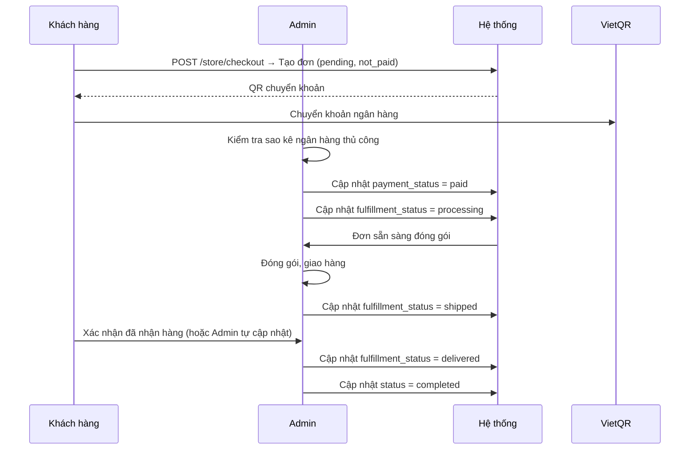
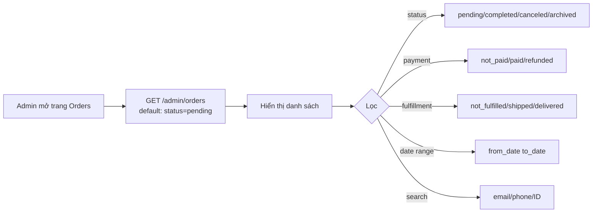

# 04 · Orders — Tổng quan

> Module quản lý đơn hàng: từ khi tạo (pending) đến khi hoàn thành hoặc hủy.

---

## 1. Tổng quan

Đơn hàng được tạo qua `POST /store/checkout`. Admin quản lý trạng thái qua panel `/admin`. Hệ thống có 3 chiều trạng thái độc lập:

| Chiều | Tên | Mô tả |
|---|---|---|
| 1 | `status` | Trạng thái tổng thể của đơn |
| 2 | `payment_status` | Trạng thái thanh toán |
| 3 | `fulfillment_status` | Trạng thái giao hàng |

---

## 2. Data Models

### Order

| Trường | Kiểu | Mô tả |
|---|---|---|
| `id` | string | PK, format `order_XXXX` |
| `display_id` | number | Số thứ tự đơn hàng (auto-increment) |
| `status` | enum | `pending`, `completed`, `canceled`, `archived` |
| `payment_status` | enum | `not_paid`, `partially_paid`, `paid`, `refunded` |
| `fulfillment_status` | enum | `not_fulfilled`, `processing`, `shipped`, `delivered`, `returned` |
| `customer_id` | string | FK → Customer (nullable nếu guest) |
| `email` | string | Email liên hệ |
| `subtotal` | number | Tổng tiền hàng (trước discount) |
| `discount_total` | number | Tổng giảm giá |
| `shipping_total` | number | Phí vận chuyển |
| `total` | number | Tổng thanh toán |
| `metadata` | jsonb | Dữ liệu bổ sung (VietQR info, notes) |
| `created_at` | timestamp | |
| `updated_at` | timestamp | |

### OrderItem

| Trường | Kiểu | Mô tả |
|---|---|---|
| `id` | string | PK |
| `order_id` | string | FK → Order |
| `variant_id` | string | FK → ProductVariant |
| `product_id` | string | FK → Product |
| `title` | string | Tên sản phẩm tại thời điểm đặt |
| `quantity` | number | Số lượng |
| `unit_price` | number | Đơn giá (tại thời điểm đặt) |
| `subtotal` | number | `unit_price * quantity` |
| `discount_total` | number | Giảm giá phân bổ |
| `total` | number | `subtotal - discount_total` |
| `metadata` | jsonb | Chứa `cost_price` (giá vốn) |

### ShippingAddress (embedded trong Order)

| Trường | Kiểu | Mô tả |
|---|---|---|
| `name` | string | Tên người nhận |
| `phone` | string | Số điện thoại |
| `address` | string | Địa chỉ chi tiết |
| `city` | string | Tỉnh/Thành phố |
| `district` | string | Quận/Huyện |
| `lat` | float | Latitude |
| `lng` | float | Longitude |
| `note` | string | Ghi chú giao hàng |

---

## 3. API Endpoints — Admin

| Method | Path | Mô tả | Permission |
|---|---|---|---|
| `GET` | `/admin/orders` | Danh sách đơn hàng | `orders:read` |
| `GET` | `/admin/orders/:id` | Chi tiết đơn hàng | `orders:read` |
| `POST` | `/admin/custom/orders/:id/status` | Cập nhật trạng thái | `orders:write` |
| `GET` | `/admin/orders?status=pending` | Filter theo status | `orders:read` |
| `GET` | `/admin/orders?payment_status=not_paid` | Filter thanh toán | `orders:read` |
| `GET` | `/admin/orders?q=keyword` | Tìm kiếm | `orders:read` |

### Request Body — Cập nhật trạng thái

`POST /admin/custom/orders/:id/status`

```json
{
  "status": "completed",
  "payment_status": "paid",
  "fulfillment_status": "delivered"
}
```

> Có thể cập nhật một hoặc nhiều trường cùng lúc. Các trường không được truyền sẽ giữ nguyên.

### Query Parameters `/admin/orders`

| Param | Mô tả |
|---|---|
| `status` | Filter: `pending`, `completed`, `canceled`, `archived` |
| `payment_status` | Filter thanh toán |
| `fulfillment_status` | Filter giao hàng |
| `q` | Tìm kiếm theo email, phone, display_id |
| `from_date` | Từ ngày (ISO 8601) |
| `to_date` | Đến ngày (ISO 8601) |
| `limit` | Số lượng / trang |
| `offset` | Offset phân trang |

---

## 4. Luồng xử lý đơn hàng



---

## 5. Tính lợi nhuận đơn hàng

```
Doanh thu = order.total
Chi phí hàng hóa = Σ (item.quantity × item.metadata.cost_price)
Chi phí đóng gói = SiteSetting['packaging_cost']
Chi phí nhân công = SiteSetting['labor_cost_per_order']

Lợi nhuận = Doanh thu - Chi phí hàng hóa - Chi phí đóng gói - Chi phí nhân công
```

---

## 6. Lọc & Tìm kiếm đơn hàng (Admin)



---

## 7. Edge Cases & Validation

| Tình huống | Xử lý |
|---|---|
| Hủy đơn đã giao (`delivered`) | ❌ Không cho phép |
| Hủy đơn đã thanh toán | Cần xử lý refund thủ công trước |
| Cập nhật sai transition | Trả lỗi 422 nếu vi phạm state machine |
| Đơn guest (không login) | Tìm theo email |
| Xem đơn của customer khác | 403 Forbidden |

---

## 8. Liên kết

- [Status Machine](./status-machine.md)
- [Finance (profit calculation)](../07-finance/README.md)
- [Cart & Checkout](../03-cart-checkout/README.md)
