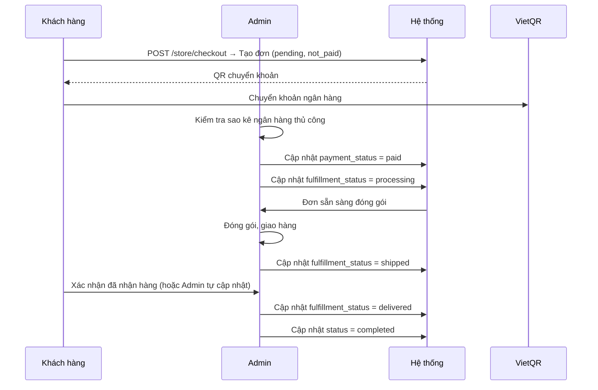
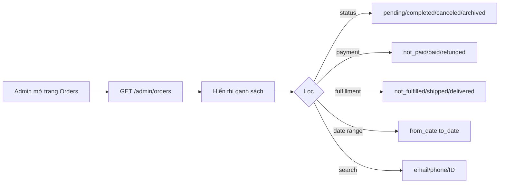

# 04 · Orders — Tổng quan

> Module quản lý đơn hàng: từ khi tạo (pending) đến khi hoàn thành hoặc hủy.

---

## 1. Tổng quan

Đơn hàng được tạo qua `POST /store/checkout`. Admin quản lý trạng thái qua panel `/admin`. Hệ thống có 3 chiều trạng thái độc lập:

| Chiều | Tên | Mô tả |
|---|---|---|
| 1 | `status` | Trạng thái tổng thể của đơn |
| 2 | `payment_status` | Trạng thái thanh toán |
| 3 | `fulfillment_status` | Trạng thái giao hàng |

---

## 2. Data Models

### Order

| Trường | Kiểu | Mô tả |
|---|---|---|
| `id` | string | PK, format `order_XXXX` |
| `display_id` | number | Số thứ tự đơn hàng (auto-increment) |
| `status` | enum | `pending`, `completed`, `canceled`, `archived` — **cột thật duy nhất trong 3 chiều trạng thái** |
| `customer_id` | string | FK → Customer (nullable nếu guest) |
| `email` | string | Email liên hệ |
| `currency_code` | string | Luôn `"vnd"` |
| `metadata` | jsonb | **Chứa `payment_status`, `fulfillment_status`, `shipping_fee`, `discount_total`, `promotion_code`, `original_subtotal`, `order_code`, `shipping_quote_mode`, `shipping_distance_km`, `shipping_matched_location`, `idempotency_key`** — xem chi tiết ở mục 2.1 |
| `created_at` / `updated_at` | timestamp | |

> `payment_status` và `fulfillment_status` **không phải cột riêng trên `order`** — cả hai nằm trong `order.metadata`, vì đây là field tùy biến của dự án (Medusa v2 core không có sẵn khái niệm fulfillment_status theo nghĩa dự án cần). Đọc/ghi qua `POST /admin/custom/orders/:id/status` — xem [Status Machine](./status-machine.md). `subtotal`/`discount_total`/`shipping_total`/`total` như một khối riêng trên `order` — **chưa verify**; giá trị tương đương thật sự nằm trong `summary` trả về từ `POST /store/checkout` (`original_subtotal, subtotal, discount, shipping, total`), không nhất thiết là cột `order`.

### 2.1 `order.metadata` — field tùy biến thật (từ checkout workflow)

| Key | Mô tả |
|---|---|
| `payment_status` | `not_paid` / `partially_paid` / `paid` / `refunded` |
| `fulfillment_status` | `not_fulfilled` / `processing` / `shipped` / `delivered` / `returned` |
| `shipping_fee` | Phí ship đã tính (VND) |
| `discount_total` | Tổng giảm giá |
| `promotion_code` | Mã khuyến mãi đã áp (nếu có) |
| `original_subtotal` | Tổng tiền hàng trước giảm giá |
| `order_code` | Mã đơn hiển thị dạng `MONG-YYYYMMDD-XXXXXX` |
| `shipping_quote_mode` | Mode trả về từ `/store/shipping/quote` lúc checkout (`district-free`, `distance-estimate`,...) |
| `idempotency_key` | Nếu client có gửi lúc checkout |

**Không có** field `vietqr`/VietQR info trong `metadata` — VietQR hoàn toàn ở phía client, backend không lưu gì liên quan.

### OrderItem

| Trường | Kiểu | Mô tả |
|---|---|---|
| `id` | string | PK |
| `order_id` | string | FK → Order |
| `variant_id` | string | FK → ProductVariant |
| `product_id` | string | FK → Product |
| `title` | string | Tên sản phẩm tại thời điểm đặt |
| `quantity` | number | Số lượng |
| `unit_price` | number | Đơn giá (tại thời điểm đặt) |
| `subtotal` | number | `unit_price * quantity` |
| `discount_total` | number | Giảm giá phân bổ |
| `total` | number | `subtotal - discount_total` |
| `metadata` | jsonb | Chứa `cost_price` (giá vốn) |

### ShippingAddress (embedded trong Order)

| Trường | Kiểu | Mô tả |
|---|---|---|
| `name` | string | Tên người nhận |
| `phone` | string | Số điện thoại |
| `address` | string | Địa chỉ chi tiết |
| `city` | string | Tỉnh/Thành phố |
| `district` | string | Quận/Huyện |
| `lat` | float | Latitude |
| `lng` | float | Longitude |
| `note` | string | Ghi chú giao hàng |

---

## 3. API Endpoints — Admin

| Method | Path | Mô tả | Permission |
|---|---|---|---|
| `GET` | `/admin/orders` | Danh sách đơn hàng | `orders.read` |
| `GET` | `/admin/orders/:id` | Chi tiết đơn hàng | `orders.read` |
| `POST` | `/admin/custom/orders/:id/status` | Cập nhật trạng thái | `orders.edit` |
| `GET` | `/admin/orders?status=pending` | Filter theo status | `orders.read` |
| `GET` | `/admin/orders?payment_status=not_paid` | Filter thanh toán | `orders.read` |
| `GET` | `/admin/orders?q=keyword` | Tìm kiếm | `orders.read` |

### Request Body — Cập nhật trạng thái

`POST /admin/custom/orders/:id/status`

```json
{
  "status": "completed",
  "payment_status": "paid",
  "fulfillment_status": "delivered"
}
```

> Có thể cập nhật một hoặc nhiều trường cùng lúc. Các trường không được truyền sẽ giữ nguyên.

### Query Parameters `/admin/orders`

| Param | Mô tả |
|---|---|
| `status` | Filter theo cột thật: `pending`, `completed`, `canceled`, `archived` |
| `q` | Tìm kiếm (hành vi mặc định của Medusa core) |
| `limit` | Số lượng / trang |
| `offset` | Offset phân trang |

> `payment_status`/`fulfillment_status`/`from_date`/`to_date` **chưa được verify** là filter hợp lệ cho `/admin/orders` — vì hai field đầu nằm trong `metadata` (không phải cột), lọc trực tiếp qua query param kiểu Medusa core tiêu chuẩn có thể không hoạt động như mong đợi.

---

## 4. Luồng xử lý đơn hàng


```mermaid
sequenceDiagram
    participant KH as Khách hàng
    participant ADM as Admin
    participant SYS as Hệ thống
    participant VQR as VietQR

    KH->>SYS: POST /store/checkout → Tạo đơn (pending, not_paid)
    SYS-->>KH: QR chuyển khoản

    KH->>VQR: Chuyển khoản ngân hàng

    ADM->>ADM: Kiểm tra sao kê ngân hàng thủ công
    ADM->>SYS: Cập nhật payment_status = paid
    ADM->>SYS: Cập nhật fulfillment_status = processing

    SYS->>ADM: Đơn sẵn sàng đóng gói

    ADM->>ADM: Đóng gói, giao hàng
    ADM->>SYS: Cập nhật fulfillment_status = shipped

    KH->>ADM: Xác nhận đã nhận hàng (hoặc Admin tự cập nhật)
    ADM->>SYS: Cập nhật fulfillment_status = delivered
    ADM->>SYS: Cập nhật status = completed
```

---

## 5. Tính lợi nhuận đơn hàng (thật, từ `GET /admin/custom?mode=dashboard`)

Tính lại **mỗi lần gọi** (không lưu sẵn), theo từng item trong đơn:

```
Với mỗi item:
  effectiveCost = item.metadata.cost_price nếu > 0
                  ngược lại: round(unit_price × default_cost_percent / 100)
  itemCost = (effectiveCost + packaging_cost) × quantity

orderCost = Σ itemCost (mọi item) + labor_cost_per_order   ← chỉ CỘNG 1 LẦN mỗi đơn, không nhân theo item
orderRevenue = Σ (unit_price × quantity)
orderProfit = orderRevenue - orderCost
```

`packaging_cost`/`labor_cost_per_order`/`default_cost_percent` đọc từ Site Settings (mặc định `5000`/`10000`/`50` nếu chưa cấu hình — xem [System](../08-system/README.md)). Đơn `canceled`/`archived` **không được tính** vào revenue/profit tổng.

---

## 6. Lọc & Tìm kiếm đơn hàng (Admin)


```mermaid
flowchart LR
    A[Admin mở trang Orders] --> B[GET /admin/orders]
    B --> C[Hiển thị danh sách]
    C --> D{Lọc}
    D -->|status| E[pending/completed/canceled/archived]
    D -->|payment| F[not_paid/paid/refunded]
    D -->|fulfillment| G[not_fulfilled/shipped/delivered]
    D -->|date range| H[from_date to_date]
    D -->|search| I[email/phone/ID]
```

---

## 7. Edge Cases & Validation

| Tình huống | Xử lý |
|---|---|
| Hủy đơn đã giao (`delivered`) | ⚠️ Không bị chặn — backend không validate transition, xem [Status Machine §5](./status-machine.md) |
| Hủy đơn đã thanh toán | Cần xử lý refund thủ công trước (không tự động) |
| Cập nhật sai transition (vd. `completed` → `pending`) | ⚠️ Không bị chặn — mọi giá trị status/payment_status/fulfillment_status đều được chấp nhận, không trả lỗi 422 |
| Đơn guest (không login) | Tìm theo email |
| Xem đơn của customer khác | 403 Forbidden |

---

## 8. Liên kết

- [Status Machine](./status-machine.md)
- [Cart & Checkout](../03-cart-checkout/README.md)
