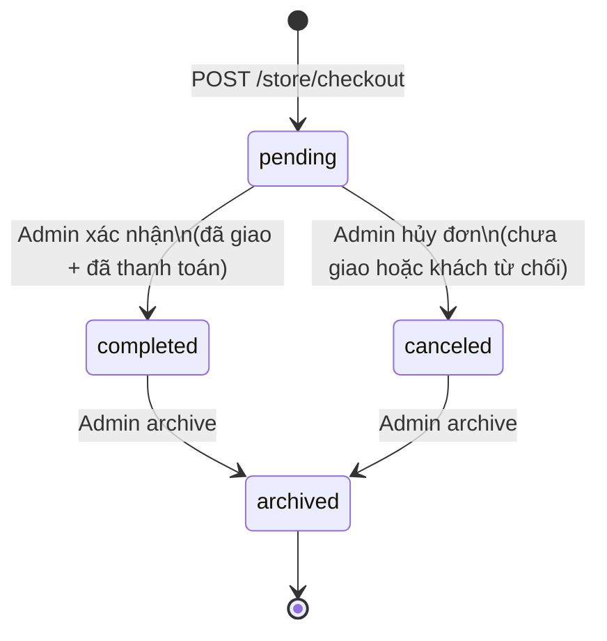
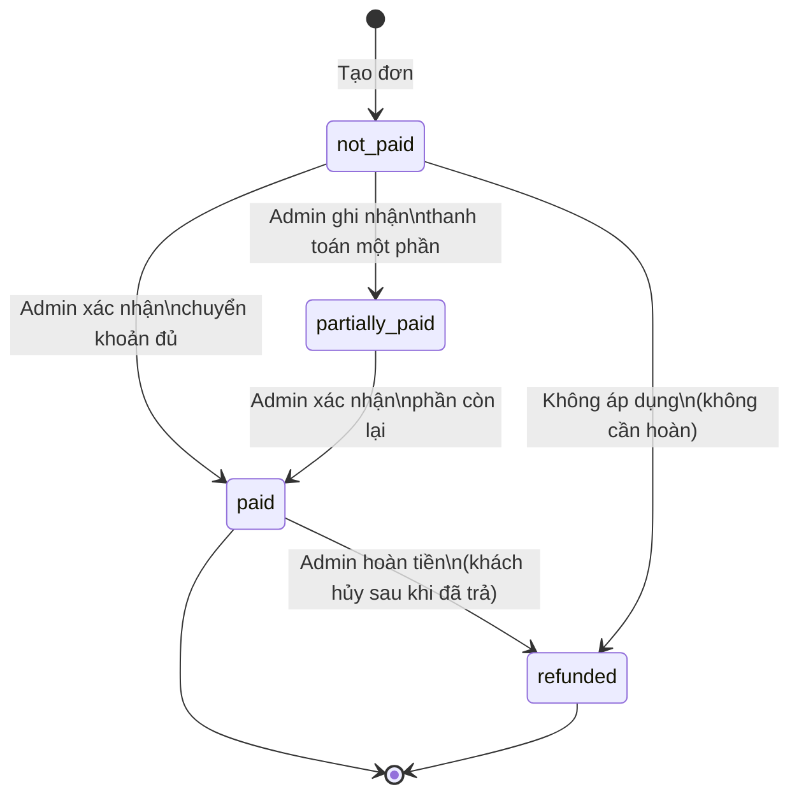
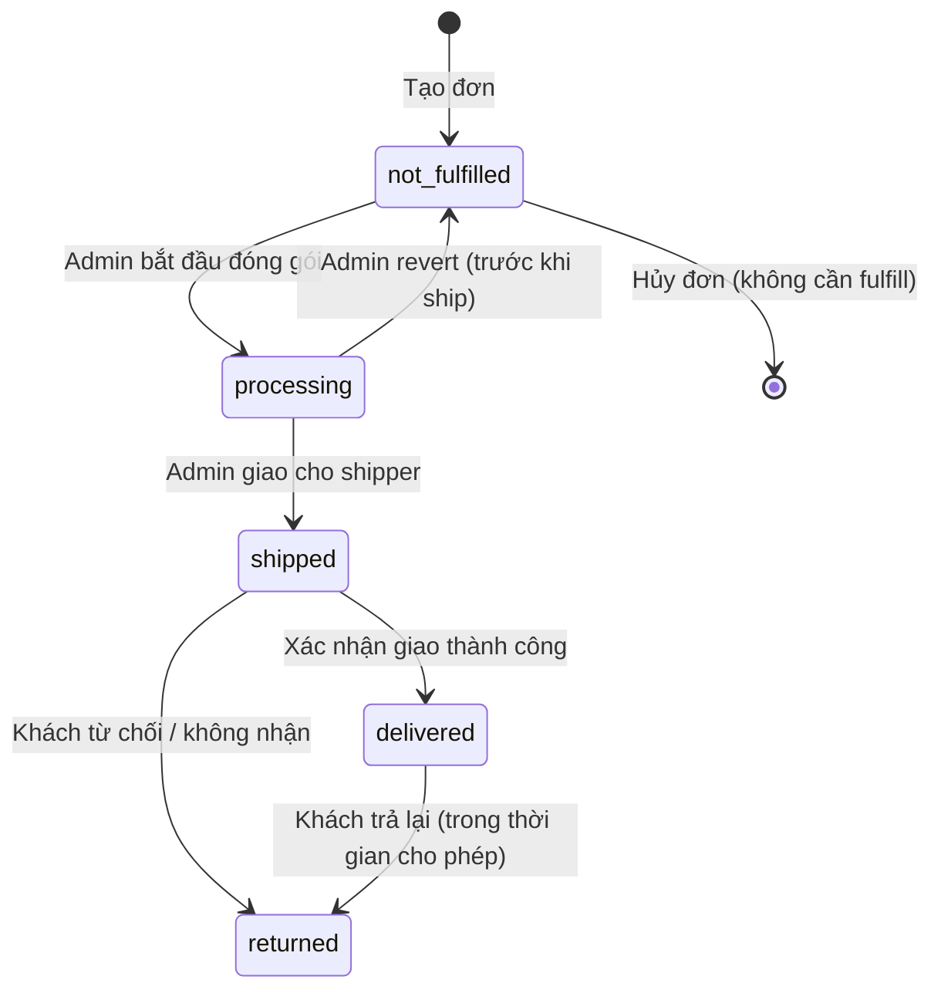
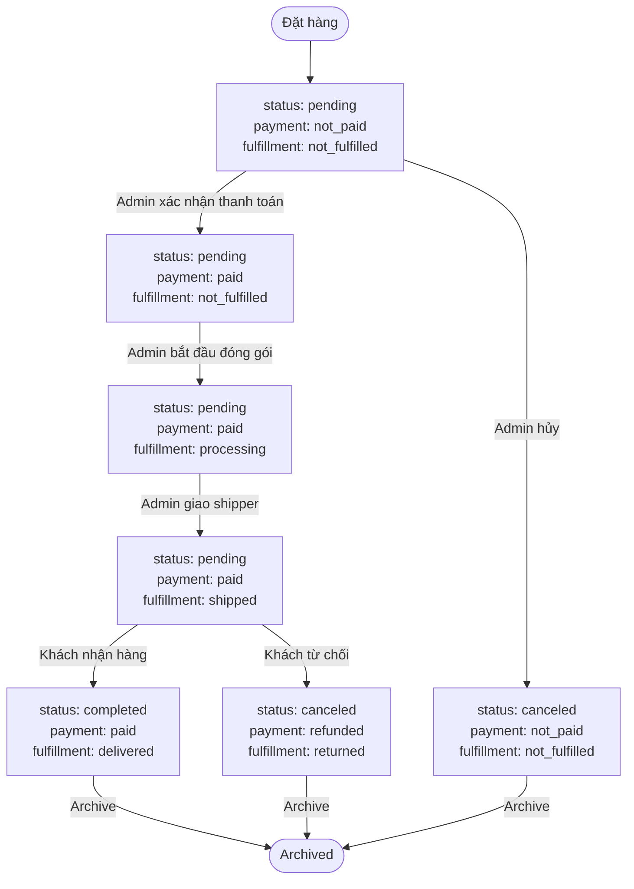

# 04 · Orders — State Machine

> Ba chiều trạng thái độc lập: **Order Status**, **Payment Status**, **Fulfillment Status**.

---

## 1. Order Status

### Các trạng thái

| Status | Mô tả | Hành động tiếp theo |
|---|---|---|
| `pending` | Đơn mới tạo, chờ xử lý | Tiếp tục xử lý hoặc hủy |
| `completed` | Đơn hoàn thành (đã giao + đã thanh toán) | Archive |
| `canceled` | Đơn bị hủy | Archive |
| `archived` | Lưu trữ, không hiển thị mặc định | Không thể thay đổi |

### State Diagram



---

## 2. Payment Status

### Các trạng thái

| Status | Mô tả |
|---|---|
| `not_paid` | Chưa thanh toán (trạng thái ban đầu) |
| `partially_paid` | Đã thanh toán một phần |
| `paid` | Đã thanh toán đủ |
| `refunded` | Đã hoàn tiền |

### State Diagram



---

## 3. Fulfillment Status

### Các trạng thái

| Status | Mô tả |
|---|---|
| `not_fulfilled` | Chưa bắt đầu đóng gói |
| `processing` | Đang chuẩn bị / đóng gói hàng |
| `shipped` | Đã giao cho shipper / đang giao |
| `delivered` | Khách đã nhận hàng |
| `returned` | Khách trả lại hàng |

### State Diagram



---

## 4. Ma trận trạng thái hợp lệ

Các kết hợp trạng thái phổ biến trong vòng đời đơn hàng:

| Giai đoạn | `status` | `payment_status` | `fulfillment_status` |
|---|---|---|---|
| Đặt hàng xong | `pending` | `not_paid` | `not_fulfilled` |
| Đã thanh toán | `pending` | `paid` | `not_fulfilled` |
| Đang đóng gói | `pending` | `paid` | `processing` |
| Đang giao hàng | `pending` | `paid` | `shipped` |
| Giao thành công | `completed` | `paid` | `delivered` |
| Khách hủy (chưa trả) | `canceled` | `not_paid` | `not_fulfilled` |
| Khách hủy (đã trả) | `canceled` | `refunded` | `not_fulfilled` |
| Lưu trữ | `archived` | any | any |

---

## 5. Transition Rules

### Điều kiện Complete đơn

```
status = pending → completed
Yêu cầu:
  - payment_status = "paid"
  - fulfillment_status = "delivered"
```

### Điều kiện Cancel đơn

```
status = pending → canceled
Cho phép khi:
  - fulfillment_status ∈ {not_fulfilled, processing}
Không cho phép khi:
  - fulfillment_status ∈ {shipped, delivered}
```

### Không cho phép

| Từ | Sang | Lý do |
|---|---|---|
| `completed` | `pending` | Đơn đã hoàn thành |
| `archived` | any | Đơn đã lưu trữ |
| `delivered` | `shipped` | Không thể quay lại |
| `paid` | `not_paid` | Không thể "unpay" |

---

## 6. Luồng trạng thái tổng hợp



---

## 7. Liên kết

- [Orders README](./README.md)
- [Finance (profit per status)](../07-finance/README.md)
