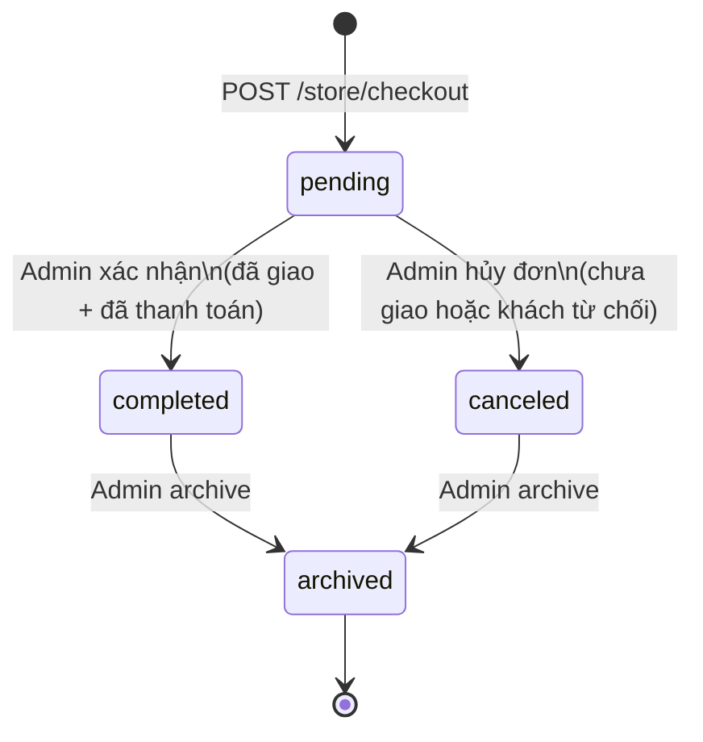
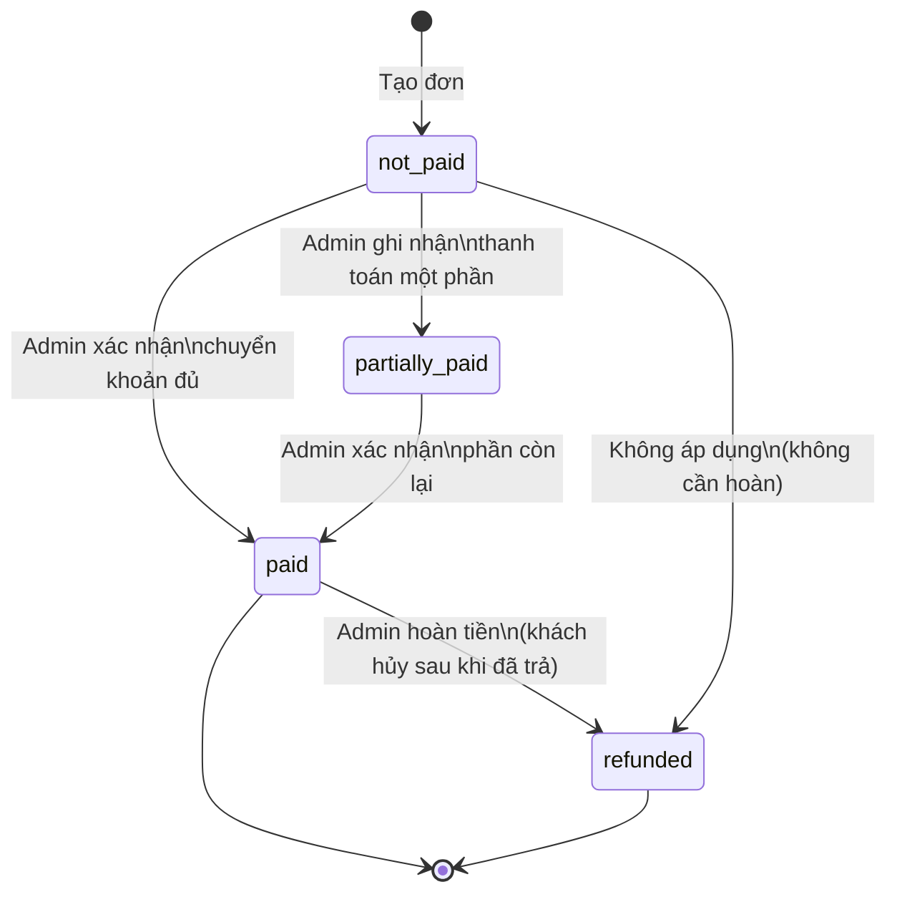
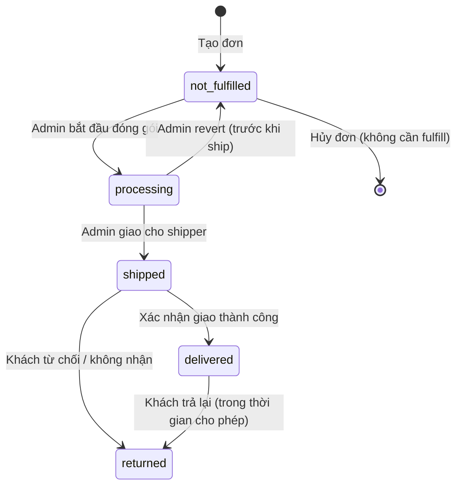
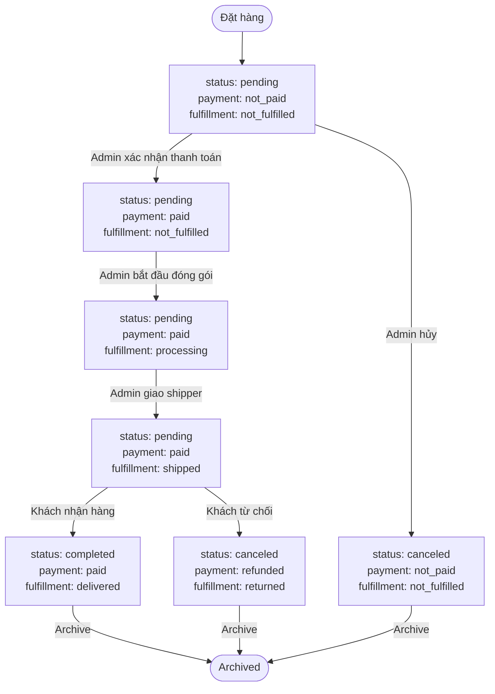

# 04 · Orders — State Machine

> Ba chiều trạng thái độc lập: **Order Status**, **Payment Status**, **Fulfillment Status**.
>
> Chỉ `status` là cột thật trên bảng `order` (core Medusa). `payment_status`
> và `fulfillment_status` không phải cột riêng — cả hai được lưu trong
> `order.metadata` (xem `POST /admin/custom/orders/:id/status`), vì Medusa
> v2 không cho ghi trực tiếp lên các trường đó theo cách project này cần.

---

## 1. Order Status

### Các trạng thái

| Status | Mô tả | Hành động tiếp theo |
|---|---|---|
| `pending` | Đơn mới tạo, chờ xử lý | Tiếp tục xử lý hoặc hủy |
| `completed` | Đơn hoàn thành (đã giao + đã thanh toán) | Archive |
| `canceled` | Đơn bị hủy | Archive |
| `archived` | Lưu trữ, không hiển thị mặc định | Không thể thay đổi |

### State Diagram


```mermaid
stateDiagram-v2
    [*] --> pending : POST /store/checkout

    pending --> completed : Admin xác nhận\n(đã giao + đã thanh toán)
    pending --> canceled : Admin hủy đơn\n(chưa giao hoặc khách từ chối)

    completed --> archived : Admin archive
    canceled --> archived : Admin archive

    archived --> [*]
```

---

## 2. Payment Status

### Các trạng thái

| Status | Mô tả |
|---|---|
| `not_paid` | Chưa thanh toán (trạng thái ban đầu) |
| `partially_paid` | Đã thanh toán một phần |
| `paid` | Đã thanh toán đủ |
| `refunded` | Đã hoàn tiền |

### State Diagram


```mermaid
stateDiagram-v2
    [*] --> not_paid : Tạo đơn

    not_paid --> partially_paid : Admin ghi nhận\nthanh toán một phần
    not_paid --> paid : Admin xác nhận\nchuyển khoản đủ
    partially_paid --> paid : Admin xác nhận\nphần còn lại
    paid --> refunded : Admin hoàn tiền\n(khách hủy sau khi đã trả)
    not_paid --> refunded : Không áp dụng\n(không cần hoàn)

    paid --> [*]
    refunded --> [*]
```

---

## 3. Fulfillment Status

### Các trạng thái

| Status | Mô tả |
|---|---|
| `not_fulfilled` | Chưa bắt đầu đóng gói |
| `processing` | Đang chuẩn bị / đóng gói hàng |
| `shipped` | Đã giao cho shipper / đang giao |
| `delivered` | Khách đã nhận hàng |
| `returned` | Khách trả lại hàng |

### State Diagram


```mermaid
stateDiagram-v2
    [*] --> not_fulfilled : Tạo đơn

    not_fulfilled --> processing : Admin bắt đầu đóng gói
    processing --> shipped : Admin giao cho shipper
    shipped --> delivered : Xác nhận giao thành công
    shipped --> returned : Khách từ chối / không nhận
    delivered --> returned : Khách trả lại (trong thời gian cho phép)

    not_fulfilled --> [*] : Hủy đơn (không cần fulfill)
    processing --> not_fulfilled : Admin revert (trước khi ship)
```

---

## 4. Ma trận trạng thái hợp lệ

Các kết hợp trạng thái phổ biến trong vòng đời đơn hàng:

| Giai đoạn | `status` | `payment_status` | `fulfillment_status` |
|---|---|---|---|
| Đặt hàng xong | `pending` | `not_paid` | `not_fulfilled` |
| Đã thanh toán | `pending` | `paid` | `not_fulfilled` |
| Đang đóng gói | `pending` | `paid` | `processing` |
| Đang giao hàng | `pending` | `paid` | `shipped` |
| Giao thành công | `completed` | `paid` | `delivered` |
| Khách hủy (chưa trả) | `canceled` | `not_paid` | `not_fulfilled` |
| Khách hủy (đã trả) | `canceled` | `refunded` | `not_fulfilled` |
| Lưu trữ | `archived` | any | any |

---

## 5. Transition Rules

> ⚠️ **Các quy tắc dưới đây KHÔNG được backend validate.** `POST
> /admin/custom/orders/:id/status` chấp nhận bất kỳ giá trị nào cho
> `status`/`payment_status`/`fulfillment_status` mà không kiểm tra
> transition có hợp lệ hay không — đây là quyết định thiết kế có chủ đích
> (admin cần toàn quyền sửa trạng thái thủ công, kể cả để sửa sai sót nhập
> liệu), không phải thiếu sót. Các bảng dưới đây là **hướng dẫn quy trình
> khuyến nghị cho admin**, không phải ràng buộc hệ thống — không có gì
> ngăn một request set `completed` ngược về `pending`, hay set `paid`
> ngược về `not_paid`.

### Điều kiện Complete đơn (khuyến nghị, không bắt buộc)

```
status = pending → completed
Khuyến nghị chỉ thực hiện khi:
  - payment_status = "paid"
  - fulfillment_status = "delivered"
```

### Điều kiện Cancel đơn (khuyến nghị, không bắt buộc)

```
status = pending → canceled
Khuyến nghị chỉ thực hiện khi:
  - fulfillment_status ∈ {not_fulfilled, processing}
Tránh thực hiện khi:
  - fulfillment_status ∈ {shipped, delivered}
```

### Nên tránh (nhưng hệ thống không chặn)

| Từ | Sang | Lý do |
|---|---|---|
| `completed` | `pending` | Đơn đã hoàn thành |
| `archived` | any | Đơn đã lưu trữ |
| `delivered` | `shipped` | Không thể quay lại |
| `paid` | `not_paid` | Không thể "unpay" |

---

## 6. Luồng trạng thái tổng hợp


```mermaid
flowchart TD
    START([Đặt hàng]) --> S1["status: pending\npayment: not_paid\nfulfillment: not_fulfilled"]

    S1 -->|Admin xác nhận thanh toán| S2["status: pending\npayment: paid\nfulfillment: not_fulfilled"]

    S2 -->|Admin bắt đầu đóng gói| S3["status: pending\npayment: paid\nfulfillment: processing"]

    S3 -->|Admin giao shipper| S4["status: pending\npayment: paid\nfulfillment: shipped"]

    S4 -->|Khách nhận hàng| S5["status: completed\npayment: paid\nfulfillment: delivered"]

    S4 -->|Khách từ chối| S6["status: canceled\npayment: refunded\nfulfillment: returned"]

    S1 -->|Admin hủy| S7["status: canceled\npayment: not_paid\nfulfillment: not_fulfilled"]

    S5 -->|Archive| DONE([Archived])
    S6 -->|Archive| DONE
    S7 -->|Archive| DONE
```

---

## 7. Liên kết

- [Orders README](./README.md)
