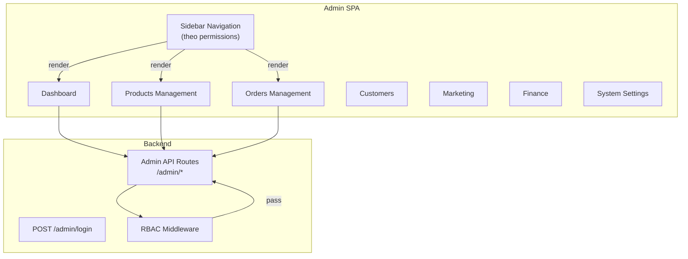
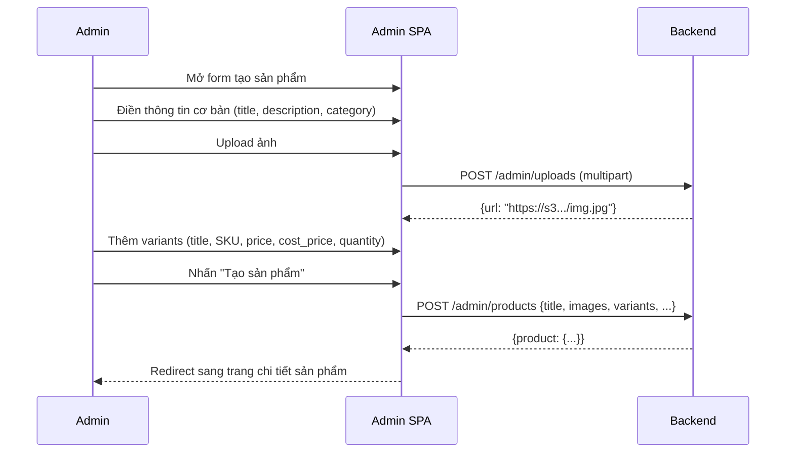
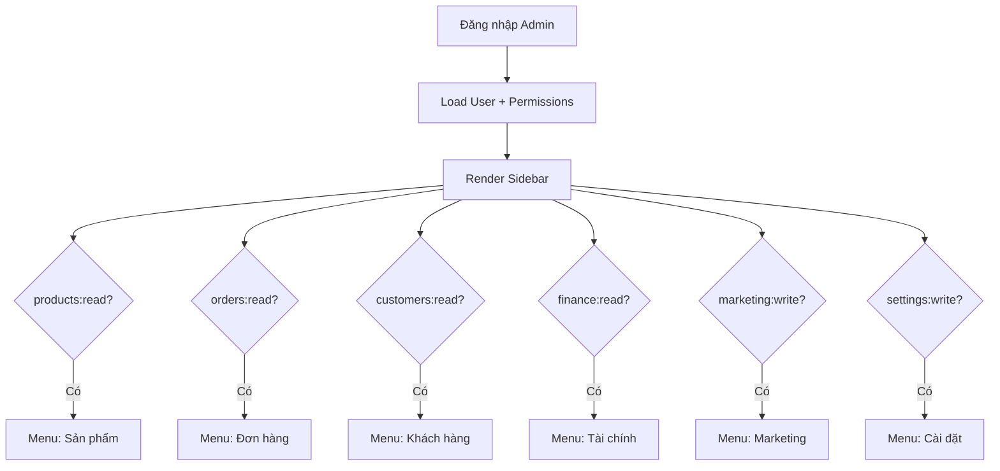

# 05 · Admin — Tổng quan

> Giao diện quản trị Admin SPA cho phép quản lý toàn bộ hệ thống: sản phẩm, đơn hàng, khách hàng, marketing, tài chính.

---

## 1. Tổng quan kiến trúc Admin

---

## 2. Quản lý Sản phẩm (Admin)

### Use Cases

| Use Case | Actor | Precondition | Flow |
|---|---|---|---|
| Tạo sản phẩm | Admin có `products:write` | Đã đăng nhập | Form → POST /admin/products |
| Thêm variant | Admin | Sản phẩm tồn tại | Form variant → POST /admin/products/:id/variants |
| Upload ảnh | Admin | Sản phẩm tồn tại | Chọn file → POST /admin/uploads → gắn URL |
| Publish sản phẩm | Admin | Draft, đủ variant + giá | PUT status=published |
| Archive sản phẩm | Admin | Đang published | PUT status=archived |
| Cập nhật tồn kho | Admin | Sản phẩm tồn tại | PUT inventory_quantity |

### Luồng tạo sản phẩm

---

## 3. Quản lý Đơn hàng (Admin)

### Use Cases

| Use Case | Actor | Flow |
|---|---|---|
| Xem danh sách đơn | Admin `orders:read` | Bảng với filter/search |
| Xem chi tiết đơn | Admin `orders:read` | Click vào đơn |
| Xác nhận thanh toán | Admin `orders:write` | Cập nhật payment_status=paid |
| Cập nhật giao hàng | Admin `orders:write` | Cập nhật fulfillment_status |
| Hủy đơn | Admin `orders:write` | status=canceled (nếu chưa ship) |
| Hoàn thành đơn | Admin `orders:write` | status=completed |

---

## 4. Quản lý Khách hàng (Admin)

### API Endpoints

| Method | Path | Mô tả | Permission |
|---|---|---|---|
| `GET` | `/admin/customers` | Danh sách khách hàng | `customers:read` |
| `GET` | `/admin/customers/:id` | Chi tiết + lịch sử đơn | `customers:read` |
| `GET` | `/admin/customers/:id/orders` | Đơn hàng của khách | `customers:read` |

---

## 5. Dashboard Overview

### Widgets hiển thị

| Widget | Data source | Mô tả |
|---|---|---|
| Tổng đơn hôm nay | `/admin/finance/summary?period=today` | Count orders |
| Doanh thu hôm nay | `/admin/finance/summary?period=today` | Sum order.total |
| Đơn chưa xử lý | `/admin/orders?status=pending` | Count |
| Đơn chưa thanh toán | `/admin/orders?payment_status=not_paid` | Count |
| Top sản phẩm | `/admin/finance/top-products` | Bestsellers |
| Biểu đồ doanh thu 7 ngày | `/admin/finance/chart?period=7d` | Line chart |

---

## 6. Navigation theo Permissions

---

## 7. Liên kết

- [RBAC chi tiết](./rbac.md)
- [Orders](../04-orders/README.md)
- [Products](../02-products/README.md)
- [Finance](../07-finance/README.md)
