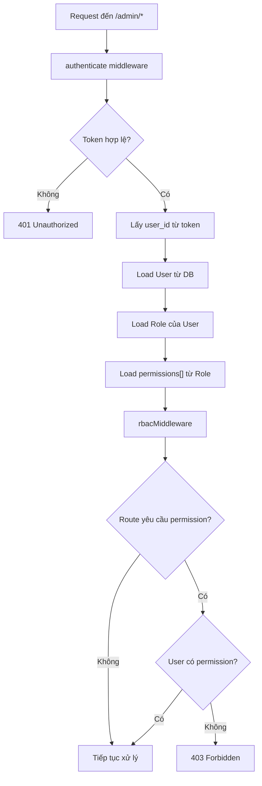

# 05 · Admin — RBAC (Role-Based Access Control)

> Hệ thống phân quyền dựa trên Role và Permission cho toàn bộ Admin routes.

---

## 1. Tổng quan


**Nguyên tắc**:
- Mỗi user thuộc **một** role
- Mỗi role có một tập **permissions**
- Permissions lưu dưới dạng **JSON array** trong role
- Middleware kiểm tra permission trước khi xử lý request

---

## 2. Data Models

### Role

| Trường | Kiểu | Mô tả |
|---|---|---|
| `id` | string | PK |
| `name` | string | Tên role (VD: "Admin", "Staff") |
| `description` | string | Mô tả vai trò |
| `guard_name` | string | Scope guard (VD: "admin") |
| `is_default` | boolean | Role mặc định khi tạo user mới |
| `permissions` | jsonb | Mảng permission names |
| `created_at` | timestamp | |
| `updated_at` | timestamp | |

**Ví dụ**:
```json
{
  "id": "role_01XXXXX",
  "name": "Staff",
  "guard_name": "admin",
  "is_default": false,
  "permissions": ["products:read", "orders:read", "orders:write", "customers:read"]
}
```

### Permission

| Trường | Kiểu | Mô tả |
|---|---|---|
| `id` | string | PK |
| `name` | string | Tên permission (VD: "products:write") |
| `guard_name` | string | Scope guard |

---

## 3. Danh sách Permissions

### Products

| Permission | Mô tả |
|---|---|
| `products:read` | Xem danh sách và chi tiết sản phẩm |
| `products:write` | Tạo, sửa sản phẩm và variant |
| `products:delete` | Xóa sản phẩm / archive |

### Orders

| Permission | Mô tả |
|---|---|
| `orders:read` | Xem đơn hàng |
| `orders:write` | Cập nhật trạng thái đơn hàng |
| `orders:cancel` | Hủy đơn hàng |

### Customers

| Permission | Mô tả |
|---|---|
| `customers:read` | Xem thông tin khách hàng |
| `customers:write` | Sửa thông tin khách hàng |

### Marketing

| Permission | Mô tả |
|---|---|
| `marketing:read` | Xem promotions, banners |
| `marketing:write` | Tạo, sửa promotions, banners |

### Finance

| Permission | Mô tả |
|---|---|
| `finance:read` | Xem báo cáo tài chính |
| `finance:write` | Sửa cost settings |

### Settings

| Permission | Mô tả |
|---|---|
| `settings:read` | Xem cài đặt hệ thống |
| `settings:write` | Sửa cài đặt hệ thống |

### RBAC Management

| Permission | Mô tả |
|---|---|
| `roles:read` | Xem roles |
| `roles:write` | Tạo, sửa roles và permissions |

---

## 4. Roles mặc định

| Role | Permissions |
|---|---|
| **Super Admin** | Tất cả permissions |
| **Admin** | Tất cả trừ `roles:write`, `settings:write` |
| **Staff** | `products:read`, `orders:read`, `orders:write`, `customers:read` |
| **Finance** | `finance:read`, `finance:write`, `orders:read` |

---

## 5. RBAC Middleware Flow



---

## 6. API Endpoints — RBAC Management

| Method | Path | Mô tả | Permission |
|---|---|---|---|
| `GET` | `/admin/roles` | Danh sách roles | `roles:read` |
| `POST` | `/admin/roles` | Tạo role mới | `roles:write` |
| `PUT` | `/admin/roles/:id` | Cập nhật role | `roles:write` |
| `DELETE` | `/admin/roles/:id` | Xóa role | `roles:write` |
| `GET` | `/admin/permissions` | Danh sách permissions | `roles:read` |
| `PUT` | `/admin/users/:id/role` | Gán role cho user | `roles:write` |

### Request Body — Tạo Role

```json
{
  "name": "Warehouse Staff",
  "description": "Nhân viên kho, chỉ xem đơn và cập nhật giao hàng",
  "guard_name": "admin",
  "permissions": ["orders:read", "orders:write"]
}
```

---

## 7. Route → Permission Mapping

| Route | Permission yêu cầu |
|---|---|
| `GET /admin/products` | `products:read` |
| `POST /admin/products` | `products:write` |
| `PUT /admin/products/:id` | `products:write` |
| `DELETE /admin/products/:id` | `products:delete` |
| `GET /admin/orders` | `orders:read` |
| `POST /admin/custom/orders/:id/status` | `orders:write` |
| `GET /admin/customers` | `customers:read` |
| `GET /admin/finance/*` | `finance:read` |
| `PUT /admin/finance/settings` | `finance:write` |
| `GET /admin/roles` | `roles:read` |
| `POST /admin/roles` | `roles:write` |
| `GET /admin/settings` | `settings:read` |
| `PUT /admin/settings` | `settings:write` |

---

## 8. Implementation Notes

### Middleware Code Pattern

```typescript
// Pseudo-code
export const rbacMiddleware = (requiredPermission: string) => {
  return async (req, res, next) => {
    const user = req.user; // set by authenticate middleware
    const role = await RoleRepository.findById(user.role_id);

    if (!role.permissions.includes(requiredPermission)) {
      return res.status(403).json({ message: "Forbidden" });
    }

    next();
  };
};

// Usage on route:
router.get("/products", authenticate, rbacMiddleware("products:read"), ProductController.list);
```

---

## 9. Edge Cases

| Tình huống | Xử lý |
|---|---|
| User không có role | Từ chối tất cả /admin/* routes |
| Role bị xóa | User không thể login hoặc mất quyền |
| Permission mới thêm | Phải gán thủ công vào roles cần thiết |
| Super Admin | Bypass RBAC check (hardcoded) |

---

## 10. Liên kết

- [Admin README](./README.md)
- [Auth flows](../01-auth/flows.md)
