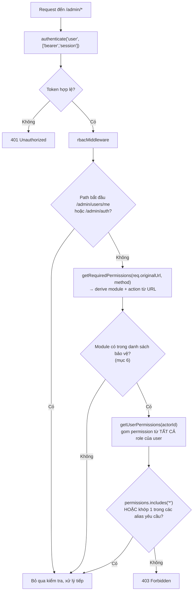

# 05 · Admin — RBAC (Role-Based Access Control)

> Hệ thống phân quyền dựa trên Role và Permission cho các Admin route **có đăng ký RBAC**. Không phải mọi route `/admin/*` đều được bảo vệ — xem mục 6.

---

## 1. Tổng quan

```mermaid
graph LR
    U["Admin User"] -->|metadata.roles: id[]| R["Role"]
    R -->|permissions: id[]| P["Permission[]"]
    P -->|resolve tên qua DB| NAME["permission.name"]
    NAME -->|so khớp| ROUTE["Admin Route"]
```

**Nguyên tắc thật** (khác một số giả định trực quan):
- User có thể thuộc **nhiều role cùng lúc** — `user.metadata.roles` là **mảng id role**, không phải 1 role duy nhất
- `role.permissions` lưu **mảng id permission** (không phải mảng tên permission) — tên chỉ resolve ra khi cần check (`lib/rbac.ts`'s `getUserPermissions`)
- Permission được yêu cầu cho một request **không tra từ bảng tĩnh** — được **tính động** từ URL + method lúc request tới (`middlewares/rbac.ts`'s `getRequiredPermissions`), xem mục 7
- Tên permission dùng dấu **chấm** (`products.read`), không phải dấu hai chấm

---

## 2. Data Models

### Role

| Trường | Kiểu | Mô tả |
|---|---|---|
| `id` | string | PK |
| `name` | string | Tên role (VD: "Manager", "Staff") |
| `description` | string \| null | |
| `guard_name` | string | Mặc định `"admin"` |
| `is_default` | boolean | Role gán mặc định cho user mới (seed hiện đặt cho "Manager") |
| `permissions` | jsonb | **Mảng id permission** (không phải mảng tên) |
| `created_at` / `updated_at` / `deleted_at` | timestamp | |

**Ví dụ thật** (rút gọn từ seed data):
```json
{
  "id": "01M1HD3G8MBZ9EV4JNRKF7AWBF",
  "name": "Staff",
  "guard_name": "admin",
  "is_default": false,
  "permissions": ["01M1HD3G89YTJ73YPFD03MWD04", "01M1HD3G894ARY6HBCZ1VWHVV3", "..."]
}
```
Muốn biết role có quyền gì phải JOIN sang bảng `permission` theo các id này — hoặc gọi `GET /admin/roles/:id` rồi tra `permission.name` tương ứng qua `GET /admin/permissions`.

### Permission

| Trường | Kiểu | Mô tả |
|---|---|---|
| `id` | string | PK |
| `name` | string | Format `<module>.<action>`, VD `orders.read` |
| `description` | string \| null | |
| `guard_name` | string | Mặc định `"admin"` |

Có unique constraint trên `(name, guard_name)` khi chưa xóa mềm (`deleted_at is null`).

---

## 3. Danh sách Permissions thật (từ seed data)

Mỗi module dưới đây có đủ 4 action: `read`, `create`, `edit`, `delete` (trừ khi ghi chú khác):

| Module | Ghi chú |
|---|---|
| `users` | Quản lý admin user |
| `roles` | Quản lý role |
| `permissions` | Quản lý permission |
| `orders` | Đơn hàng |
| `products` | Sản phẩm, variant |
| `categories` | Danh mục sản phẩm (route `/admin/product-categories`) |
| `customers` | Khách hàng |
| `promotions` | Khuyến mãi |
| `inventory` | Tồn kho (route `/admin/custom/inventory`) |
| `ingredients` | Nguyên liệu + công thức (route `/admin/ingredients`, `/admin/recipes`) |
| `banners` | Banner trang chủ |
| `media` | Upload/quản lý ảnh |
| `blog` | Blog post (route thật `/admin/blog-posts` map vào `settings`, xem mục 7) |
| `blog-categories` | Danh mục blog |
| `finance` | Dashboard doanh thu/lợi nhuận (`/admin/custom?mode=dashboard`) |
| `content` | Kiểm duyệt review khách hàng (route `/admin/reviews`) |
| `chatbot` | (route `/admin/chatbot/*` map vào `settings`, xem mục 7) |
| `search` | Cấu hình search |
| `settings` | Cài đặt hệ thống + cost settings |

> **Không có** permission riêng cho `recipes` hay `reviews` — hai route này dùng chung permission của `ingredients` và `content` (xem mục 7). Đây là quyết định thiết kế vì hai resource này gắn chặt về nghiệp vụ với module tương ứng, không phải thiếu sót.

---

## 4. Roles mặc định (từ `backend/src/scripts/seed.ts`)

| Role | Permissions thật |
|---|---|
| **Super Admin** | **Tất cả** permission trong bảng trên |
| **Manager** *(is_default)* | `orders.*`, `finance.read`, `products.*` (trừ delete), `promotions.*` (trừ delete), `categories.*` (trừ delete), `inventory.read/edit`, `ingredients.read/edit`, `customers.read/edit` |
| **Staff** | `orders.read/edit/create`, `products.read`, `inventory.read`, `customers.read` |

Không có role "Admin" hay "Finance" như một số tài liệu cũ mô tả — chỉ có 3 role trên.

**Super Admin bypass**: user được coi là Super Admin theo **1 trong 2** điều kiện độc lập với việc có role "Super Admin" hay không:
1. `user.metadata.is_super_admin === true`, hoặc
2. Email user nằm trong env `SUPER_ADMIN_EMAILS` (danh sách phân tách bởi dấu phẩy)

Cả hai đều **không được seed mặc định** — user seed `admin@mongfruitbox.com` chỉ có full quyền vì role "Super Admin" của nó nắm **toàn bộ permission hiện có trong bảng**, không phải nhờ bypass này.

---

## 5. RBAC Middleware Flow (thật)


```mermaid
flowchart TD
    A["Request đến /admin/*"] --> B["authenticate('user', ['bearer','session'])"]
    B --> C{Token hợp lệ?}
    C -- Không --> D["401 Unauthorized"]
    C -- Có --> E["rbacMiddleware"]
    E --> F{"Path bắt đầu /admin/users/me\nhoặc /admin/auth?"}
    F -- Có --> K["Bỏ qua kiểm tra, xử lý tiếp"]
    F -- Không --> G["getRequiredPermissions(req.originalUrl, method)\n→ derive module + action từ URL"]
    G --> H{"Module có trong danh sách bảo vệ?\n(mục 6)"}
    H -- Không --> K
    H -- Có --> I["getUserPermissions(actorId)\ngom permission từ TẤT CẢ role của user"]
    I --> J{"permissions.includes('*')\nHOẶC khớp 1 trong các alias yêu cầu?"}
    J -- Không --> L["403 Forbidden"]
    J -- Có --> K
```

**Khác biệt quan trọng so với hình dung thông thường**: middleware dùng `req.originalUrl` (path đầy đủ), **không phải** `req.path` — vì middleware được mount tại `/admin/*`, `req.path` bên trong nó luôn chỉ là `"/"`. Đây từng là bug khiến RBAC hoàn toàn không hoạt động (đã sửa).

---

## 6. API Endpoints — RBAC Management

Update dùng **`POST`**, không phải `PUT` — quy ước xuyên suốt toàn bộ custom route trong dự án này (không riêng RBAC).

| Method | Path | Mô tả | Permission yêu cầu |
|---|---|---|---|
| `GET` | `/admin/roles` | Danh sách roles (hỗ trợ filter `?name=`) | `roles.read`/`.view`/`.list` |
| `POST` | `/admin/roles` | Tạo role mới | `roles.create`/`.add`/`.write` |
| `POST` | `/admin/roles/:id` | Cập nhật role | `roles.edit`/`.update`/`.write` |
| `DELETE` | `/admin/roles/:id` | Xóa role (chặn nếu đang gán cho user, trả `409`) | `roles.delete`/`.remove`/`.write` |
| `GET` | `/admin/permissions` | Danh sách permissions | `permissions.read`/`.view`/`.list` |
| `POST` | `/admin/roles/:id/permissions` | Gán lại toàn bộ permission cho role | `roles.edit`/`.update`/`.write` |
| `POST` | `/admin/users/:id/roles` | Gán role cho user (không phải `/admin/users/:id/role` số ít) | `users.edit`/`.update`/`.write` |
| `GET` | `/admin/users/me/permissions` | Lấy permission của chính mình | Không kiểm tra (loại trừ RBAC) |

### Request Body — Tạo Role

```json
{
  "name": "Warehouse Staff",
  "description": "Nhân viên kho, chỉ xem đơn và cập nhật giao hàng",
  "permissions": ["01M1HD3G89YTJ73YPFD03MWD04", "01M1HD3G894ARY6HBCZ1VWHVV3"]
}
```
`permissions` nhận **id**, không phải tên — lấy id từ `GET /admin/permissions` trước.

---

## 7. Cách permission được suy ra từ Route (thật, không phải bảng tĩnh)

`getRequiredPermissions(path, method)` trong `backend/src/api/middlewares/rbac.ts` tính động theo quy tắc:

1. Lấy segment đầu tiên sau `/admin/` làm `moduleName` (VD `/admin/products/:id` → `products`)
2. Vài `moduleName` được **remap** sang permission module khác:
   - `product-categories` → `categories`
   - `blog-posts`, `chatbot` → `settings`
   - `recipes` → `ingredients`
   - `reviews` → `content`
3. `/admin/custom/*` là ngoại lệ, xử lý riêng theo path con vì gộp nhiều resource không liên quan dưới 1 tiền tố:
   - `/admin/custom/orders/...` → module `orders`
   - `/admin/custom/inventory...` → module `inventory`
   - `/admin/custom` trần (GET, dashboard/settings) → chấp nhận `finance.read` **hoặc** `settings.read`
   - `/admin/custom` trần (POST, lưu settings) → yêu cầu `settings.edit`
4. Action suy từ HTTP method + có id trong path hay không:
   - `DELETE` → `delete`
   - `POST` + không có id trong path (và không phải module `settings`) → `create`
   - `GET` → `read`
   - còn lại (`POST` có id, `PUT`...) → `edit`
5. Mỗi action mở rộng thành **alias set** — chỉ cần khớp 1 alias là qua:
   ```
   read:   read, view, list
   create: create, add, write
   edit:   edit, update, write
   delete: delete, remove, write
   ```
   Lưu ý: `write` xuất hiện ở cả `create`, `edit`, `delete` — một permission tên `<module>.write` (nếu ai đó tự tạo qua `/admin/permissions`) sẽ thỏa **cả 3** action đó cùng lúc.

**Ví dụ áp dụng** (không phải bảng permission cố định — chỉ minh họa kết quả của thuật toán trên):

| Route | Method | → Permission cần (1 trong các alias) |
|---|---|---|
| `GET /admin/products` | GET | `products.read`/`.view`/`.list` |
| `POST /admin/products` | POST | `products.create`/`.add`/`.write` |
| `POST /admin/products/:id` | POST | `products.edit`/`.update`/`.write` |
| `DELETE /admin/products/:id` | DELETE | `products.delete`/`.remove`/`.write` |
| `POST /admin/custom/orders/:id/status` | POST | `orders.edit`/`.update`/`.write` |
| `GET /admin/custom?mode=dashboard` | GET | `finance.read...` hoặc `settings.read...` |

### Route KHÔNG được RBAC bảo vệ

`/admin/users/me*` và mọi path bắt đầu `/admin/auth*` được **loại trừ hoàn toàn** khỏi bước 3 trở đi — chỉ cần token hợp lệ là qua, bất kể quyền gì.

---

## 8. Implementation Notes

### Middleware — logic thật (rút gọn, không phải pseudo-code)

```typescript
// backend/src/api/middlewares/rbac.ts (rút gọn)
export async function rbacMiddleware(req, res, next) {
  const actorId = req.auth_context.app_metadata?.user_id || req.auth_context.actor_id
  const fullPath = (req.originalUrl || req.url || "").split("?")[0] // KHÔNG dùng req.path
  const requiredPermissions = getRequiredPermissions(fullPath, req.method.toUpperCase())

  if (!actorId || !requiredPermissions.length) return next() // module không nằm trong danh sách bảo vệ → cho qua

  const permissions = await getUserPermissions(req.scope, actorId) // gộp permission từ mọi role của user
  const allowed = permissions.includes("*") || permissions.some(p => requiredPermissions.includes(p))

  if (!allowed) return res.status(403).json({ code: "FORBIDDEN", message: `Requires one of: ${requiredPermissions.join(", ")}` })
  return next()
}
```

### Đăng ký middleware

`backend/src/api/middlewares.ts`: `{ matcher: "/admin/*", middlewares: [authenticate("user", [...]), rbacMiddleware] }` — áp dụng cho **toàn bộ** `/admin/*`, không cấu hình riêng lẻ từng route.

---

## 9. Edge Cases

| Tình huống | Xử lý thật |
|---|---|
| User không có role nào | `getUserPermissions` trả mảng rỗng → mọi route có yêu cầu permission đều `403` |
| Role bị xóa nhưng user vẫn còn id role đó trong `metadata.roles` | Role không tồn tại bị bỏ qua khi query — user coi như không có quyền từ role đó (không lỗi, không crash) |
| Xóa role đang gán cho user | Bị chặn, trả `409` kèm tên user đang giữ role (đã thêm bảo vệ) |
| Module admin mới thêm nhưng quên đăng ký vào `protectedModules` | **Không có bảo vệ gì cả** — bất kỳ user đăng nhập nào cũng gọi được, kể cả không có permission (đây từng là lỗ hổng thật ở 6 module, đã vá) |
| Super Admin | Bypass hoàn toàn nếu `metadata.is_super_admin === true` hoặc email trong `SUPER_ADMIN_EMAILS` — **không phải** cơ chế "hardcoded" đơn giản như một role tên cố định |

---

## 10. Liên kết

- [Admin README](./README.md)
- [Auth flows](../01-auth/flows.md)
