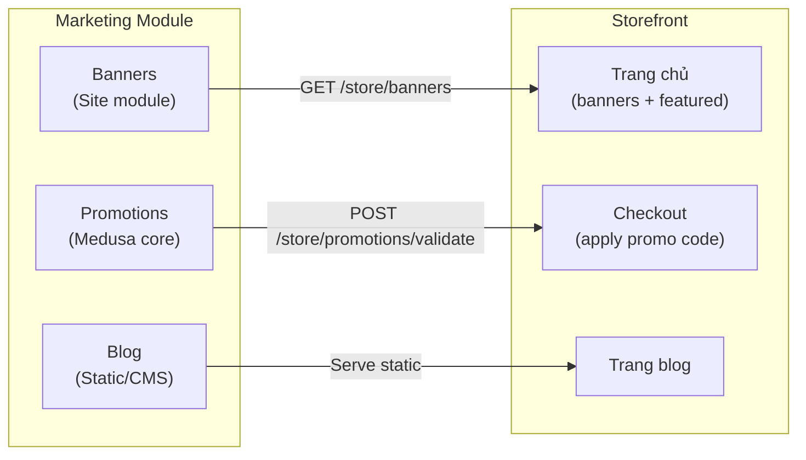
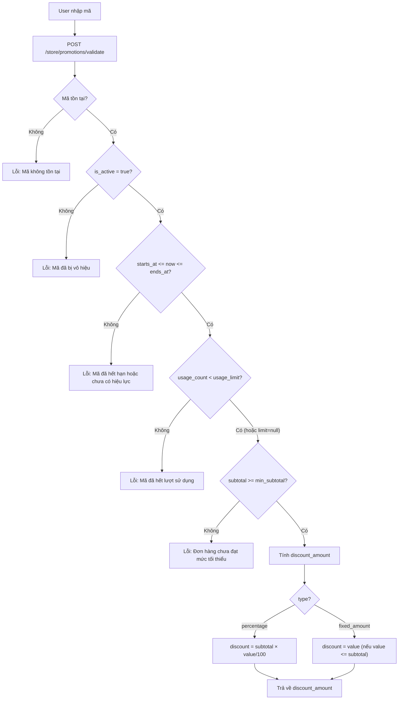
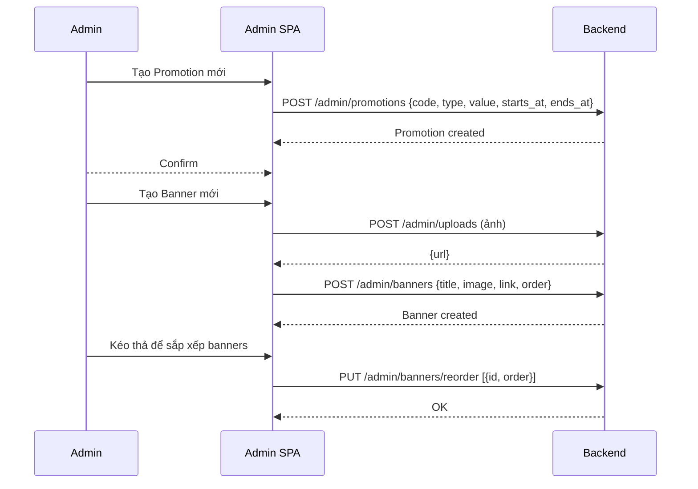

# 06 · Marketing — Tổng quan

> Module Marketing quản lý các công cụ khuyến mãi và tiếp thị: **Promotions** (mã giảm giá), **Banners** (slider trang chủ), **Blog** (nội dung tĩnh).

---

## 1. Tổng quan



---

## 2. Promotions (Mã giảm giá)

### Data Model — Promotion

| Trường | Kiểu | Mô tả |
|---|---|---|
| `id` | string | PK |
| `code` | string | Mã coupon (VD: "SUMMER20"), unique, uppercase |
| `type` | enum | `percentage` hoặc `fixed_amount` |
| `value` | number | Giá trị giảm (% hoặc VND) |
| `campaign_id` | string | FK → Campaign (nullable) |
| `starts_at` | timestamp | Ngày bắt đầu hiệu lực |
| `ends_at` | timestamp | Ngày hết hạn |
| `usage_limit` | number | Số lần dùng tối đa (nullable = không giới hạn) |
| `usage_count` | number | Số lần đã dùng |
| `min_subtotal` | number | Đơn hàng tối thiểu để áp dụng |
| `is_active` | boolean | Bật/tắt promotion |

### Data Model — Campaign

| Trường | Kiểu | Mô tả |
|---|---|---|
| `id` | string | PK |
| `name` | string | Tên chiến dịch |
| `budget_type` | enum | `spend` hoặc `usage` |
| `budget_limit` | number | Ngân sách tối đa |
| `starts_at` | timestamp | |
| `ends_at` | timestamp | |

### Promotion Types

| Type | Mô tả | Ví dụ |
|---|---|---|
| `percentage` | Giảm theo % | 20% off → giảm 20% subtotal |
| `fixed_amount` | Giảm số tiền cố định | Giảm 50,000 VND |

### API Endpoints — Promotions

| Method | Path | Mô tả | Auth |
|---|---|---|---|
| `POST` | `/store/promotions/validate` | Validate mã coupon | Public |
| `GET` | `/admin/promotions` | Danh sách promotions | `marketing:read` |
| `POST` | `/admin/promotions` | Tạo promotion mới | `marketing:write` |
| `PUT` | `/admin/promotions/:id` | Cập nhật promotion | `marketing:write` |
| `DELETE` | `/admin/promotions/:id` | Xóa promotion | `marketing:write` |
| `GET` | `/admin/campaigns` | Danh sách campaigns | `marketing:read` |
| `POST` | `/admin/campaigns` | Tạo campaign | `marketing:write` |

### Luồng apply Promotion tại Checkout



### Validation Rules — Promotion

| Rule | Mô tả |
|---|---|
| Code uppercase | Tự động chuyển code thành chữ hoa |
| Unique code | Mỗi mã chỉ tồn tại một lần |
| `ends_at > starts_at` | Ngày hết hạn phải sau ngày bắt đầu |
| `value > 0` | Giá trị giảm phải dương |
| `percentage <= 100` | Không vượt 100% |
| Double-check tại checkout | Server validate lại khi POST /store/checkout |

---

## 3. Banners (Slider trang chủ)

### Data Model — Banner

| Trường | Kiểu | Mô tả |
|---|---|---|
| `id` | string | PK |
| `title` | string | Tiêu đề banner |
| `subtitle` | string | Mô tả phụ |
| `image` | string | URL ảnh (từ S3) |
| `link` | string | URL click-through (nullable) |
| `order` | number | Thứ tự hiển thị (ASC) |
| `active` | boolean | Hiển thị hay ẩn |
| `created_at` | timestamp | |

### API Endpoints — Banners

| Method | Path | Mô tả | Auth |
|---|---|---|---|
| `GET` | `/store/banners` | Lấy banners active | Public |
| `GET` | `/admin/banners` | Tất cả banners | `marketing:read` |
| `POST` | `/admin/banners` | Tạo banner | `marketing:write` |
| `PUT` | `/admin/banners/:id` | Cập nhật banner | `marketing:write` |
| `DELETE` | `/admin/banners/:id` | Xóa banner | `marketing:write` |
| `PUT` | `/admin/banners/reorder` | Sắp xếp lại thứ tự | `marketing:write` |

### Response `/store/banners`

```json
{
  "banners": [
    {
      "id": "banner_01",
      "title": "Trái cây tươi mỗi ngày",
      "subtitle": "Giao hàng trong 1 giờ",
      "image": "https://s3.../banner1.jpg",
      "link": "/products",
      "order": 1
    }
  ]
}
```

---

## 4. Blog

> Blog hiện tại là **static content** hoặc tích hợp CMS đơn giản. Chưa có API động.

### Cấu trúc hiện tại

```
/blog
  /bai-viet-1           → Static page hoặc CMS entry
  /meo-bao-quan-trai-cay
  /...
```

### Kế hoạch tương lai (nếu cần động)

| Trường | Kiểu | Mô tả |
|---|---|---|
| `id` | string | PK |
| `title` | string | Tiêu đề bài |
| `slug` | string | URL slug |
| `content` | text | Nội dung (Markdown/HTML) |
| `author` | string | Tác giả |
| `published_at` | timestamp | |
| `thumbnail` | string | Ảnh đại diện |
| `tags` | string[] | Tags |

---

## 5. Luồng quản lý Marketing (Admin)



---

## 6. Edge Cases

| Tình huống | Xử lý |
|---|---|
| Áp 2 promotion cùng lúc | Hệ thống chỉ cho phép 1 mã tại 1 thời điểm |
| Banner không có ảnh | Validate bắt buộc có `image` URL |
| Banner `active=false` | Không trả về trong `/store/banners` |
| Promotion dùng đúng giờ expires | Server kiểm tra `ends_at` tại thời điểm checkout |

---

## 7. Liên kết

- [Cart & Checkout (áp promo)](../03-cart-checkout/README.md)
- [Site Module (banners)](../08-system/README.md)
- [Finance (promo impact)](../07-finance/README.md)
