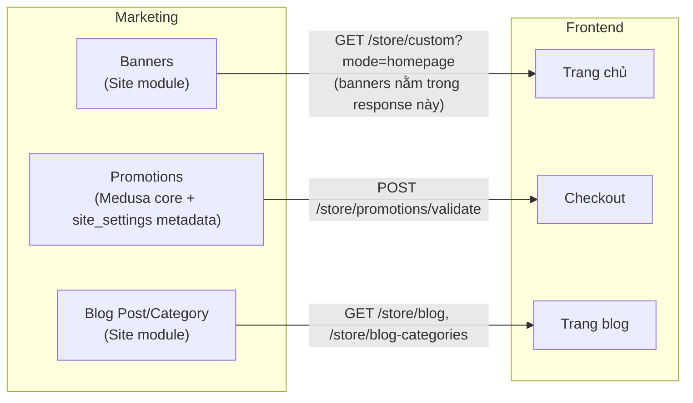
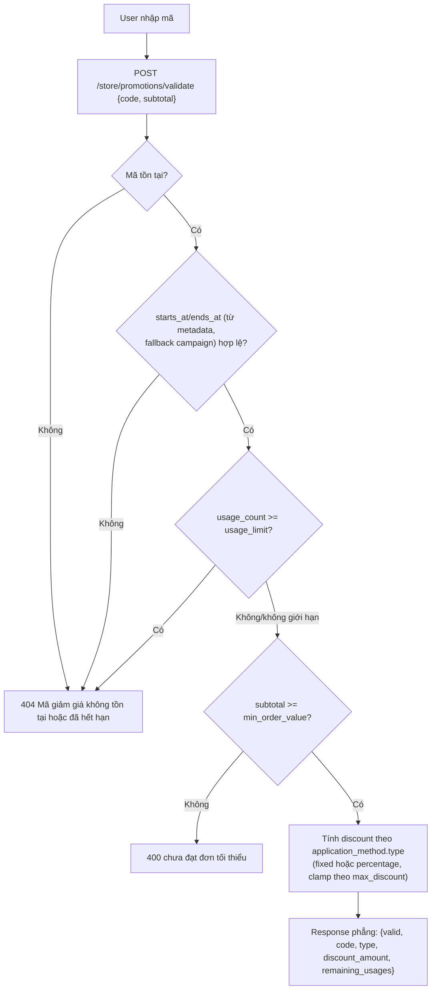
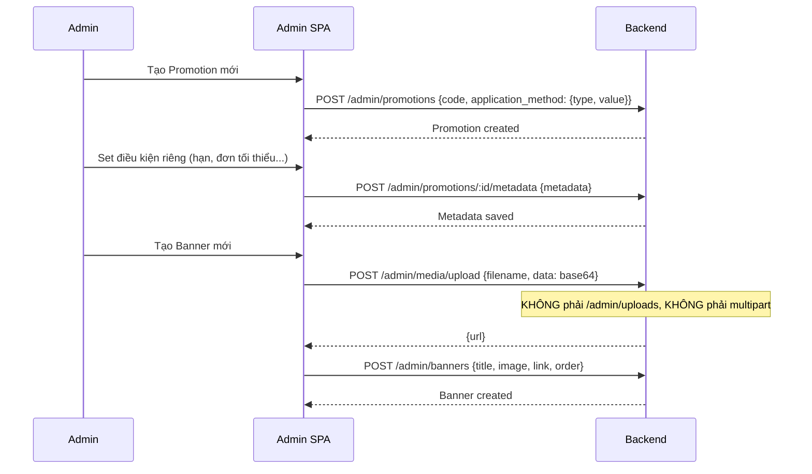

# 06 · Marketing — Tổng quan

> Module Marketing quản lý **Promotions** (mã giảm giá, core Medusa + metadata tùy biến), **Banners** (Site module), **Blog** (Site module, **đã có API động** — không phải static content như tài liệu cũ). Toàn bộ response custom route bọc trong envelope `{ data, error, meta }`, ví dụ dưới đây chỉ hiện phần `data`.

---

## 1. Tổng quan

```mermaid
graph LR
    subgraph Marketing
        PROMO["Promotions\n(Medusa core + site_settings metadata)"]
        BANNER["Banners\n(Site module)"]
        BLOG["Blog Post/Category\n(Site module)"]
    end

    subgraph Frontend
        HOME["Trang chủ"]
        CART["Checkout"]
        BLOG_PAGE["Trang blog"]
    end

    BANNER -->|"GET /store/custom?mode=homepage\n(banners nằm trong response này)"| HOME
    PROMO -->|POST /store/promotions/validate| CART
    BLOG -->|"GET /store/blog, /store/blog-categories"| BLOG_PAGE
```

**Không có** `GET /store/banners` riêng — banner trang chủ nằm trong `data.banners` của `GET /store/custom?mode=homepage` (cùng response với site settings).

---

## 2. Promotions (Mã giảm giá)

### Data Model — thật, không phải 1 bảng custom

`Promotion` là entity **core Medusa** (`Modules.PROMOTION`), có `code`, `application_method` (chứa `type`: `"fixed"` hoặc `"percentage"`, `value`), có thể liên kết `campaign` (core Medusa, có `budget`).

Các field nghiệp vụ riêng của dự án này — **`starts_at`, `ends_at`, `usage_limit`, `min_order_value`, `max_discount`** — **không nằm trên bảng promotion** mà lưu trong `site_settings` (key `promotion:<id>:metadata`, xem `backend/src/lib/promotion-metadata.ts`), đọc/ghi qua endpoint riêng ở mục 2.3. `campaign.starts_at`/`campaign.budget.limit` chỉ dùng làm **fallback** khi metadata chưa set.

> Field tên `min_subtotal` trong tài liệu cũ không tồn tại — tên thật là **`min_order_value`**.

### API Endpoints — Promotions

| Method | Path | Mô tả | Nguồn |
|---|---|---|---|
| `POST` | `/store/promotions/validate` | Validate mã (public) | Custom route |
| `GET` | `/admin/promotions` | Danh sách promotions | Medusa core |
| `POST` | `/admin/promotions` | Tạo promotion | Medusa core |
| `POST` | `/admin/promotions/:id` | Cập nhật (không phải `PUT`) | Medusa core |
| `DELETE` | `/admin/promotions/:id` | Xóa | Medusa core |
| `GET` | `/admin/promotions/:id/metadata` | Đọc metadata tùy biến + `usage_count` tính động | Custom route |
| `POST` | `/admin/promotions/:id/metadata` | Ghi metadata tùy biến | Custom route |
| `GET` | `/admin/campaigns` | Danh sách campaigns | Medusa core |

Permission (xem [RBAC](../05-admin/rbac.md)): route core Medusa `/admin/promotions*`/`/admin/campaigns*` **không** nằm trong `protectedModules` của middleware tùy biến — chỉ cần đăng nhập admin là gọi được, không kiểm tra permission cụ thể. Riêng `/admin/promotions/:id/metadata` (route custom) yêu cầu `promotions.read`/`promotions.edit`.

### `usage_count` tính thế nào

**Không có cột `usage_count`** lưu sẵn. `GET /admin/promotions/:id/metadata` tính động bằng cách đếm số order có `metadata.promotion_code` khớp mã — quét toàn bộ order mỗi lần gọi (xem `countPromotionUsage()`), chấp nhận được ở quy mô cửa hàng hiện tại nhưng không có cache.

### Luồng apply Promotion tại Checkout (thật)

```mermaid
flowchart TD
    A[User nhập mã] --> B["POST /store/promotions/validate {code, subtotal}"]
    B --> C{Mã tồn tại?}
    C -- Không --> D["404 Mã giảm giá không tồn tại hoặc đã hết hạn"]
    C -- Có --> E{"starts_at/ends_at (từ metadata,\nfallback campaign) hợp lệ?"}
    E -- Không --> D
    E -- Có --> F{usage_count >= usage_limit?}
    F -- Có --> D
    F -- Không/không giới hạn --> G{subtotal >= min_order_value?}
    G -- Không --> H["400 chưa đạt đơn tối thiểu"]
    G -- Có --> I["Tính discount theo application_method.type\n(fixed hoặc percentage, clamp theo max_discount)"]
    I --> J["Response phẳng: {valid, code, type, discount_amount, remaining_usages}"]
```

Response thành công **không lồng trong object `promotion`** — xem chi tiết ở [Cart & Checkout](../03-cart-checkout/README.md#4-promotion-validation).

### Validation Rules — thật

| Rule | Mô tả |
|---|---|
| Code | Tự động uppercase khi so khớp (`promotion_code.toUpperCase()`) |
| `percentage` discount | Bị **clamp không vượt `subtotal`** dù `value` cấu hình sai (>100%) hoặc thiếu `max_discount` |
| Double-check tại checkout | `processCheckoutPromotions` validate lại toàn bộ (hạn, lượt dùng, đơn tối thiểu) tại thời điểm checkout, không tin kết quả validate trước đó |

---

## 3. Banners (Site module)

### Data Model — thật (khớp `BannerBodySchema`)

| Trường | Kiểu | Mô tả |
|---|---|---|
| `id` | string | PK |
| `title` | string | Tối đa 200 ký tự |
| `subtitle` | string \| null | |
| `image` | string \| null | |
| `link` | string \| null | |
| `order` | number | ≥0, mặc định = số banner hiện có (round-trip qua 1 lần đọc DB, có race condition nhẹ nếu 2 admin tạo cùng lúc) |
| `active` | boolean | |
| `created_at` / `updated_at` / `deleted_at` | timestamp | |

### API Endpoints — thật

| Method | Path | Mô tả | Auth |
|---|---|---|---|
| `GET` | `/store/custom?mode=homepage` | Banner nằm trong `data.banners`, chỉ trả `active=true` | Public |
| `GET` | `/admin/banners` | Tất cả banners (kể cả `active=false`) | `banners.read` |
| `POST` | `/admin/banners` | Tạo banner | `banners.create` |
| `POST` | `/admin/banners/:id` | Cập nhật (không phải `PUT`) | `banners.edit` |
| `DELETE` | `/admin/banners/:id` | Xóa | `banners.delete` |

**Không có** `GET /store/banners` riêng và **không có** `PUT /admin/banners/reorder` — muốn đổi thứ tự phải `POST /admin/banners/:id` từng banner với `order` mới.

---

## 4. Blog (Site module) — **có API động, không phải static**

> Tài liệu cũ mô tả blog là "static content, chưa có API động" — sai. Có đầy đủ CRUD qua Site module (`BlogPost`, `BlogCategory`), đã verify hoạt động trên backend đang chạy.

### Data Model — BlogPost (khớp `BlogPostBodySchema`)

| Trường | Kiểu | Mô tả |
|---|---|---|
| `id` | string | PK |
| `title` | string | ≤240 ký tự |
| `slug` | string | ≤260 ký tự, regex `[a-z0-9]+(-[a-z0-9]+)*` |
| `excerpt` | string \| null | |
| `content` | string \| null | |
| `image` | string \| null | |
| `author` | string \| null | |
| `category_id` | string \| null | FK → BlogCategory |
| `published` | boolean | |
| `published_at` | timestamp \| null | |

### Data Model — BlogCategory (khớp `BlogCategoryBodySchema`)

| Trường | Kiểu | Mô tả |
|---|---|---|
| `id` | string | PK |
| `name` | string | ≤120 ký tự |
| `slug` | string | ≤160 ký tự, regex như trên, **unique** khi chưa xóa mềm |
| `description` | string \| null | |

### API Endpoints

| Method | Path | Mô tả | Auth |
|---|---|---|---|
| `GET` | `/store/blog` | Danh sách bài đã publish | Public |
| `GET` | `/store/blog-categories` | Danh sách danh mục | Public |
| `GET` | `/admin/blog-posts` | Tất cả bài (kể cả chưa publish) | `blog-posts` → map vào `settings.read` (xem [RBAC](../05-admin/rbac.md#7-cách-permission-được-suy-ra-từ-route-thật-không-phải-bảng-tĩnh)) |
| `POST` | `/admin/blog-posts` | Tạo bài | `settings.create` |
| `POST` | `/admin/blog-posts/:id` | Cập nhật | `settings.edit` |
| `GET`/`POST`/`DELETE` | `/admin/blog-categories*` | CRUD danh mục | `blog-categories.*` |

---

## 5. Luồng quản lý Marketing (Admin) — sửa endpoint sai

```mermaid
sequenceDiagram
    participant ADM as Admin
    participant UI as Admin SPA
    participant API as Backend

    ADM->>UI: Tạo Promotion mới
    UI->>API: POST /admin/promotions {code, application_method: {type, value}}
    API-->>UI: Promotion created
    ADM->>UI: Set điều kiện riêng (hạn, đơn tối thiểu...)
    UI->>API: POST /admin/promotions/:id/metadata {metadata}
    API-->>UI: Metadata saved

    ADM->>UI: Tạo Banner mới
    UI->>API: POST /admin/media/upload {filename, data: base64}
    Note over API: KHÔNG phải /admin/uploads, KHÔNG phải multipart
    API-->>UI: {url}
    UI->>API: POST /admin/banners {title, image, link, order}
    API-->>UI: Banner created
```

---

## 6. Edge Cases

| Tình huống | Xử lý thật |
|---|---|
| Áp 2 promotion cùng lúc | `promotion_code` trong checkout body chỉ nhận 1 string — chỉ áp được 1 mã |
| Banner `active=false` | Không xuất hiện trong `/store/custom?mode=homepage` |
| Promotion phần trăm cấu hình sai (>100%) | Không lỗi — discount tự clamp về đúng subtotal |
| 2 admin tạo banner cùng lúc | Có thể trùng `order` (không có transaction/lock) |

---

## 7. Liên kết

- [Cart & Checkout (áp promo)](../03-cart-checkout/README.md)
- [Site Module](../08-system/README.md)
