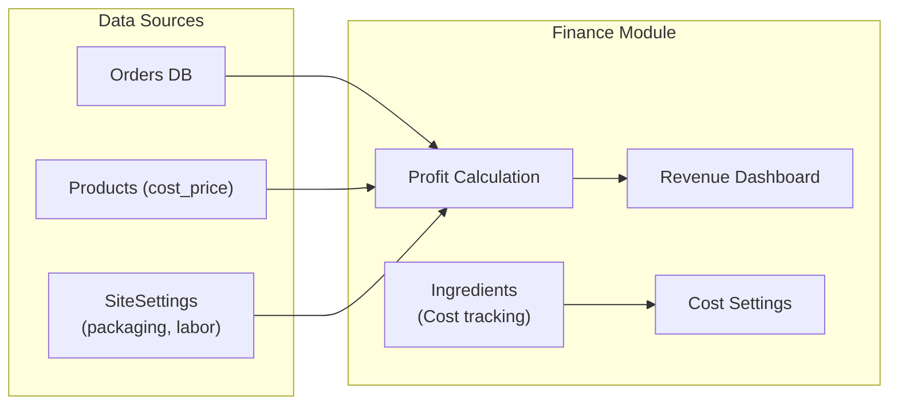
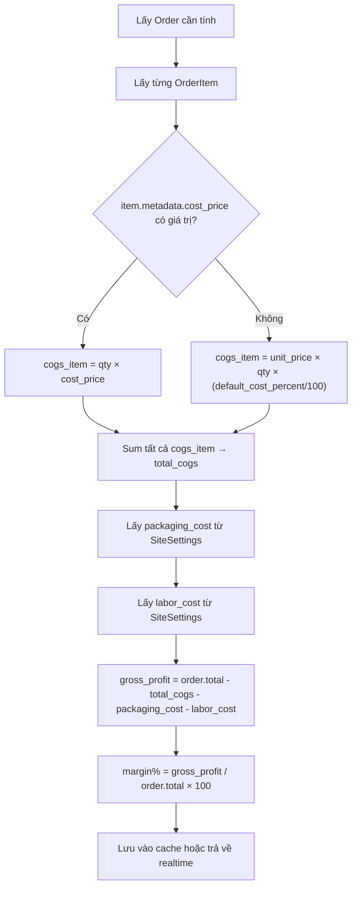
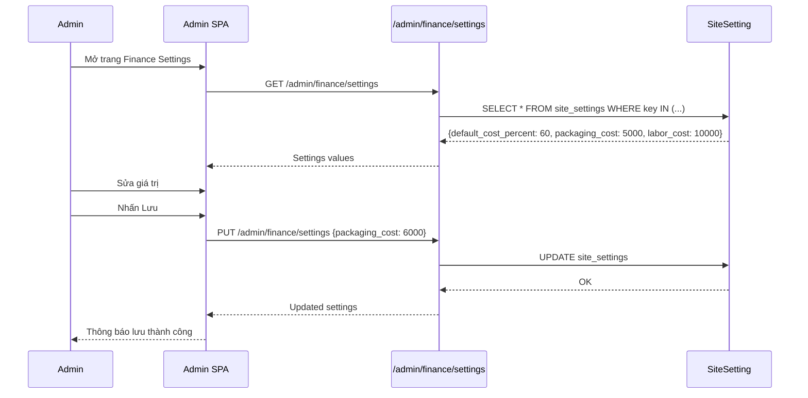

# 07 · Finance — Tổng quan

> Module tài chính cung cấp dashboard doanh thu, theo dõi lợi nhuận, quản lý chi phí và nguyên vật liệu.

---

## 1. Tổng quan



---

## 2. Công thức tính lợi nhuận

### Cấp đơn hàng

```
revenue          = order.total
cogs             = Σ (item.quantity × item.metadata.cost_price)
packaging_cost   = SiteSetting['packaging_cost']          // VND / đơn
labor_cost       = SiteSetting['labor_cost_per_order']    // VND / đơn
shipping_paid    = order.shipping_total                   // Thu từ khách

gross_profit     = revenue - cogs - packaging_cost - labor_cost
profit_margin%   = gross_profit / revenue × 100
```

### Trường hợp không có `cost_price`

Khi `item.metadata.cost_price` là `null` hoặc `0`:

```
Dùng fallback: cogs_item = item.unit_price × (default_cost_percent / 100)
default_cost_percent lấy từ SiteSetting['default_cost_percent']
```

---

## 3. API Endpoints — Finance

| Method | Path | Mô tả | Permission |
|---|---|---|---|
| `GET` | `/admin/finance/summary` | Dashboard tổng quan | `finance:read` |
| `GET` | `/admin/finance/orders` | Danh sách với lợi nhuận | `finance:read` |
| `GET` | `/admin/finance/chart` | Dữ liệu biểu đồ | `finance:read` |
| `GET` | `/admin/finance/top-products` | Top sản phẩm doanh thu | `finance:read` |
| `GET` | `/admin/finance/settings` | Xem cost settings | `finance:read` |
| `PUT` | `/admin/finance/settings` | Cập nhật cost settings | `finance:write` |
| `GET` | `/admin/finance/ingredients` | Danh sách nguyên vật liệu | `finance:read` |
| `POST` | `/admin/finance/ingredients` | Thêm nguyên vật liệu | `finance:write` |
| `PUT` | `/admin/finance/ingredients/:id` | Cập nhật | `finance:write` |

### Query Parameters — `/admin/finance/summary`

| Param | Mô tả | Ví dụ |
|---|---|---|
| `period` | Khoảng thời gian định sẵn | `today`, `7d`, `30d`, `month`, `year` |
| `from_date` | Từ ngày (ISO 8601) | `2026-06-01` |
| `to_date` | Đến ngày (ISO 8601) | `2026-06-30` |

### Response `/admin/finance/summary`

```json
{
  "period": { "from": "2026-06-01", "to": "2026-06-30" },
  "revenue": {
    "total": 15000000,
    "vs_prev_period": +12.5
  },
  "orders": {
    "total": 142,
    "completed": 128,
    "canceled": 14,
    "vs_prev_period": +8.2
  },
  "profit": {
    "gross": 5200000,
    "margin_percent": 34.7,
    "cogs": 7800000,
    "packaging": 710000,
    "labor": 1420000
  },
  "avg_order_value": 117187
}
```

### Response `/admin/finance/chart`

```json
{
  "labels": ["01/06", "02/06", ..., "30/06"],
  "revenue": [450000, 820000, ...],
  "profit": [150000, 280000, ...],
  "orders_count": [4, 7, ...]
}
```

---

## 4. Data Models

### SiteSetting (Finance keys)

| Key | Kiểu | Mô tả | Default |
|---|---|---|---|
| `default_cost_percent` | number | % giá vốn mặc định (khi chưa có cost_price) | 60 |
| `packaging_cost` | number | Chi phí đóng gói / đơn (VND) | 5000 |
| `labor_cost_per_order` | number | Chi phí nhân công / đơn (VND) | 10000 |

### Ingredient (Nguyên vật liệu)

| Trường | Kiểu | Mô tả |
|---|---|---|
| `id` | string | PK |
| `name` | string | Tên nguyên vật liệu (VD: "Xoài Cát Hòa Lộc") |
| `unit` | string | Đơn vị (kg, hộp, túi, ...) |
| `cost_per_unit` | number | Giá / đơn vị (VND) |
| `supplier` | string | Nhà cung cấp (nullable) |
| `stock_quantity` | number | Tồn kho hiện tại |
| `min_stock_alert` | number | Ngưỡng cảnh báo tồn kho thấp |
| `created_at` | timestamp | |
| `updated_at` | timestamp | |

---

## 5. Luồng tính lợi nhuận theo đơn



---

## 6. Dashboard Finance — Wireframe logic

```
┌─────────────────────────────────────────────────────┐
│  [Filter: Today | 7D | 30D | Tháng | Custom range]  │
├──────────────┬──────────────┬──────────────────────┤
│  Doanh thu   │  Đơn hàng   │    Lợi nhuận gộp     │
│  15,000,000  │    142       │      5,200,000       │
│  +12.5% ▲   │  +8.2% ▲    │     Margin: 34.7%    │
├──────────────┴──────────────┴──────────────────────┤
│         Biểu đồ doanh thu & lợi nhuận (Line chart)  │
├─────────────────────────────────────────────────────┤
│  Chi phí breakdown:                                 │
│  • Giá vốn hàng hoá: 7,800,000                     │
│  • Đóng gói: 710,000                               │
│  • Nhân công: 1,420,000                            │
│  • Vận chuyển (thu từ KH): 1,060,000               │
├─────────────────────────────────────────────────────┤
│  Top sản phẩm bán chạy (theo doanh thu)             │
│  1. Hộp Premium - Nhỏ: 4,200,000 (28%)             │
│  2. Hộp Gia Đình:      3,800,000 (25%)             │
└─────────────────────────────────────────────────────┘
```

---

## 7. Cost Settings — Cập nhật



---

## 8. Ingredients Management

### Use Cases

| Use Case | Mô tả |
|---|---|
| Thêm nguyên liệu | Ghi nhận nguyên liệu mới với giá vốn |
| Cập nhật giá | Khi giá nhà cung cấp thay đổi |
| Cảnh báo tồn kho | Alert khi `stock_quantity < min_stock_alert` |
| Xuất báo cáo | Xuất danh sách nguyên liệu ra CSV/Excel |

---

## 9. Edge Cases

| Tình huống | Xử lý |
|---|---|
| Đơn hàng canceled | Không tính vào doanh thu thực |
| `cost_price = 0` | Dùng `default_cost_percent` |
| Shipping fee âm | Không xảy ra, validate ≥ 0 |
| Ngày range không hợp lệ | Trả lỗi 422 |
| Lợi nhuận âm | Hiển thị màu đỏ, không báo lỗi |

---

## 10. Liên kết

- [Orders (cost_price)](../04-orders/README.md)
- [Products (variant cost_price)](../02-products/README.md)
- [System Settings](../08-system/README.md)
