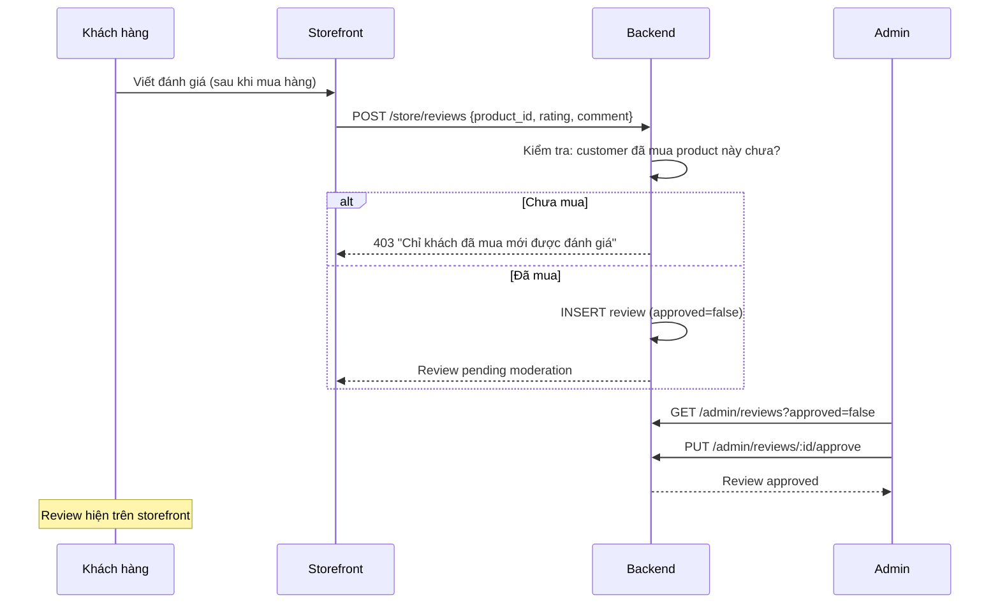
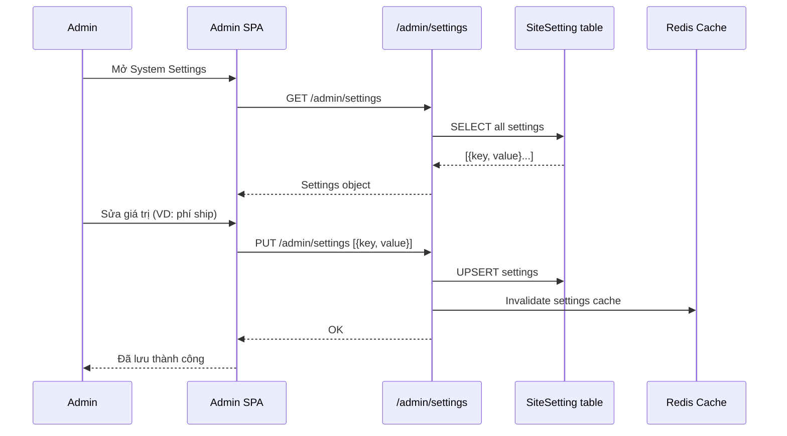

# 08 · System — Tổng quan

> Module hệ thống bao gồm: **Site Settings** (cài đặt toàn cục), **Chatbot Question Log** (log câu hỏi chatbot), và các tiện ích vận hành hệ thống.

---

## 1. Tổng quan Site Module

**Site Module** là custom Medusa module chứa các entity không thuộc core Medusa:

| Entity | Mô tả |
|---|---|
| `Banner` | Banner/slider trang chủ |
| `Review` | Đánh giá sản phẩm |
| `ChatbotQuestionLog` | Lịch sử câu hỏi chatbot |
| `SiteSetting` | Key-value store cài đặt toàn cục |

---

## 2. SiteSetting (Key-Value Store)

### Data Model

| Trường | Kiểu | Mô tả |
|---|---|---|
| `id` | string | PK |
| `key` | string | Khóa cài đặt, unique |
| `value` | text | Giá trị (string/JSON) |
| `type` | enum | `string`, `number`, `boolean`, `json` |
| `description` | string | Mô tả dùng để gì |
| `updated_at` | timestamp | |

### Danh sách Settings

| Key | Type | Mô tả | Giá trị mặc định |
|---|---|---|---|
| `store_name` | string | Tên cửa hàng | "Mong Fruitboxz" |
| `store_email` | string | Email liên hệ | — |
| `store_phone` | string | Số điện thoại | — |
| `store_address` | string | Địa chỉ kho | "Hà Nội" |
| `warehouse_lat` | number | Vĩ độ kho | 21.012805 |
| `warehouse_lng` | number | Kinh độ kho | 105.836483 |
| `vietqr_bank` | string | Ngân hàng VietQR | — |
| `vietqr_account_number` | string | Số tài khoản | — |
| `vietqr_account_name` | string | Tên tài khoản | — |
| `shipping_fee_under_5km` | number | Phí ship < 5km | 15000 |
| `shipping_fee_5_10km` | number | Phí ship 5-10km | 25000 |
| `shipping_fee_10_20km` | number | Phí ship 10-20km | 35000 |
| `shipping_fee_over_20km` | number | Phí ship > 20km | 50000 |
| `default_cost_percent` | number | % giá vốn mặc định | 60 |
| `packaging_cost` | number | Chi phí đóng gói/đơn | 5000 |
| `labor_cost_per_order` | number | Chi phí nhân công/đơn | 10000 |
| `chatbot_enabled` | boolean | Bật/tắt chatbot | true |

### API Endpoints — Settings

| Method | Path | Mô tả | Permission |
|---|---|---|---|
| `GET` | `/admin/settings` | Tất cả settings | `settings:read` |
| `GET` | `/admin/settings/:key` | Một setting | `settings:read` |
| `PUT` | `/admin/settings` | Cập nhật (batch) | `settings:write` |
| `PUT` | `/admin/settings/:key` | Cập nhật một setting | `settings:write` |

**Request PUT `/admin/settings`**:
```json
{
  "settings": [
    { "key": "packaging_cost", "value": "6000" },
    { "key": "shipping_fee_under_5km", "value": "18000" }
  ]
}
```

---

## 3. Review (Đánh giá sản phẩm)

### Data Model

| Trường | Kiểu | Mô tả |
|---|---|---|
| `id` | string | PK |
| `handle` | string | Slug liên quan (nếu cần) |
| `product_id` | string | FK → Product |
| `customer_id` | string | FK → Customer |
| `rating` | number | Số sao (1-5) |
| `comment` | text | Nội dung đánh giá |
| `approved` | boolean | Admin duyệt hiển thị |
| `created_at` | timestamp | |

### API Endpoints — Reviews

| Method | Path | Mô tả | Auth |
|---|---|---|---|
| `POST` | `/store/reviews` | Gửi đánh giá | Customer token |
| `GET` | `/store/products/:id/reviews` | Xem đánh giá (approved) | Public |
| `GET` | `/admin/reviews` | Tất cả reviews | `settings:read` |
| `PUT` | `/admin/reviews/:id/approve` | Duyệt review | `settings:write` |
| `DELETE` | `/admin/reviews/:id` | Xóa review | `settings:write` |

### Luồng duyệt Review



---

## 4. ChatbotQuestionLog

### Data Model

| Trường | Kiểu | Mô tả |
|---|---|---|
| `id` | string | PK |
| `message` | text | Câu hỏi gốc từ user |
| `normalized_message` | text | Câu hỏi sau khi normalize (lowercase, bỏ dấu) |
| `response_mode` | enum | `faq`, `ai`, `fallback` |
| `resolved` | boolean | Chatbot trả lời được hay không |
| `metadata` | jsonb | Thông tin bổ sung (session_id, user_agent) |
| `created_at` | timestamp | |

### Response Modes

| Mode | Mô tả |
|---|---|
| `faq` | Trả lời từ FAQ định sẵn |
| `ai` | Trả lời từ AI/LLM integration |
| `fallback` | Không trả lời được, chuyển sang contact form |

### API Endpoints — Chatbot

| Method | Path | Mô tả | Auth |
|---|---|---|---|
| `POST` | `/store/chatbot` | Gửi câu hỏi chatbot | Public |
| `GET` | `/admin/chatbot-logs` | Xem log câu hỏi | `settings:read` |
| `GET` | `/admin/chatbot-logs/unresolved` | Câu hỏi chưa giải quyết | `settings:read` |

### Request `/store/chatbot`

```json
{
  "message": "Hộp trái cây của bạn có giao ngoại tỉnh không?",
  "session_id": "session_xxx"
}
```

---

## 5. System Configuration (Infrastructure)

### Environment Variables

| Biến | Mô tả |
|---|---|
| `DATABASE_URL` | PostgreSQL connection string |
| `REDIS_URL` | Redis connection string |
| `JWT_SECRET` | Secret key ký JWT |
| `S3_BUCKET` | Tên S3 bucket |
| `S3_REGION` | AWS region |
| `S3_ACCESS_KEY_ID` | AWS Access Key |
| `S3_SECRET_ACCESS_KEY` | AWS Secret Key |
| `VIETQR_BANK_BIN` | BIN mã ngân hàng VietQR |
| `STORE_CORS_ORIGINS` | Allowed CORS origins |
| `ADMIN_CORS_ORIGINS` | Admin CORS origins |

---

## 6. Health Check

| Endpoint | Mô tả |
|---|---|
| `GET /health` | Kiểm tra backend alive |
| `GET /health/db` | Kiểm tra kết nối PostgreSQL |
| `GET /health/redis` | Kiểm tra kết nối Redis |

---

## 7. Luồng Settings Update



---

## 8. Liên kết

- [Finance (cost settings)](../07-finance/README.md)
- [Marketing (banners)](../06-marketing/README.md)
- [RBAC (permissions)](../05-admin/rbac.md)
