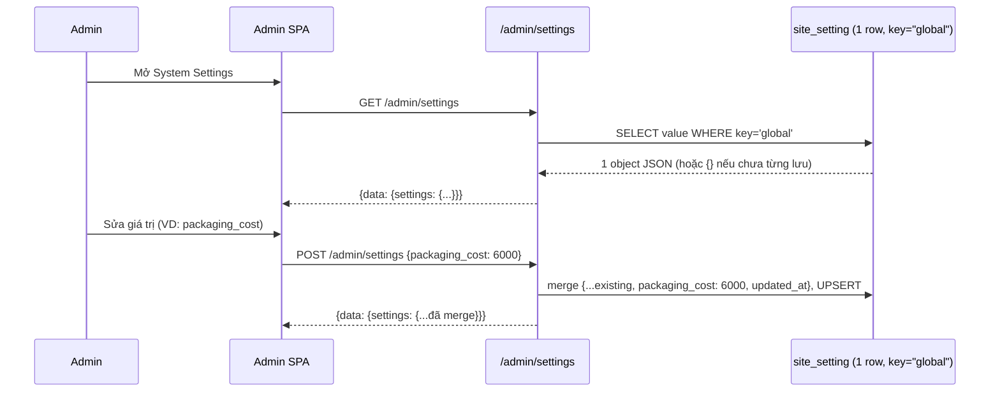

# 08 · System — Tổng quan

> Module hệ thống bao gồm: **Site Settings** (cài đặt toàn cục — 1 JSON blob, không phải nhiều row), **Chatbot** (FAQ + log câu hỏi chưa trả lời được), và các tiện ích vận hành. Toàn bộ response custom route bọc trong envelope `{ data, error, meta }`.

---

## 1. Tổng quan Site Module

**Site Module** (`backend/src/modules/site`) chứa các entity không thuộc core Medusa:

| Entity | Bảng | Mô tả |
|---|---|---|
| `Banner` | `site_banner` | Banner/slider trang chủ |
| `SiteSetting` | `site_setting` | Key-value store — **chỉ dùng 1 row duy nhất, `key = "global"`** |
| `ChatbotQuestionLog` | `site_chatbot_question_log` | Log câu hỏi chatbot |
| `ContactMessage` | `site_contact_message` | Form liên hệ |
| `BlogPost` / `BlogCategory` | `site_blog_post` / `site_blog_category` | Xem [Marketing](../06-marketing/README.md) |
| `Review` | `site_review` | Đánh giá sản phẩm — xem [Products](../02-products/README.md) |

---

## 2. SiteSetting — thật (khác hoàn toàn thiết kế "nhiều row" của tài liệu cũ)

### Data Model thật

```ts
model.define("site_setting", {
  id: model.id().primaryKey(),
  key: model.text(),
  value: model.json().nullable(),   // JSON tuỳ ý, không có cột "type" riêng
})
```

**Toàn bộ cài đặt toàn cục nằm trong ĐÚNG 1 row** với `key = "global"`, và `value` là **1 object JSON gộp mọi setting** — không phải "mỗi setting một row" như tài liệu cũ mô tả. `updateGlobalSettings()` merge (`{...existing, ...updates}`) chứ không ghi đè toàn bộ.

`SiteSetting` cũng được dùng lại cho mục đích khác (không phải chỉ "global"): promotion metadata dùng key `promotion:<id>:metadata` (xem [Marketing](../06-marketing/README.md)).

### Các key thường dùng trong `value` (đọc từ code, không phải bảng cấu hình cố định)

Không có danh sách key "chính thức" — bất kỳ key nào trong object đều hợp lệ. Các key đang thực sự được đọc ở đâu đó trong code, kèm giá trị fallback nếu thiếu:

| Key | Dùng ở đâu | Fallback nếu thiếu |
|---|---|---|
| `default_cost_percent` | Dashboard tính lợi nhuận | `50` (%) |
| `packaging_cost` | Dashboard tính lợi nhuận | `5000` |
| `labor_cost_per_order` | Dashboard tính lợi nhuận | `10000` |
| `shipping_origin_lat` / `shipping_origin_lng` | Tính phí ship | `21.012805` / `105.836483` (từ env `SHIPPING_ORIGIN_LAT/LNG` nếu cũng thiếu) |
| `shipping_base_fee` | Tính phí ship | `18000` |
| `shipping_fee_per_km` | Tính phí ship | `2200` |
| `shipping_min_fee` / `shipping_max_fee` | Tính phí ship | `18000` / `60000` |
| `shipping_base_cost` | Phí mặc định khi không xác định được vị trí (Hà Nội) | `30000` |
| `shipping_non_hanoi_fee` | Phí cố định ngoài Hà Nội | `45000` |
| `free_shipping_districts` | Danh sách quận miễn phí ship (chuỗi phân tách dấu phẩy) | 6 quận nội thành mặc định |
| `chatbot_enabled` | Bật/tắt chatbot | `true` |
| `chatbot_faqs` | Danh sách FAQ chatbot (mảng) | `[]` |
| `phone` | Số hotline hiển thị trong câu trả lời fallback của chatbot | `"0945.204.432"` |

**Không có** `store_name`, `store_email`, `vietqr_bank`... như bảng "mặc định" của tài liệu cũ liệt kê — chưa xác nhận các key này được đọc ở đâu trong code hiện tại.

### API Endpoints — Settings (thật, khác hoàn toàn)

| Method | Path | Mô tả | Permission |
|---|---|---|---|
| `GET` | `/admin/settings` | Trả về `{ settings: {...toàn bộ object} }` | `settings.read` |
| `POST` | `/admin/settings` | Merge object gửi lên vào settings hiện có | `settings.edit` |

**Không có** `GET/PUT /admin/settings/:key` — chỉ thao tác ở mức toàn bộ object, không có endpoint cho từng key riêng lẻ.

**Request `POST /admin/settings`** — object phẳng, **không phải** mảng `{settings:[{key,value}]}`:
```json
{ "packaging_cost": 6000, "shipping_base_fee": 18000 }
```

---

## 3. Chatbot

Xem đánh giá bảo mật chi tiết (prompt injection, cache poisoning...) ở agent `chatbot-ai-reviewer` (`.claude/agents/`). Phần dưới chỉ mô tả API.

### ChatbotQuestionLog — Data Model thật

| Trường | Kiểu | Mô tả |
|---|---|---|
| `id` | string | PK |
| `message` | text | Câu hỏi gốc |
| `normalized_message` | text | Sau khi bỏ dấu, lowercase |
| `response_mode` | string \| null | **Không phải enum cố định** — giá trị thật: `"empty"`, `"catalog-rag"`, `"faq-rag"`, `"faq"`, `"catalog-fallback"`, `"fallback"` (tùy nhánh xử lý trong `buildChatbotReply`) |
| `resolved` | boolean | `true` trừ khi `response_mode === "fallback"` |
| `metadata` | jsonb \| null | Chỉ có `{suggestions: <số lượng gợi ý>}`, không lưu `session_id`/`user_agent` |

### API Endpoints — thật

| Method | Path | Mô tả | Auth |
|---|---|---|---|
| `POST` | `/store/chatbot/message` | Gửi câu hỏi (không phải `/store/chatbot`) | Public, **rate-limit theo IP qua Redis** (mặc định 20 request/60s, header `X-RateLimit-Remaining`, `429` kèm `Retry-After` khi vượt) |
| `GET` | `/admin/chatbot/faqs` | Đọc FAQ + trạng thái bật/tắt | `settings.read` (chatbot map vào settings, xem [RBAC](../05-admin/rbac.md)) |
| `POST` | `/admin/chatbot/faqs` | Ghi FAQ | `settings.edit` |
| `GET` | `/admin/chatbot/unanswered` | Log câu hỏi `resolved=false` (không phải `/admin/chatbot-logs/unresolved`) | `settings.read` |
| `DELETE` | `/admin/chatbot/unanswered` | Xóa hàng loạt (`{deleteAll:true}` hoặc `{ids:[...]}`) | `settings.edit` |
| `DELETE` | `/admin/chatbot/unanswered/:id` | Xóa 1 log | `settings.edit` |

**Không có** `/admin/chatbot-logs` hay `/admin/chatbot-logs/unresolved`.

### Request `POST /store/chatbot/message`

```json
{ "message": "Hộp trái cây của bạn có giao ngoại tỉnh không?" }
```
Chỉ có field `message` (≤1000 ký tự) — **không có `session_id`** trong request.

---

## 4. System Configuration (Infrastructure) — thật, theo `backend/.env.template`

| Biến | Mô tả |
|---|---|
| `DATABASE_URL` | PostgreSQL connection string |
| `REDIS_URL` | Redis connection string |
| `JWT_SECRET` / `COOKIE_SECRET` | Secret ký JWT / cookie |
| `STORE_CORS` / `ADMIN_CORS` / `AUTH_CORS` | Danh sách origin cho phép (không phải `STORE_CORS_ORIGINS`) |
| `MEILI_HOST` / `MEILI_MASTER_KEY` / `MEILI_PRODUCT_INDEX` | Cấu hình Meilisearch |
| `MINIO_ENDPOINT` / `MINIO_ACCESS_KEY` / `MINIO_SECRET_KEY` / `MINIO_BUCKET` | MinIO (dev) — alias `S3_*` cũng được hỗ trợ cho môi trường dùng S3 thật |
| `SHIPPING_ORIGIN_LAT` / `SHIPPING_ORIGIN_LNG` | Toạ độ kho mặc định (fallback nếu Site Settings chưa set) |
| `CHATBOT_RATE_LIMIT` / `CHATBOT_RATE_WINDOW_SECONDS` | Cấu hình rate limit chatbot (mặc định 20/60s) |
| `SUPER_ADMIN_EMAILS` | Danh sách email bypass RBAC hoàn toàn, phân tách dấu phẩy |
| `GROQ_API_KEY` / `GROQ_MODEL` | API key + model cho chatbot AI |

**Không có** `S3_REGION`/`VIETQR_BANK_BIN` là biến bắt buộc riêng như tài liệu cũ liệt kê — VietQR được dựng hoàn toàn ở frontend, không đọc config nào từ backend.

---

## 5. Health Check

| Endpoint | Trạng thái |
|---|---|
| `GET /health` | Có, trả `200` |
| `GET /health/db` | **Không tồn tại** (404) |
| `GET /health/redis` | **Không tồn tại** (404) |

`/health` chỉ xác nhận Node process đang chạy — không tự kiểm tra kết nối Postgres/Redis. Muốn kiểm tra Postgres/Redis phải tự query trực tiếp (`docker compose ps` xem healthcheck của từng container, xem [docker-env-ops skill](../../.claude/skills/docker-env-ops/SKILL.md)).

---

## 6. Luồng Settings Update (thật)


```mermaid
sequenceDiagram
    participant ADM as Admin
    participant UI as Admin SPA
    participant API as /admin/settings
    participant DB as site_setting (1 row, key="global")

    ADM->>UI: Mở System Settings
    UI->>API: GET /admin/settings
    API->>DB: SELECT value WHERE key='global'
    DB-->>API: 1 object JSON (hoặc {} nếu chưa từng lưu)
    API-->>UI: {data: {settings: {...}}}
    ADM->>UI: Sửa giá trị (VD: packaging_cost)
    UI->>API: POST /admin/settings {packaging_cost: 6000}
    API->>DB: merge {...existing, packaging_cost: 6000, updated_at}, UPSERT
    API-->>UI: {data: {settings: {...đã merge}}}
```

Không có bước "Invalidate settings cache" — `getGlobalSettings`/`updateGlobalSettings` đọc thẳng DB mỗi lần, không qua Redis cache.

---

## 7. Liên kết

- [Marketing (banners, promotions)](../06-marketing/README.md)
- [RBAC (permissions)](../05-admin/rbac.md)
