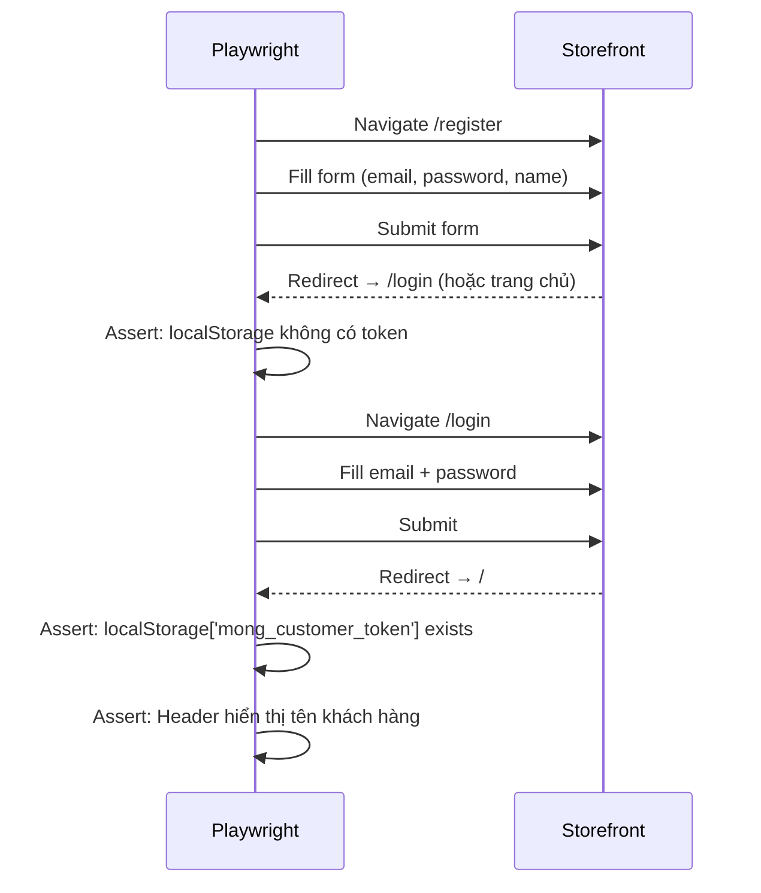
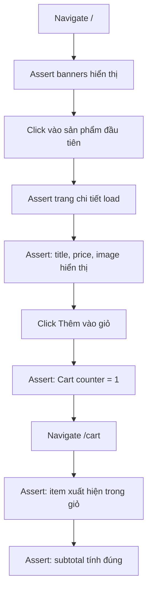
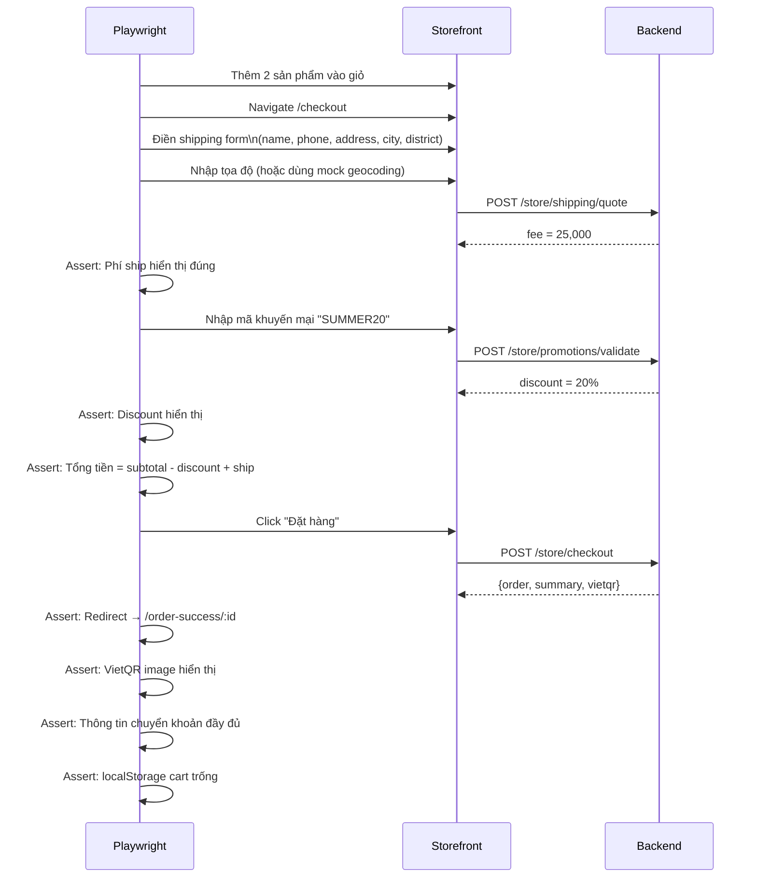
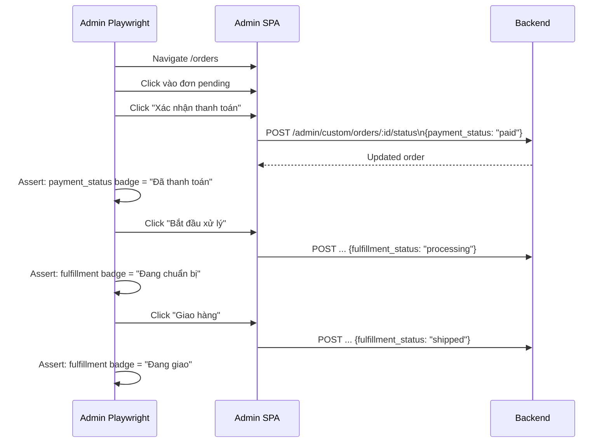

# 09 · Testing — E2E Scenarios

> Các kịch bản kiểm thử end-to-end (Playwright) mô phỏng hành vi thực tế của người dùng.

---

## 1. Công cụ & Cài đặt

- **Framework**: [Playwright](https://playwright.dev)
- **Ngôn ngữ**: TypeScript
- **Browser**: Chromium (primary), Firefox, Safari (smoke)
- **Base URL Storefront**: `http://localhost:5173`
- **Base URL Admin**: `http://localhost:5174`

```bash
# Chạy tất cả E2E tests
npx playwright test

# Chạy một file cụ thể
npx playwright test e2e/checkout.spec.ts

# Chế độ UI debug
npx playwright test --ui
```

---

## 2. Scenario 01 — Đăng ký & Đăng nhập Customer

**Priority**: P0 | **Actor**: Khách hàng mới



**Playwright Spec (pseudo)**:
```typescript
test('Customer registration and login', async ({ page }) => {
  await page.goto('/register');
  await page.fill('[name=first_name]', 'Nguyễn');
  await page.fill('[name=last_name]', 'Văn A');
  await page.fill('[name=email]', 'test@example.com');
  await page.fill('[name=password]', 'password123');
  await page.click('[type=submit]');
  await expect(page).toHaveURL('/login');

  await page.fill('[name=email]', 'test@example.com');
  await page.fill('[name=password]', 'password123');
  await page.click('[type=submit]');
  await expect(page).toHaveURL('/');

  const token = await page.evaluate(() => localStorage.getItem('mong_customer_token'));
  expect(token).toBeTruthy();
});
```

---

## 3. Scenario 02 — Xem sản phẩm và thêm vào giỏ

**Priority**: P0 | **Actor**: Khách hàng



**Playwright Spec (pseudo)**:
```typescript
test('Add product to cart', async ({ page }) => {
  await page.goto('/');
  await expect(page.locator('.banner-slider')).toBeVisible();

  await page.locator('.product-card').first().click();
  await expect(page.locator('h1.product-title')).toBeVisible();

  const price = await page.locator('.product-price').textContent();
  await page.click('[data-testid=add-to-cart]');
  await expect(page.locator('[data-testid=cart-count]')).toHaveText('1');

  await page.goto('/cart');
  await expect(page.locator('.cart-item')).toHaveCount(1);
});
```

---

## 4. Scenario 03 — Checkout hoàn chỉnh (Happy Path)

**Priority**: P0 | **Actor**: Khách hàng (với sản phẩm trong giỏ)



---

## 5. Scenario 04 — Checkout thất bại: Sản phẩm hết hàng

**Priority**: P0 | **Actor**: Khách hàng

**Bước thực hiện**:
1. Thêm sản phẩm X vào giỏ (lúc này còn hàng)
2. Admin cập nhật `inventory_quantity = 0` cho variant đó
3. Customer tiến hành checkout
4. **Assert**: Server trả lỗi 422 "Sản phẩm X đã hết hàng"
5. **Assert**: UI hiển thị thông báo lỗi, không redirect
6. **Assert**: Cart vẫn còn items

---

## 6. Scenario 05 — Áp mã khuyến mại không hợp lệ

**Priority**: P1 | **Actor**: Khách hàng

```mermaid
flowchart TD
    A[Mở /checkout] --> B[Nhập mã "INVALID123"]
    B --> C[POST /store/promotions/validate]
    C --> D{API response}
    D -->|valid:false, reason: "Mã không tồn tại"| E[Assert: Thông báo lỗi hiển thị]
    D -->|valid:false, reason: "Mã đã hết hạn"| F[Assert: Thông báo hết hạn]
    E --> G[Assert: Không có discount trong summary]
    F --> G
```

**Test cases cần cover**:
- Mã không tồn tại
- Mã đúng nhưng đã hết hạn
- Mã đúng nhưng đơn hàng chưa đạt `min_subtotal`
- Mã đúng nhưng đã hết `usage_limit`

---

## 7. Scenario 06 — Admin Đăng nhập và Xem đơn hàng

**Priority**: P0 | **Actor**: Admin

```typescript
test('Admin login and view orders', async ({ page }) => {
  await page.goto('http://localhost:5174/login');
  await page.fill('[name=email]', 'admin@mong.vn');
  await page.fill('[name=password]', 'adminpass');
  await page.click('[type=submit]');

  await expect(page).toHaveURL('/dashboard');
  await page.click('[data-testid=nav-orders]');
  await expect(page).toHaveURL('/orders');
  await expect(page.locator('.order-row')).toHaveCount.greaterThan(0);
});
```

---

## 8. Scenario 07 — Admin Cập nhật trạng thái đơn hàng

**Priority**: P0 | **Actor**: Admin có `orders:write`



---

## 9. Scenario 08 — Admin RBAC: Staff không thể xóa sản phẩm

**Priority**: P0 | **Actor**: Staff user

```typescript
test('Staff cannot delete products', async ({ page }) => {
  // Login as Staff
  await loginAs(page, 'staff@mong.vn', 'staffpass');

  await page.goto('/products');
  // Nút Delete không hiển thị hoặc bị disabled
  const deleteBtn = page.locator('[data-testid=delete-product]').first();
  await expect(deleteBtn).not.toBeVisible(); // hoặc toBeDisabled()

  // Gọi thẳng API
  const response = await page.request.delete('/admin/products/prod_01XXX', {
    headers: { Authorization: `Bearer ${staffToken}` }
  });
  expect(response.status()).toBe(403);
});
```

---

## 10. Scenario 09 — Tìm kiếm sản phẩm

**Priority**: P1 | **Actor**: Khách hàng

```typescript
test('Product search works', async ({ page }) => {
  await page.goto('/');
  await page.fill('[data-testid=search-input]', 'xoài');
  await page.press('[data-testid=search-input]', 'Enter');

  await expect(page).toHaveURL(/q=xo%C3%A0i/);
  const results = page.locator('.product-card');
  await expect(results).toHaveCount.greaterThan(0);

  // Kiểm tra tất cả kết quả chứa từ khóa
  const titles = await results.locator('.product-title').allTextContents();
  titles.forEach(title => {
    expect(title.toLowerCase()).toContain('xoài');
  });
});
```

---

## 11. Scenario 10 — VietQR hiển thị sau checkout

**Priority**: P0 | **Actor**: Khách hàng

**Assert cần kiểm tra sau khi checkout thành công**:
- [ ] Trang chuyển sang `/order-success/ORDER_ID`
- [ ] Hiển thị Order ID (`#1042` format)
- [ ] VietQR image render (src có domain `img.vietqr.io`)
- [ ] Tên ngân hàng hiển thị đúng
- [ ] Số tài khoản hiển thị
- [ ] Số tiền cần chuyển = `summary.total`
- [ ] Nội dung chuyển khoản chứa Order ID
- [ ] localStorage `mong_cart` = `null` hoặc `[]`

---

## 12. Scenario 11 — Mobile Responsive

**Priority**: P1 | **Actor**: Khách hàng mobile

```typescript
test('Checkout works on mobile', async ({ browser }) => {
  const context = await browser.newContext({
    viewport: { width: 375, height: 812 }, // iPhone SE
    userAgent: 'Mozilla/5.0 (iPhone; CPU iPhone OS 15_0...)...'
  });
  const page = await context.newPage();

  await page.goto('/');
  // Assert: Mobile menu visible
  await expect(page.locator('[data-testid=mobile-menu-btn]')).toBeVisible();

  // Assert: Products display correctly
  await expect(page.locator('.product-card')).toHaveCount.greaterThan(0);

  // Assert: Cart accessible
  await page.locator('.product-card').first().click();
  await page.click('[data-testid=add-to-cart]');
  await expect(page.locator('[data-testid=cart-count]')).toHaveText('1');
});
```

---

## 13. Test Fixtures & Helpers

```typescript
// fixtures/auth.ts
export async function loginAsCustomer(page: Page) {
  await page.goto('/login');
  await page.fill('[name=email]', process.env.TEST_CUSTOMER_EMAIL!);
  await page.fill('[name=password]', process.env.TEST_CUSTOMER_PASSWORD!);
  await page.click('[type=submit]');
  await page.waitForURL('/');
}

export async function loginAsAdmin(page: Page, role: 'admin' | 'staff' = 'admin') {
  const creds = TEST_USERS[role];
  await page.goto('http://localhost:5174/login');
  await page.fill('[name=email]', creds.email);
  await page.fill('[name=password]', creds.password);
  await page.click('[type=submit]');
  await page.waitForURL('/dashboard');
}

// fixtures/cart.ts
export async function addProductToCart(page: Page, productHandle: string) {
  await page.goto(`/products/${productHandle}`);
  await page.click('[data-testid=add-to-cart]');
  await expect(page.locator('[data-testid=cart-count]')).toBeVisible();
}
```

---

## 14. Liên kết

- [Test Plan](./test-plan.md)
- [Auth flows](../01-auth/flows.md)
- [Cart & Checkout](../03-cart-checkout/README.md)
