# Báo cáo thiết kế hệ thống bán hàng trực tuyến

**Môn học:** Phân tích và Thiết kế Hệ thống  
**Giảng viên:** TS. Nguyễn Kiêm Hiếu  
**Nhóm:** Nhóm 08 - Phan Anh Tài, Đặng Thái Sơn, Đặng Quốc Vinh, Nguyễn Công Minh, Nguyễn Chí Dũng

Báo cáo này trình bày phần thiết kế hệ thống bán hàng trực tuyến, tập trung vào kiến trúc triển khai, lớp nghiệp vụ, tầng truy cập và quản lý dữ liệu, giao diện, luồng tương tác và cơ sở dữ liệu. Phạm vi thiết kế bao gồm 7 nhóm nghiệp vụ chính:

| Mã | Use case | Tác nhân chính | Mục tiêu thiết kế |
|---|---|---|---|
| UC01 | Đăng nhập/Đăng ký tài khoản | Người dùng hệ thống | Xác thực, tạo phiên làm việc, kiểm soát tài khoản bị khóa |
| UC02 | Quản lý người dùng | Admin/Người quản lý | CRUD tài khoản, phân quyền, khóa/xóa, ghi nhật ký thao tác |
| UC03 | Xem/Tìm kiếm sản phẩm | Khách hàng | Tìm kiếm, lọc, xem chi tiết, thêm sản phẩm vào giỏ hàng |
| UC04 | Đặt hàng & Thanh toán đơn hàng | Khách hàng, API ngân hàng/ví | Kiểm tra tồn kho, lập đơn, thanh toán, cập nhật trạng thái |
| UC05 | Quản lý sản phẩm | Người bán hàng/Người quản lý | Thêm/sửa/xóa/ẩn hiện sản phẩm, validate dữ liệu, quản lý tồn kho |
| UC06 | Quản lý đơn hàng | Người mua, người bán, quản lý | Xác nhận, giao hàng, hủy đơn, hoàn tiền, theo dõi trạng thái |
| UC07 | Báo cáo doanh thu | Người quản lý | Tổng hợp doanh thu, lọc thời gian, xuất báo cáo |

## Mục lục

1. [Kiến trúc thiết kế tổng thể](#1-kiến-trúc-thiết-kế-tổng-thể)
2. [Sơ đồ triển khai](#2-sơ-đồ-triển-khai)
3. [Sơ đồ lớp mức chi tiết](#3-sơ-đồ-lớp-mức-chi-tiết)
4. [Nguyên mẫu giao diện](#4-nguyên-mẫu-giao-diện)
5. [Sơ đồ luồng tương tác](#5-sơ-đồ-luồng-tương-tác)
6. [Sơ đồ trạng thái quan trọng](#6-sơ-đồ-trạng-thái-quan-trọng)
7. [Sơ đồ cơ sở dữ liệu](#7-sơ-đồ-cơ-sở-dữ-liệu)
8. [Thiết kế xử lý theo use case](#8-thiết-kế-xử-lý-theo-use-case)
9. [Ghi chú triển khai và kết luận](#9-ghi-chú-triển-khai-và-kết-luận)

## 1. Kiến trúc thiết kế tổng thể

Hệ thống được thiết kế theo kiến trúc phân lớp để tách biệt giao diện, nghiệp vụ, miền dữ liệu và truy cập dữ liệu. Kiến trúc tổng thể sử dụng mô hình N-Tier/MVC/Repository Pattern với luồng phụ thuộc: `Presentation/Controller -> Business Logic/Service -> Data Access/DAM -> Storage/Infrastructure`.

Tầng DAM trong báo cáo này là tầng `Data Access & Management`, bao gồm cả DAL Repository Interface, Repository Implementation, UnitOfWork và TransactionManager. Tầng này chịu trách nhiệm ánh xạ đối tượng nghiệp vụ xuống CSDL, quản lý transaction và cô lập chi tiết truy vấn.

| Tầng | Thành phần chính | Trách nhiệm |
|---|---|---|
| Presentation/UI | LoginInterface, CatalogUI, CartCheckoutUI, UserManagementUI, ProductManagementUI, OrderManagementUI, RevenueReportUI | Hiển thị màn hình, nhận thao tác, trình bày lỗi/thành công |
| Controller/API | LoginController, UserController, ProductController, CartController, OrderController, PaymentController, ReportController | Nhận request, kiểm tra quyền, gọi service phù hợp |
| Application/Service | AuthService, UserService, ProductService, CartService, OrderService, PaymentService, ShippingService, ReportService, AuditService | Xử lý nghiệp vụ theo UC01-UC07 |
| Domain Model | Account, Customer, Seller, Manager, Product, Category, ProductReview, Cart, Order, OrderDetail, Payment, ShippingInfo, OperationHistory, RevenueReport | Biểu diễn trạng thái và quy tắc nghiệp vụ |
| DAM | Repository/DAO, UnitOfWork, TransactionManager, DatabaseConnection | Truy vấn, lưu trữ, transaction, mapping dữ liệu |
| Infrastructure | RDBMS, Object Storage, Payment Gateway, Shipping API, Cache | Lưu CSDL, lưu ảnh sản phẩm, tích hợp thanh toán/vận chuyển |

| Kiểu kiến trúc | Áp dụng trong hệ thống |
|---|---|
| MVC | Controller nhận request, Service xử lý nghiệp vụ, Domain/DTO biểu diễn dữ liệu |
| Repository Pattern | Service không truy vấn CSDL trực tiếp mà đi qua interface repository |
| Separation of Concerns | UI, nghiệp vụ, truy cập dữ liệu và hạ tầng được tách thành các tầng riêng |
| Transaction Boundary | Các nghiệp vụ đặt hàng, thanh toán, hủy đơn/hoàn tiền được gom trong UnitOfWork |

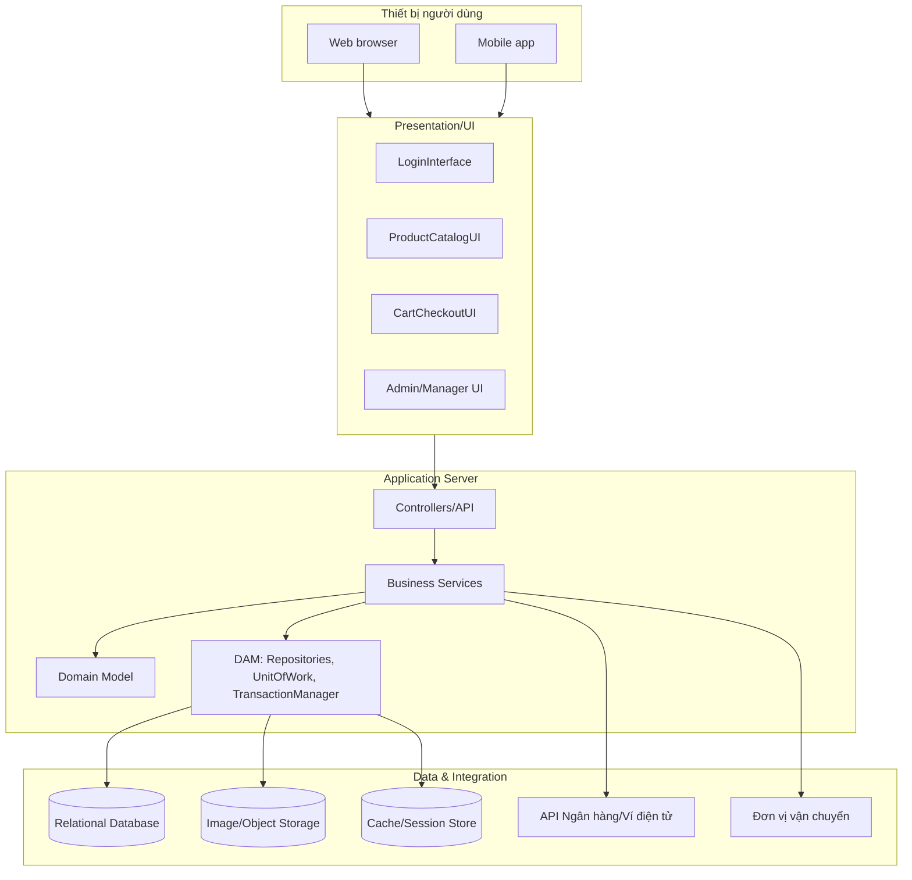
```mermaid
flowchart TB
    subgraph Client["Thiết bị người dùng"]
        Web["Web browser"]
        Mobile["Mobile app"]
    end

    subgraph Presentation["Presentation/UI"]
        LoginUI["LoginInterface"]
        CatalogUI["ProductCatalogUI"]
        CheckoutUI["CartCheckoutUI"]
        AdminUI["Admin/Manager UI"]
    end

    subgraph App["Application Server"]
        Controllers["Controllers/API"]
        Services["Business Services"]
        Domain["Domain Model"]
        DAM["DAM: Repositories, UnitOfWork, TransactionManager"]
    end

    subgraph Data["Data & Integration"]
        DB[("Relational Database")]
        ObjectStore[("Image/Object Storage")]
        Cache[("Cache/Session Store")]
        PaymentGW["API Ngân hàng/Ví điện tử"]
        ShippingGW["Đơn vị vận chuyển"]
    end

    Web --> Presentation
    Mobile --> Presentation
    Presentation --> Controllers
    Controllers --> Services
    Services --> Domain
    Services --> DAM
    DAM --> DB
    DAM --> Cache
    DAM --> ObjectStore
    Services --> PaymentGW
    Services --> ShippingGW
```

## 2. Sơ đồ triển khai

Sơ đồ triển khai phản ánh môi trường Web/App qua Internet như tài liệu gốc, có thêm các node hạ tầng cần thiết cho triển khai thực tế: máy chủ ứng dụng, CSDL, lưu ảnh sản phẩm, cache/session và các hệ thống ngoài.

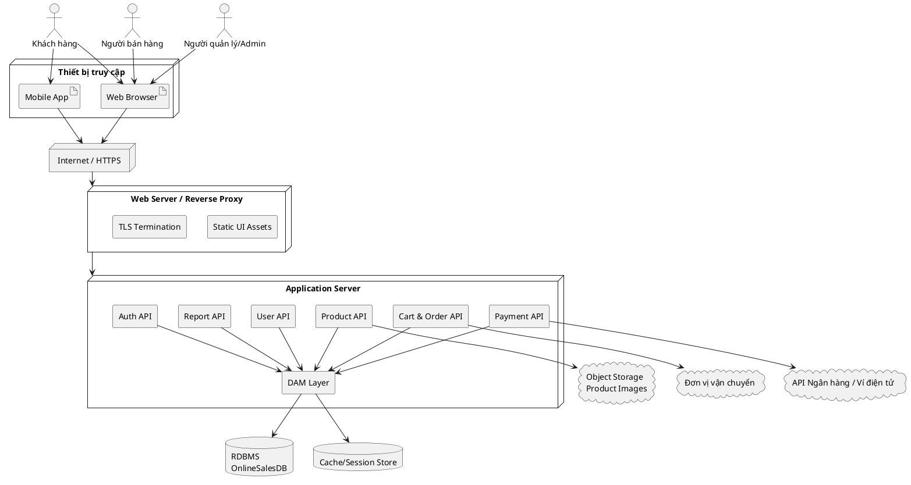
```plantuml
@startuml
skinparam componentStyle rectangle
skinparam shadowing false

actor "Khách hàng" as Customer
actor "Người bán hàng" as Seller
actor "Người quản lý/Admin" as Manager

node "Thiết bị truy cập" {
  artifact "Web Browser" as Browser
  artifact "Mobile App" as MobileApp
}

node "Internet / HTTPS" as Internet

node "Web Server / Reverse Proxy" as WebServer {
  component "Static UI Assets" as UIAssets
  component "TLS Termination" as TLS
}

node "Application Server" as AppServer {
  component "Auth API" as AuthAPI
  component "User API" as UserAPI
  component "Product API" as ProductAPI
  component "Cart & Order API" as OrderAPI
  component "Payment API" as PaymentAPI
  component "Report API" as ReportAPI
  component "DAM Layer" as DAM
}

database "RDBMS\nOnlineSalesDB" as DB
database "Cache/Session Store" as Cache
cloud "Object Storage\nProduct Images" as Obj
cloud "API Ngân hàng / Ví điện tử" as Bank
cloud "Đơn vị vận chuyển" as Shipper

Customer --> Browser
Customer --> MobileApp
Seller --> Browser
Manager --> Browser

Browser --> Internet
MobileApp --> Internet
Internet --> WebServer
WebServer --> AppServer

AuthAPI --> DAM
UserAPI --> DAM
ProductAPI --> DAM
OrderAPI --> DAM
PaymentAPI --> DAM
ReportAPI --> DAM

DAM --> DB
DAM --> Cache
ProductAPI --> Obj
PaymentAPI --> Bank
OrderAPI --> Shipper

@enduml
```

### 2.1. Đặc tả node triển khai

| Node | Vai trò | Công nghệ gợi ý | Cấu hình tối thiểu |
|---|---|---|---|
| DNS/WAF | Định tuyến và chặn request bất thường | Cloudflare hoặc tương đương | Managed service |
| CDN | Cache tài nguyên tĩnh, ảnh sản phẩm phổ biến | CloudFront/CDN nội bộ | Managed service |
| Load Balancer/Reverse Proxy | SSL termination, phân phối tải tới app server | Nginx 1.24+ | 2 vCPU, 4 GB RAM |
| Application Server | Chạy REST API, service nghiệp vụ, controller | Spring Boot 3 hoặc Node.js 20 | 4 vCPU, 8 GB RAM |
| MySQL Master | Ghi dữ liệu chính, transaction đơn hàng/thanh toán | MySQL 8.0 | 8 vCPU, 16 GB RAM, SSD |
| MySQL Read Replica | Phục vụ đọc sản phẩm, báo cáo, lịch sử đơn | MySQL 8.0 replication | 4 vCPU, 8 GB RAM |
| Redis/Cache | Lưu session, token, dữ liệu hot | Redis 7.x | 2 vCPU, 4 GB RAM |
| Object Storage | Lưu ảnh sản phẩm, file xuất báo cáo | MinIO/AWS S3 | Từ 500 GB |
| Payment Gateway | Thanh toán online và hoàn tiền | VNPay/MoMo/API ngân hàng | Dịch vụ ngoài |
| Shipping API | Tạo vận đơn, cập nhật giao hàng | GHTK hoặc tương đương | Dịch vụ ngoài |

### 2.2. Sơ đồ triển khai mở rộng

Sơ đồ sau cụ thể hóa phương án scale-out đề xuất: nhiều app server sau load balancer, CSDL master/replica, Redis cho session/cache và object storage cho ảnh sản phẩm/file báo cáo.

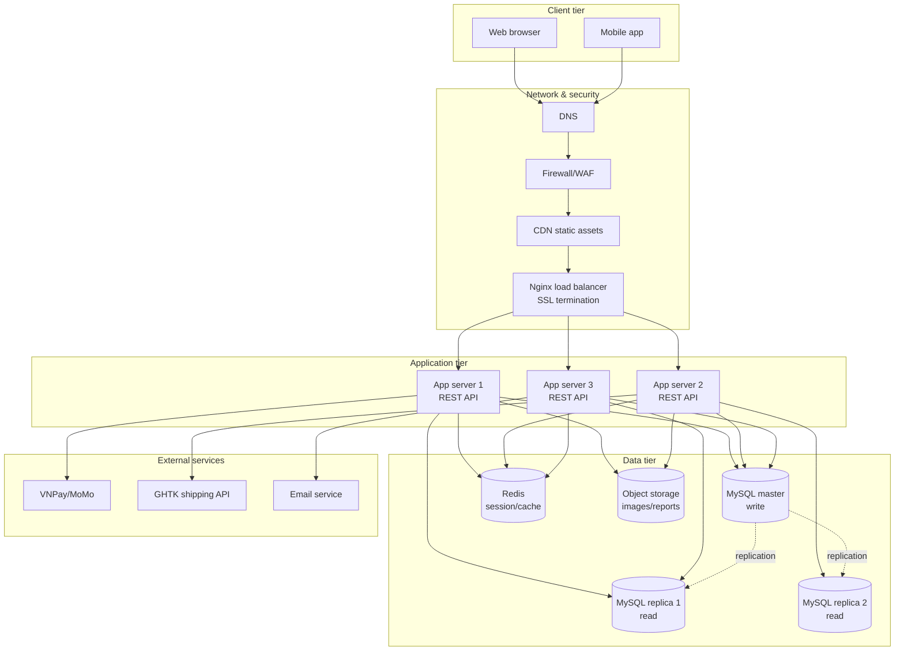
```mermaid
flowchart TB
    subgraph ClientTier["Client tier"]
        Browser["Web browser"]
        Mobile["Mobile app"]
    end

    subgraph Network["Network & security"]
        DNS["DNS"]
        WAF["Firewall/WAF"]
        CDN["CDN static assets"]
        LB["Nginx load balancer\nSSL termination"]
    end

    subgraph AppTier["Application tier"]
        App1["App server 1\nREST API"]
        App2["App server 2\nREST API"]
        App3["App server 3\nREST API"]
    end

    subgraph DataTier["Data tier"]
        MySQLM[("MySQL master\nwrite")]
        MySQLR1[("MySQL replica 1\nread")]
        MySQLR2[("MySQL replica 2\nread")]
        Redis[("Redis\nsession/cache")]
        ObjectStore[("Object storage\nimages/reports")]
    end

    subgraph External["External services"]
        Vnpay["VNPay/MoMo"]
        Shipping["GHTK shipping API"]
        Mail["Email service"]
    end

    Browser --> DNS
    Mobile --> DNS
    DNS --> WAF --> CDN --> LB
    LB --> App1
    LB --> App2
    LB --> App3
    App1 --> MySQLM
    App2 --> MySQLM
    App3 --> MySQLM
    App1 --> MySQLR1
    App2 --> MySQLR2
    App3 --> MySQLR1
    MySQLM -. replication .-> MySQLR1
    MySQLM -. replication .-> MySQLR2
    App1 --> Redis
    App2 --> Redis
    App3 --> Redis
    App1 --> ObjectStore
    App2 --> ObjectStore
    App1 --> Vnpay
    App2 --> Shipping
    App3 --> Mail
```

## 3. Sơ đồ lớp mức chi tiết

### 3.1. Sơ đồ lớp nghiệp vụ và ứng dụng

Sơ đồ lớp mức nghiệp vụ và ứng dụng mô tả đầy đủ các nhóm lớp UI, Controller, Service và Domain Entity. Các lớp cốt lõi gồm `Account`, `Customer`, `Seller`, `Manager`, `Session`, `Product`, `Category`, `ProductReview`, `SearchResult`, `Cart`, `Order`, `OrderDetail`, `OrderStatus`, `Payment`, `ShippingInfo`, `OperationHistory`, `RevenueReport`.

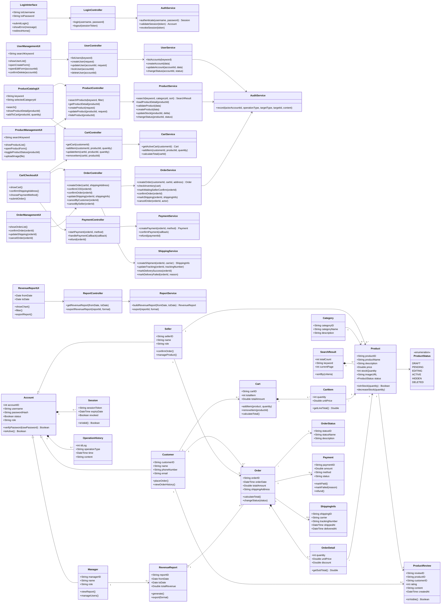
```mermaid
classDiagram
direction LR

class LoginInterface {
  +String txtUsername
  +String txtPassword
  +submitLogin()
  +showError(message)
  +redirectHome()
}

class UserManagementUI {
  +String searchKeyword
  +showUserList()
  +openCreateForm()
  +openEditForm(accountId)
  +confirmDelete(accountId)
}

class ProductCatalogUI {
  +String keyword
  +String selectedCategoryId
  +search()
  +showProductDetail(productId)
  +addToCart(productId, quantity)
}

class CartCheckoutUI {
  +showCart()
  +confirmShippingAddress()
  +choosePaymentMethod()
  +submitOrder()
}

class ProductManagementUI {
  +String searchKeyword
  +showProductList()
  +openProductForm()
  +toggleProductStatus(productId)
  +uploadImage(file)
}

class OrderManagementUI {
  +showOrderList()
  +confirmOrder(orderId)
  +updateShipping(orderId)
  +cancelOrder(orderId)
}

class RevenueReportUI {
  +Date fromDate
  +Date toDate
  +showChart()
  +filter()
  +exportReport()
}

class LoginController {
  +login(username, password)
  +logout(sessionToken)
}

class UserController {
  +listUsers(keyword)
  +createUser(request)
  +updateUser(accountId, request)
  +lockUser(accountId)
  +deleteUser(accountId)
}

class ProductController {
  +searchProducts(keyword, filter)
  +getProductDetail(productId)
  +createProduct(request)
  +updateProduct(productId, request)
  +hideProduct(productId)
}

class CartController {
  +getCart(customerId)
  +addItem(customerId, productId, quantity)
  +updateItem(cartId, productId, quantity)
  +removeItem(cartId, productId)
}

class OrderController {
  +createOrder(cartId, shippingAddress)
  +confirmCOD(orderId)
  +confirmOrder(orderId)
  +updateShipping(orderId, shippingInfo)
  +cancelByCustomer(orderId)
  +cancelBySeller(orderId)
}

class PaymentController {
  +startPayment(orderId, method)
  +handlePaymentCallback(callback)
  +refund(orderId)
}

class ReportController {
  +getRevenueReport(fromDate, toDate)
  +exportRevenueReport(reportId, format)
}

class AuthService {
  +authenticate(username, password) Session
  +validateSession(token) Account
  +revokeSession(token)
}

class UserService {
  +listAccounts(keyword)
  +createAccount(data)
  +updateAccount(accountId, data)
  +changeStatus(accountId, status)
}

class ProductService {
  +search(keyword, categoryId, sort) SearchResult
  +loadProductDetail(productId)
  +validateProduct(data)
  +createProduct(data)
  +updateStock(productId, delta)
  +changeStatus(productId, status)
}

class CartService {
  +getActiveCart(customerId) Cart
  +addItem(customerId, productId, quantity)
  +calculateTotal(cartId)
}

class OrderService {
  +createOrder(customerId, cartId, address) Order
  +checkInventory(cart)
  +markWaitingSellerConfirm(orderId)
  +confirmOrder(orderId)
  +markShipping(orderId, shippingInfo)
  +cancelOrder(orderId, actor)
}

class PaymentService {
  +createPayment(orderId, method) Payment
  +confirmPayment(callback)
  +refund(paymentId)
}

class ShippingService {
  +createShipment(orderId, carrier) ShippingInfo
  +updateTracking(orderId, trackingNumber)
  +markDeliverySuccess(orderId)
  +markDeliveryFailed(orderId, reason)
}

class ReportService {
  +buildRevenueReport(fromDate, toDate) RevenueReport
  +export(reportId, format)
}

class AuditService {
  +record(actorAccountId, operationType, targetType, targetId, content)
}

class Account {
  +int accountID
  +String username
  +String passwordHash
  +Boolean status
  +String role
  +verifyPassword(rawPassword) Boolean
  +isActive() Boolean
}

class Customer {
  +String customerID
  +String name
  +String phoneNumber
  +String email
  +placeOrder()
  +viewOrderHistory()
}

class Seller {
  +String sellerID
  +String name
  +String role
  +confirmOrder()
  +manageProduct()
}

class Manager {
  +String managerID
  +String name
  +String role
  +viewReport()
  +manageUsers()
}

class Session {
  +String sessionToken
  +DateTime expiryDate
  +Boolean revoked
  +isValid() Boolean
}

class Product {
  +String productID
  +String productName
  +String description
  +Double price
  +int stockQuantity
  +String imageURL
  +ProductStatus status
  +isInStock(quantity) Boolean
  +decreaseStock(quantity)
}

class ProductReview {
  +String reviewID
  +String productID
  +String customerID
  +int rating
  +String content
  +DateTime createdAt
  +isVisible() Boolean
}

class ProductStatus {
  <<enumeration>>
  DRAFT
  PENDING
  EDITING
  ACTIVE
  HIDDEN
  DELETED
}

class Category {
  +String categoryID
  +String categoryName
  +String description
}

class SearchResult {
  +int totalCount
  +String keyword
  +int currentPage
  +sortBy(criteria)
}

class Cart {
  +String cartID
  +int totalItem
  +Double totalAmount
  +addItem(product, quantity)
  +removeItem(productId)
  +calculateTotal()
}

class CartItem {
  +int quantity
  +Double unitPrice
  +getLineTotal() Double
}

class Order {
  +String orderID
  +DateTime orderDate
  +Double totalAmount
  +String shippingAddress
  +calculateTotal()
  +changeStatus(status)
}

class OrderDetail {
  +int quantity
  +Double unitPrice
  +Double discount
  +getSubTotal() Double
}

class OrderStatus {
  +String statusID
  +String statusName
  +String description
}

class Payment {
  +String paymentID
  +Double amount
  +String method
  +String status
  +markPaid()
  +markFailed(reason)
  +refund()
}

class ShippingInfo {
  +String shippingID
  +String carrier
  +String trackingNumber
  +DateTime shippedAt
  +DateTime deliveredAt
}

class OperationHistory {
  +int idLog
  +String operationType
  +DateTime time
  +String content
}

class RevenueReport {
  +String reportID
  +Date fromDate
  +Date toDate
  +Double totalRevenue
  +generate()
  +export(format)
}

LoginInterface --> LoginController
UserManagementUI --> UserController
ProductCatalogUI --> ProductController
ProductCatalogUI --> CartController
CartCheckoutUI --> CartController
CartCheckoutUI --> OrderController
CartCheckoutUI --> PaymentController
ProductManagementUI --> ProductController
OrderManagementUI --> OrderController
RevenueReportUI --> ReportController

LoginController --> AuthService
UserController --> UserService
ProductController --> ProductService
CartController --> CartService
OrderController --> OrderService
OrderController --> ShippingService
PaymentController --> PaymentService
ReportController --> ReportService

UserService --> AuditService
ProductService --> AuditService
OrderService --> AuditService

Account <|-- Customer
Account <|-- Seller
Account <|-- Manager
Account "1" *-- "0..*" Session
Account "1" *-- "0..*" OperationHistory
Customer "1" --> "0..*" Cart
Customer "1" --> "0..*" Order
Seller "1" --> "0..*" Product
Seller "1" --> "0..*" Order
Category "1" --> "0..*" Product
Product --> ProductStatus
Product "1" --> "0..*" ProductReview
Customer "1" --> "0..*" ProductReview
SearchResult "1" *-- "0..*" Product
Cart "1" *-- "1..*" CartItem
CartItem "*" --> "1" Product
Order "1" *-- "1..*" OrderDetail
OrderDetail "*" --> "1" Product
Order "*" --> "1" OrderStatus
Order "1" --> "0..1" Payment
Order "1" --> "0..1" ShippingInfo
RevenueReport "1" o-- "0..*" Order
Manager "1" --> "0..*" RevenueReport
```

### 3.2. Sơ đồ lớp tầng DAM

Tầng DAM tách logic truy cập dữ liệu khỏi controller/service. Mỗi repository chịu trách nhiệm một nhóm aggregate, dùng `UnitOfWork` và `TransactionManager` để bảo toàn tính nhất quán trong các thao tác có nhiều bước như đặt hàng, thanh toán, hủy đơn/hoàn tiền.

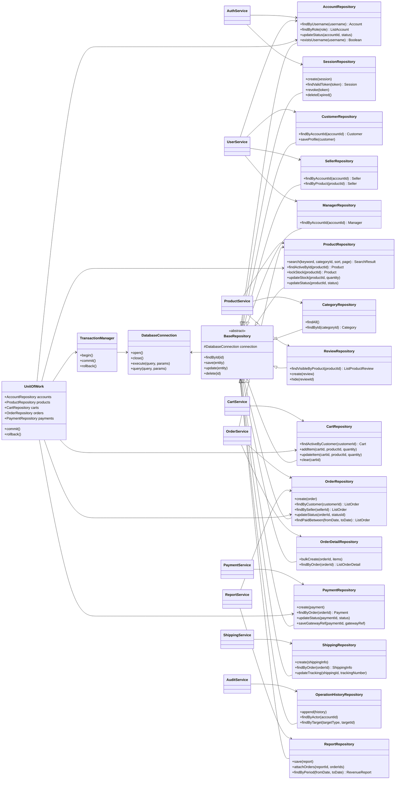
```mermaid
classDiagram
direction LR

class DatabaseConnection {
  +open()
  +close()
  +execute(query, params)
  +query(query, params)
}

class TransactionManager {
  +begin()
  +commit()
  +rollback()
}

class UnitOfWork {
  +AccountRepository accounts
  +ProductRepository products
  +CartRepository carts
  +OrderRepository orders
  +PaymentRepository payments
  +commit()
  +rollback()
}

class BaseRepository {
  <<abstract>>
  #DatabaseConnection connection
  +findById(id)
  +save(entity)
  +update(entity)
  +delete(id)
}

class AccountRepository {
  +findByUsername(username) Account
  +findByRole(role) ListAccount
  +updateStatus(accountId, status)
  +existsUsername(username) Boolean
}

class SessionRepository {
  +create(session)
  +findValidToken(token) Session
  +revoke(token)
  +deleteExpired()
}

class CustomerRepository {
  +findByAccountId(accountId) Customer
  +saveProfile(customer)
}

class SellerRepository {
  +findByAccountId(accountId) Seller
  +findByProduct(productId) Seller
}

class ManagerRepository {
  +findByAccountId(accountId) Manager
}

class ProductRepository {
  +search(keyword, categoryId, sort, page) SearchResult
  +findActiveById(productId) Product
  +lockStock(productId) Product
  +updateStock(productId, quantity)
  +updateStatus(productId, status)
}

class CategoryRepository {
  +findAll()
  +findById(categoryId) Category
}

class ReviewRepository {
  +findVisibleByProduct(productId) ListProductReview
  +create(review)
  +hide(reviewId)
}

class CartRepository {
  +findActiveByCustomer(customerId) Cart
  +addItem(cartId, productId, quantity)
  +updateItem(cartId, productId, quantity)
  +clear(cartId)
}

class OrderRepository {
  +create(order)
  +findByCustomer(customerId) ListOrder
  +findBySeller(sellerId) ListOrder
  +updateStatus(orderId, statusId)
  +findPaidBetween(fromDate, toDate) ListOrder
}

class OrderDetailRepository {
  +bulkCreate(orderId, items)
  +findByOrder(orderId) ListOrderDetail
}

class PaymentRepository {
  +create(payment)
  +findByOrder(orderId) Payment
  +updateStatus(paymentId, status)
  +saveGatewayRef(paymentId, gatewayRef)
}

class ShippingRepository {
  +create(shippingInfo)
  +findByOrder(orderId) ShippingInfo
  +updateTracking(shippingId, trackingNumber)
}

class OperationHistoryRepository {
  +append(history)
  +findByActor(accountId)
  +findByTarget(targetType, targetId)
}

class ReportRepository {
  +save(report)
  +attachOrders(reportId, orderIds)
  +findByPeriod(fromDate, toDate) RevenueReport
}

AuthService --> AccountRepository
AuthService --> SessionRepository
UserService --> AccountRepository
UserService --> CustomerRepository
UserService --> SellerRepository
UserService --> ManagerRepository
ProductService --> ProductRepository
ProductService --> CategoryRepository
ProductService --> ReviewRepository
CartService --> CartRepository
OrderService --> OrderRepository
OrderService --> OrderDetailRepository
OrderService --> ProductRepository
PaymentService --> PaymentRepository
ShippingService --> ShippingRepository
ReportService --> ReportRepository
ReportService --> OrderRepository
AuditService --> OperationHistoryRepository

DatabaseConnection <-- BaseRepository
TransactionManager --> DatabaseConnection
UnitOfWork --> TransactionManager
UnitOfWork --> AccountRepository
UnitOfWork --> ProductRepository
UnitOfWork --> CartRepository
UnitOfWork --> OrderRepository
UnitOfWork --> PaymentRepository

BaseRepository <|-- AccountRepository
BaseRepository <|-- SessionRepository
BaseRepository <|-- CustomerRepository
BaseRepository <|-- SellerRepository
BaseRepository <|-- ManagerRepository
BaseRepository <|-- ProductRepository
BaseRepository <|-- CategoryRepository
BaseRepository <|-- ReviewRepository
BaseRepository <|-- CartRepository
BaseRepository <|-- OrderRepository
BaseRepository <|-- OrderDetailRepository
BaseRepository <|-- PaymentRepository
BaseRepository <|-- ShippingRepository
BaseRepository <|-- OperationHistoryRepository
BaseRepository <|-- ReportRepository
```

### 3.3. Tầng DAL - Repository Interfaces

Các interface repository là hợp đồng truy cập dữ liệu cho service. Thiết kế này giúp service không phụ thuộc vào MySQL/Redis cụ thể và có thể thay thế implementation khi cần kiểm thử hoặc đổi hạ tầng.


```mermaid
classDiagram
direction LR

class IAccountRepository {
  <<interface>>
  +findById(id) Account
  +findByUsername(username) Account
  +findAll() ListAccount
  +findByRole(role) ListAccount
  +save(account) Account
  +update(account) Boolean
  +delete(id) Boolean
  +existsByUsername(username) Boolean
  +lockAccount(id) Boolean
  +unlockAccount(id) Boolean
}

class ISessionRepository {
  <<interface>>
  +findByToken(token) Session
  +findByAccountId(accountId) ListSession
  +save(session) Session
  +revoke(token) Boolean
  +deleteExpired() Integer
  +isTokenValid(token) Boolean
}

class IProductRepository {
  <<interface>>
  +findById(id) Product
  +findActiveById(id) Product
  +findByCategory(categoryId) ListProduct
  +findByKeyword(keyword) ListProduct
  +findBySeller(sellerId) ListProduct
  +search(keyword, categoryId, sort, page) SearchResult
  +save(product) Product
  +update(product) Boolean
  +updateStock(id, quantity) Boolean
  +updateStatus(id, status) Boolean
}

class ICategoryRepository {
  <<interface>>
  +findAll() ListCategory
  +findActive() ListCategory
  +findById(id) Category
  +save(category) Category
  +update(category) Boolean
}

class IReviewRepository {
  <<interface>>
  +findVisibleByProduct(productId) ListProductReview
  +create(review) ProductReview
  +hide(reviewId) Boolean
}

class ICartRepository {
  <<interface>>
  +findActiveByCustomer(customerId) Cart
  +findById(cartId) Cart
  +save(cart) Cart
  +addItem(cartId, productId, quantity) Boolean
  +removeItem(cartId, productId) Boolean
  +updateItemQty(cartId, productId, quantity) Boolean
  +clear(cartId) Boolean
}

class IOrderRepository {
  <<interface>>
  +findById(id) Order
  +findByCustomer(customerId) ListOrder
  +findBySeller(sellerId) ListOrder
  +findByStatus(statusId) ListOrder
  +findByDateRange(fromDate, toDate) ListOrder
  +create(order) Order
  +update(order) Boolean
  +updateStatus(id, statusId) Boolean
  +findPaidBetween(fromDate, toDate) ListOrder
  +getTotalRevenue(fromDate, toDate) Double
}

class IPaymentRepository {
  <<interface>>
  +findById(id) Payment
  +findByOrderId(orderId) Payment
  +findByTransactionRef(ref) Payment
  +create(payment) Payment
  +updateStatus(id, status) Boolean
  +saveGatewayRef(id, ref) Boolean
}

class IShippingRepository {
  <<interface>>
  +findByOrderId(orderId) ShippingInfo
  +findById(id) ShippingInfo
  +save(shippingInfo) ShippingInfo
  +updateTracking(id, trackingNumber) Boolean
  +updateLocation(id, location) Boolean
}

class IOperationHistoryRepository {
  <<interface>>
  +append(history) OperationHistory
  +findByActor(accountId) ListOperationHistory
  +findByTarget(targetType, targetId) ListOperationHistory
  +findByDateRange(fromDate, toDate) ListOperationHistory
}

class IReportRepository {
  <<interface>>
  +save(report) RevenueReport
  +attachOrders(reportId, orderIds) Boolean
  +findByPeriod(fromDate, toDate) RevenueReport
}
```

### 3.4. Tầng DAL - Repository Implementations

Repository implementation hiện thực các interface ở trên. Trong triển khai Java/Spring có thể dùng `JdbcTemplate` hoặc JPA/Hibernate; trong triển khai Node.js có thể thay bằng ORM tương đương như Prisma/TypeORM. `SessionRepositoryImpl` ưu tiên Redis vì dữ liệu phiên có TTL.

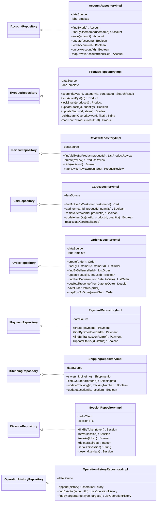
```mermaid
classDiagram
direction LR

class AccountRepositoryImpl {
  -dataSource
  -jdbcTemplate
  +findById(id) Account
  +findByUsername(username) Account
  +save(account) Account
  +update(account) Boolean
  +lockAccount(id) Boolean
  +unlockAccount(id) Boolean
  -mapRowToAccount(resultSet) Account
}

class ProductRepositoryImpl {
  -dataSource
  -jdbcTemplate
  +search(keyword, categoryId, sort, page) SearchResult
  +findActiveById(id) Product
  +lockStock(productId) Product
  +updateStock(id, quantity) Boolean
  +updateStatus(id, status) Boolean
  -buildSearchQuery(keyword, filter) String
  -mapRowToProduct(resultSet) Product
}

class ReviewRepositoryImpl {
  -dataSource
  +findVisibleByProduct(productId) ListProductReview
  +create(review) ProductReview
  +hide(reviewId) Boolean
  -mapRowToReview(resultSet) ProductReview
}

class CartRepositoryImpl {
  -dataSource
  +findActiveByCustomer(customerId) Cart
  +addItem(cartId, productId, quantity) Boolean
  +removeItem(cartId, productId) Boolean
  +updateItemQty(cartId, productId, quantity) Boolean
  -recalculateCartTotal(cartId)
}

class OrderRepositoryImpl {
  -dataSource
  -jdbcTemplate
  +create(order) Order
  +findByCustomer(customerId) ListOrder
  +findBySeller(sellerId) ListOrder
  +updateStatus(id, statusId) Boolean
  +findPaidBetween(fromDate, toDate) ListOrder
  +getTotalRevenue(fromDate, toDate) Double
  -saveOrderDetails(order)
  -mapRowToOrder(resultSet) Order
}

class PaymentRepositoryImpl {
  -dataSource
  +create(payment) Payment
  +findByOrderId(orderId) Payment
  +findByTransactionRef(ref) Payment
  +updateStatus(id, status) Boolean
}

class ShippingRepositoryImpl {
  -dataSource
  +save(shippingInfo) ShippingInfo
  +findByOrderId(orderId) ShippingInfo
  +updateTracking(id, trackingNumber) Boolean
  +updateLocation(id, location) Boolean
}

class SessionRepositoryImpl {
  -redisClient
  -sessionTTL
  +findByToken(token) Session
  +save(session) Session
  +revoke(token) Boolean
  +deleteExpired() Integer
  -serialize(session) String
  -deserialize(data) Session
}

class OperationHistoryRepositoryImpl {
  -dataSource
  +append(history) OperationHistory
  +findByActor(accountId) ListOperationHistory
  +findByTarget(targetType, targetId) ListOperationHistory
}

IAccountRepository <|.. AccountRepositoryImpl
IProductRepository <|.. ProductRepositoryImpl
IReviewRepository <|.. ReviewRepositoryImpl
ICartRepository <|.. CartRepositoryImpl
IOrderRepository <|.. OrderRepositoryImpl
IPaymentRepository <|.. PaymentRepositoryImpl
IShippingRepository <|.. ShippingRepositoryImpl
ISessionRepository <|.. SessionRepositoryImpl
IOperationHistoryRepository <|.. OperationHistoryRepositoryImpl
```

### 3.5. Tầng Service - Business Logic

Service là nơi đặt quy tắc nghiệp vụ chính: xác thực, validate dữ liệu, kiểm tra tồn kho, chuyển trạng thái đơn hàng, gọi thanh toán, hoàn tiền và tạo báo cáo doanh thu.

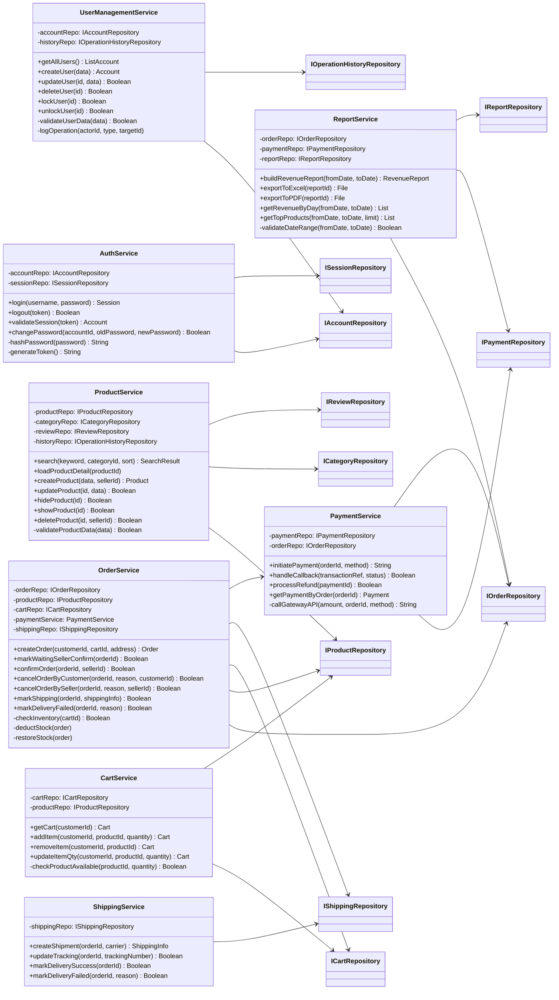
```mermaid
classDiagram
direction LR

class AuthService {
  -accountRepo: IAccountRepository
  -sessionRepo: ISessionRepository
  +login(username, password) Session
  +logout(token) Boolean
  +validateSession(token) Account
  +changePassword(accountId, oldPassword, newPassword) Boolean
  -hashPassword(password) String
  -generateToken() String
}

class UserManagementService {
  -accountRepo: IAccountRepository
  -historyRepo: IOperationHistoryRepository
  +getAllUsers() ListAccount
  +createUser(data) Account
  +updateUser(id, data) Boolean
  +deleteUser(id) Boolean
  +lockUser(id) Boolean
  +unlockUser(id) Boolean
  -validateUserData(data) Boolean
  -logOperation(actorId, type, targetId)
}

class ProductService {
  -productRepo: IProductRepository
  -categoryRepo: ICategoryRepository
  -reviewRepo: IReviewRepository
  -historyRepo: IOperationHistoryRepository
  +search(keyword, categoryId, sort) SearchResult
  +loadProductDetail(productId)
  +createProduct(data, sellerId) Product
  +updateProduct(id, data) Boolean
  +hideProduct(id) Boolean
  +showProduct(id) Boolean
  +deleteProduct(id, sellerId) Boolean
  -validateProductData(data) Boolean
}

class CartService {
  -cartRepo: ICartRepository
  -productRepo: IProductRepository
  +getCart(customerId) Cart
  +addItem(customerId, productId, quantity) Cart
  +removeItem(customerId, productId) Cart
  +updateItemQty(customerId, productId, quantity) Cart
  -checkProductAvailable(productId, quantity) Boolean
}

class OrderService {
  -orderRepo: IOrderRepository
  -productRepo: IProductRepository
  -cartRepo: ICartRepository
  -paymentService: PaymentService
  -shippingRepo: IShippingRepository
  +createOrder(customerId, cartId, address) Order
  +markWaitingSellerConfirm(orderId) Boolean
  +confirmOrder(orderId, sellerId) Boolean
  +cancelOrderByCustomer(orderId, reason, customerId) Boolean
  +cancelOrderBySeller(orderId, reason, sellerId) Boolean
  +markShipping(orderId, shippingInfo) Boolean
  +markDeliveryFailed(orderId, reason) Boolean
  -checkInventory(cartId) Boolean
  -deductStock(order)
  -restoreStock(order)
}

class PaymentService {
  -paymentRepo: IPaymentRepository
  -orderRepo: IOrderRepository
  +initiatePayment(orderId, method) String
  +handleCallback(transactionRef, status) Boolean
  +processRefund(paymentId) Boolean
  +getPaymentByOrder(orderId) Payment
  -callGatewayAPI(amount, orderId, method) String
}

class ShippingService {
  -shippingRepo: IShippingRepository
  +createShipment(orderId, carrier) ShippingInfo
  +updateTracking(orderId, trackingNumber) Boolean
  +markDeliverySuccess(orderId) Boolean
  +markDeliveryFailed(orderId, reason) Boolean
}

class ReportService {
  -orderRepo: IOrderRepository
  -paymentRepo: IPaymentRepository
  -reportRepo: IReportRepository
  +buildRevenueReport(fromDate, toDate) RevenueReport
  +exportToExcel(reportId) File
  +exportToPDF(reportId) File
  +getRevenueByDay(fromDate, toDate) List
  +getTopProducts(fromDate, toDate, limit) List
  -validateDateRange(fromDate, toDate) Boolean
}

AuthService --> IAccountRepository
AuthService --> ISessionRepository
UserManagementService --> IAccountRepository
UserManagementService --> IOperationHistoryRepository
ProductService --> IProductRepository
ProductService --> ICategoryRepository
ProductService --> IReviewRepository
CartService --> ICartRepository
CartService --> IProductRepository
OrderService --> IOrderRepository
OrderService --> IProductRepository
OrderService --> ICartRepository
OrderService --> IShippingRepository
OrderService --> PaymentService
PaymentService --> IPaymentRepository
PaymentService --> IOrderRepository
ShippingService --> IShippingRepository
ReportService --> IOrderRepository
ReportService --> IPaymentRepository
ReportService --> IReportRepository
```

### 3.6. Tầng Controller - REST API

Controller là tầng nhận/trả HTTP request, kiểm tra token/quyền cơ bản và chuyển request sang service. DTO/request/response không vẽ chi tiết trong sơ đồ để tránh làm rối, nhưng các method dưới đây phản ánh các endpoint chính.

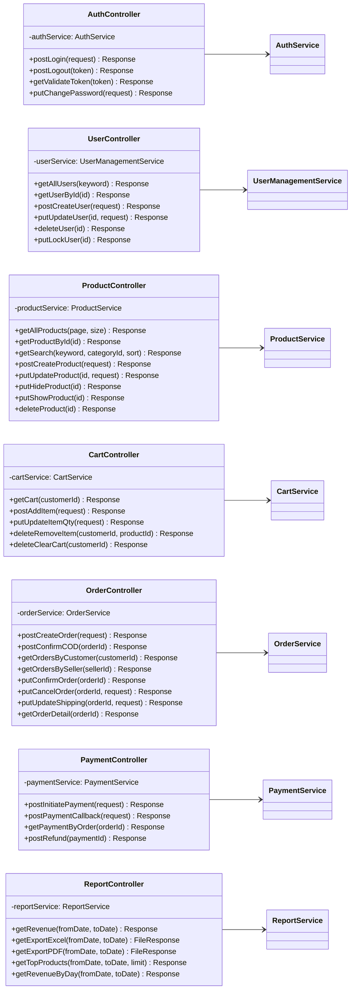
```mermaid
classDiagram
direction LR

class AuthController {
  -authService: AuthService
  +postLogin(request) Response
  +postLogout(token) Response
  +getValidateToken(token) Response
  +putChangePassword(request) Response
}

class UserController {
  -userService: UserManagementService
  +getAllUsers(keyword) Response
  +getUserById(id) Response
  +postCreateUser(request) Response
  +putUpdateUser(id, request) Response
  +deleteUser(id) Response
  +putLockUser(id) Response
}

class ProductController {
  -productService: ProductService
  +getAllProducts(page, size) Response
  +getProductById(id) Response
  +getSearch(keyword, categoryId, sort) Response
  +postCreateProduct(request) Response
  +putUpdateProduct(id, request) Response
  +putHideProduct(id) Response
  +putShowProduct(id) Response
  +deleteProduct(id) Response
}

class CartController {
  -cartService: CartService
  +getCart(customerId) Response
  +postAddItem(request) Response
  +putUpdateItemQty(request) Response
  +deleteRemoveItem(customerId, productId) Response
  +deleteClearCart(customerId) Response
}

class OrderController {
  -orderService: OrderService
  +postCreateOrder(request) Response
  +postConfirmCOD(orderId) Response
  +getOrdersByCustomer(customerId) Response
  +getOrdersBySeller(sellerId) Response
  +putConfirmOrder(orderId) Response
  +putCancelOrder(orderId, request) Response
  +putUpdateShipping(orderId, request) Response
  +getOrderDetail(orderId) Response
}

class PaymentController {
  -paymentService: PaymentService
  +postInitiatePayment(request) Response
  +postPaymentCallback(request) Response
  +getPaymentByOrder(orderId) Response
  +postRefund(paymentId) Response
}

class ReportController {
  -reportService: ReportService
  +getRevenue(fromDate, toDate) Response
  +getExportExcel(fromDate, toDate) FileResponse
  +getExportPDF(fromDate, toDate) FileResponse
  +getTopProducts(fromDate, toDate, limit) Response
  +getRevenueByDay(fromDate, toDate) Response
}

AuthController --> AuthService
UserController --> UserManagementService
ProductController --> ProductService
CartController --> CartService
OrderController --> OrderService
PaymentController --> PaymentService
ReportController --> ReportService
```

## 4. Nguyên mẫu giao diện

Các nguyên mẫu dưới đây tập trung vào các màn hình chính của tài liệu gốc. Mục tiêu là thể hiện vùng dữ liệu, hành động chính và thông báo lỗi/thành công, không phải bản thiết kế màu sắc cuối cùng.

### 4.1. Bản đồ màn hình

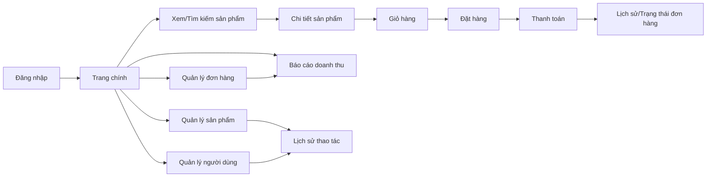
```mermaid
flowchart LR
    Login["Đăng nhập"] --> Home["Trang chính"]
    Home --> Catalog["Xem/Tìm kiếm sản phẩm"]
    Catalog --> Detail["Chi tiết sản phẩm"]
    Detail --> Cart["Giỏ hàng"]
    Cart --> Checkout["Đặt hàng"]
    Checkout --> Payment["Thanh toán"]
    Payment --> OrderHistory["Lịch sử/Trạng thái đơn hàng"]

    Home --> AdminUsers["Quản lý người dùng"]
    Home --> AdminProducts["Quản lý sản phẩm"]
    Home --> AdminOrders["Quản lý đơn hàng"]
    Home --> Reports["Báo cáo doanh thu"]

    AdminProducts --> Audit["Lịch sử thao tác"]
    AdminUsers --> Audit
    AdminOrders --> Reports
```

### 4.2. Màn hình đăng nhập

```text
+------------------------------------------------------+
| HỆ THỐNG BÁN HÀNG TRỰC TUYẾN                         |
+------------------------------------------------------+
| Tên đăng nhập: [ nguyen_van_a                    ]   |
| Mật khẩu:      [ ********                       ]    |
|                                                      |
| [ Đăng nhập ]                         [ Đăng ký ]    |
|                                                      |
| ! Tên đăng nhập hoặc mật khẩu không đúng             |
| ! Tài khoản bị khóa, vui lòng liên hệ quản trị viên  |
+------------------------------------------------------+
```

### 4.3. Màn hình xem/tìm kiếm sản phẩm

```text
+--------------------------------------------------------------------------------+
| Logo | Tìm kiếm: [ bàn phím cơ                         ] [Tìm] | Giỏ hàng (1) |
+--------------------------------------------------------------------------------+
| Danh mục                  | Kết quả: 2 sản phẩm                                  |
| [ ] Phụ kiện máy tính     | +---------------------+  +---------------------+     |
| [ ] Âm thanh              | | Bàn phím cơ AKKO    |  | Bàn phím Keychron   |     |
| [ ] Thiết bị ngoại vi     | | 1.200.000đ          |  | 1.850.000đ          |     |
| Sắp xếp: Giá tăng [v]     | | Tồn: 45             |  | Tồn: 30             |     |
|                           | | [Chi tiết] [Đánh giá] [Thêm] | [Chi tiết] [Đánh giá] [Thêm] |
|                           | +---------------------+  +---------------------+     |
|                           | Không tìm thấy? Gợi ý sản phẩm phổ biến             |
+--------------------------------------------------------------------------------+
```

### 4.4. Màn hình giỏ hàng, đặt hàng và thanh toán

```text
+--------------------------------------------------------------------------------+
| GIỎ HÀNG / ĐẶT HÀNG                                                            |
+--------------------------------------------------------------------------------+
| Sản phẩm                | Đơn giá      | SL | Giảm giá | Thành tiền            |
| Bàn phím cơ AKKO        | 1.200.000đ   | 1  | 0đ       | 1.200.000đ            |
+--------------------------------------------------------------------------------+
| Địa chỉ giao hàng: [ Số 1 Đại Cồ Việt, Hà Nội                         ]        |
| Phương thức thanh toán: ( ) COD  (x) Thẻ tín dụng  ( ) Ví điện tử              |
| Tổng tiền: 1.200.000đ                                                           |
| [Quay lại]                                      [Xác nhận thanh toán]          |
|                                                                                |
| ! Sản phẩm đã hết hoặc không đủ số lượng                                       |
| ! Giao dịch bị từ chối, vui lòng thử lại hoặc chọn phương thức khác            |
+--------------------------------------------------------------------------------+
```

### 4.5. Màn hình quản lý sản phẩm

```text
+--------------------------------------------------------------------------------+
| QUẢN LÝ SẢN PHẨM                                            [Thêm sản phẩm]    |
+--------------------------------------------------------------------------------+
| Tìm kiếm: [ Tai nghe Sony                             ]  Danh mục [Tất cả v]   |
+--------------------------------------------------------------------------------+
| Mã SP | Tên sản phẩm             | Giá        | Tồn | Danh mục | Trạng thái     |
| P010  | Tai nghe Sony WH-1000    | 4.500.000đ | 20  | Âm thanh | ACTIVE [Ẩn]    |
| P001  | Bàn phím cơ              | 1.000.000đ | 45  | Phụ kiện | ACTIVE [Ẩn]    |
+--------------------------------------------------------------------------------+
| Form thêm/sửa: Tên, Giá, Mô tả, Số lượng tồn, Danh mục, Ảnh, Trạng thái        |
| Validate: bắt buộc nhập, giá/số lượng là số, mã/tên không trùng                |
+--------------------------------------------------------------------------------+
```

### 4.6. Màn hình quản lý đơn hàng

```text
+--------------------------------------------------------------------------------+
| QUẢN LÝ ĐƠN HÀNG                                                                |
+--------------------------------------------------------------------------------+
| Lọc trạng thái [Tất cả v]  Từ ngày [__/__/____]  Đến ngày [__/__/____] [Lọc]   |
+--------------------------------------------------------------------------------+
| Mã đơn  | Khách hàng     | Tổng tiền   | Thanh toán | Giao hàng | Hành động     |
| DH-2026 | Nguyễn Văn A   | 1.250.000đ  | Paid       | Shipping  | [Chi tiết]    |
| DH-2027 | Trần Văn B     | 850.000đ    | Pending    | New       | [Xác nhận]    |
+--------------------------------------------------------------------------------+
| Chi tiết đơn: sản phẩm, số lượng, địa chỉ, thanh toán, mã vận đơn              |
| Hành động: Xác nhận, Cập nhật giao hàng, Hủy đơn, Hoàn tiền                    |
+--------------------------------------------------------------------------------+
```

### 4.7. Màn hình báo cáo doanh thu

```text
+--------------------------------------------------------------------------------+
| BÁO CÁO DOANH THU                                                               |
+--------------------------------------------------------------------------------+
| Từ ngày [01/04/2026]  Đến ngày [30/04/2026]  [Lọc] [Xuất Excel/PDF]            |
+--------------------------------------------------------------------------------+
| Tổng doanh thu: 15.000.000đ | Số đơn hoàn tất: 2 | Hoàn tiền: 0đ               |
+--------------------------------------------------------------------------------+
| Biểu đồ doanh thu theo ngày                                                     |
| 05/04  █████ 5.000.000đ                                                         |
| 15/04  ██████████ 10.000.000đ                                                   |
+--------------------------------------------------------------------------------+
| Đơn hàng | Ngày đặt    | Khách hàng | Trạng thái | Số tiền                    |
| DH101    | 05/04/2026  | ...        | Paid       | 5.000.000đ                 |
| DH102    | 15/04/2026  | ...        | Paid       | 10.000.000đ                |
+--------------------------------------------------------------------------------+
```

## 5. Sơ đồ luồng tương tác

### 5.1. UC01 - Đăng nhập

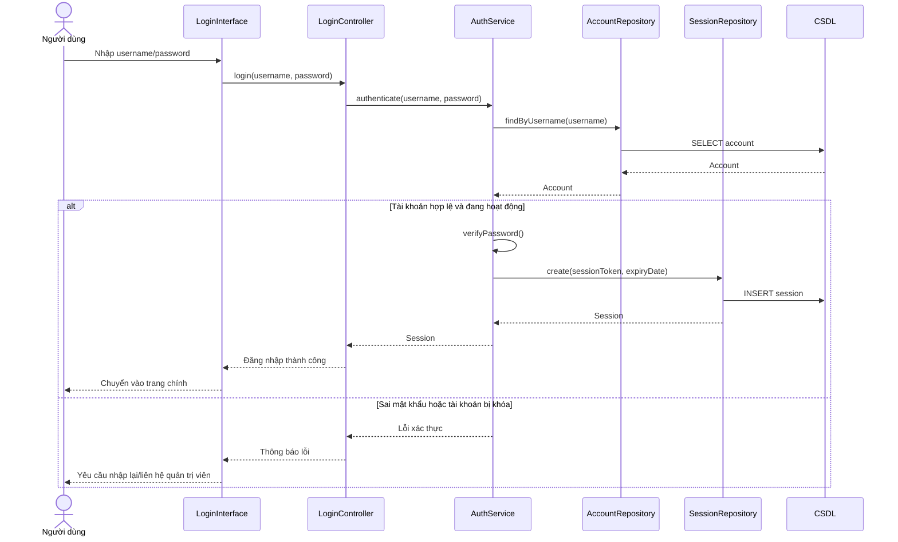
```mermaid
sequenceDiagram
    actor User as Người dùng
    participant UI as LoginInterface
    participant C as LoginController
    participant Auth as AuthService
    participant AccRepo as AccountRepository
    participant SessRepo as SessionRepository
    participant DB as CSDL

    User->>UI: Nhập username/password
    UI->>C: login(username, password)
    C->>Auth: authenticate(username, password)
    Auth->>AccRepo: findByUsername(username)
    AccRepo->>DB: SELECT account
    DB-->>AccRepo: Account
    AccRepo-->>Auth: Account
    alt Tài khoản hợp lệ và đang hoạt động
        Auth->>Auth: verifyPassword()
        Auth->>SessRepo: create(sessionToken, expiryDate)
        SessRepo->>DB: INSERT session
        SessRepo-->>Auth: Session
        Auth-->>C: Session
        C-->>UI: Đăng nhập thành công
        UI-->>User: Chuyển vào trang chính
    else Sai mật khẩu hoặc tài khoản bị khóa
        Auth-->>C: Lỗi xác thực
        C-->>UI: Thông báo lỗi
        UI-->>User: Yêu cầu nhập lại/liên hệ quản trị viên
    end
```

### 5.2. UC03 - Tìm kiếm sản phẩm và thêm vào giỏ

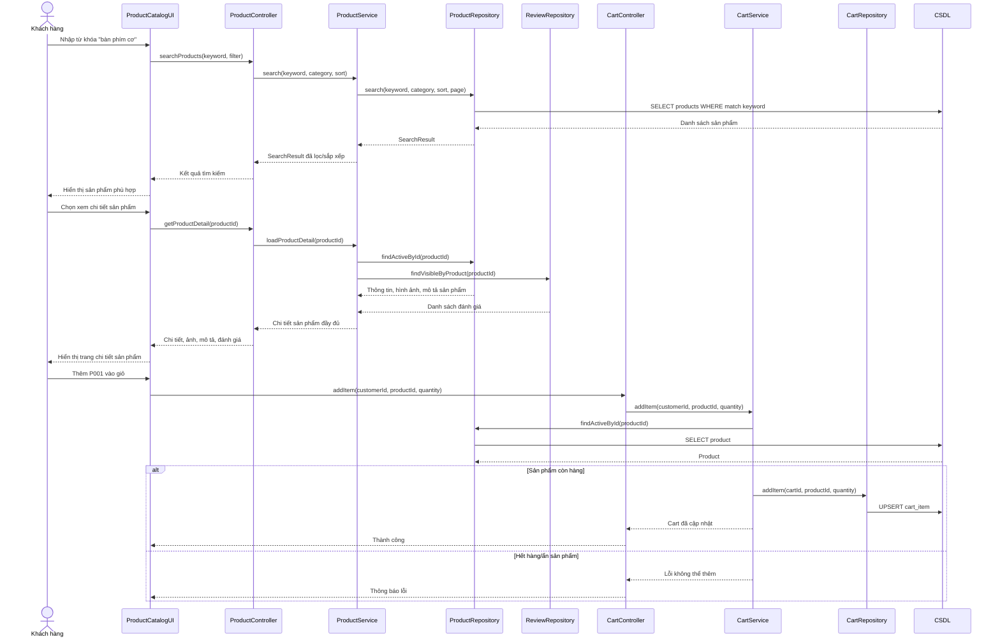
```mermaid
sequenceDiagram
    actor Customer as Khách hàng
    participant UI as ProductCatalogUI
    participant PC as ProductController
    participant PS as ProductService
    participant PR as ProductRepository
    participant RR as ReviewRepository
    participant CC as CartController
    participant CS as CartService
    participant CR as CartRepository
    participant DB as CSDL

    Customer->>UI: Nhập từ khóa "bàn phím cơ"
    UI->>PC: searchProducts(keyword, filter)
    PC->>PS: search(keyword, category, sort)
    PS->>PR: search(keyword, category, sort, page)
    PR->>DB: SELECT products WHERE match keyword
    DB-->>PR: Danh sách sản phẩm
    PR-->>PS: SearchResult
    PS-->>PC: SearchResult đã lọc/sắp xếp
    PC-->>UI: Kết quả tìm kiếm
    UI-->>Customer: Hiển thị sản phẩm phù hợp

    Customer->>UI: Chọn xem chi tiết sản phẩm
    UI->>PC: getProductDetail(productId)
    PC->>PS: loadProductDetail(productId)
    PS->>PR: findActiveById(productId)
    PS->>RR: findVisibleByProduct(productId)
    PR-->>PS: Thông tin, hình ảnh, mô tả sản phẩm
    RR-->>PS: Danh sách đánh giá
    PS-->>PC: Chi tiết sản phẩm đầy đủ
    PC-->>UI: Chi tiết, ảnh, mô tả, đánh giá
    UI-->>Customer: Hiển thị trang chi tiết sản phẩm

    Customer->>UI: Thêm P001 vào giỏ
    UI->>CC: addItem(customerId, productId, quantity)
    CC->>CS: addItem(customerId, productId, quantity)
    CS->>PR: findActiveById(productId)
    PR->>DB: SELECT product
    DB-->>PR: Product
    alt Sản phẩm còn hàng
        CS->>CR: addItem(cartId, productId, quantity)
        CR->>DB: UPSERT cart_item
        CS-->>CC: Cart đã cập nhật
        CC-->>UI: Thành công
    else Hết hàng/ẩn sản phẩm
        CS-->>CC: Lỗi không thể thêm
        CC-->>UI: Thông báo lỗi
    end
```

### 5.3. UC04 - Đặt hàng và thanh toán

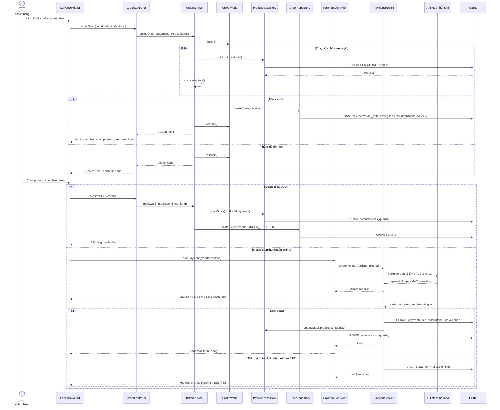
```mermaid
sequenceDiagram
    actor Customer as Khách hàng
    participant UI as CartCheckoutUI
    participant OC as OrderController
    participant OS as OrderService
    participant UOW as UnitOfWork
    participant PR as ProductRepository
    participant OR as OrderRepository
    participant PayC as PaymentController
    participant PayS as PaymentService
    participant PayGW as API Ngân hàng/Ví
    participant DB as CSDL

    Customer->>UI: Vào giỏ hàng và chọn Đặt hàng
    UI->>OC: createOrder(cartId, shippingAddress)
    OC->>OS: createOrder(customerId, cartId, address)
    OS->>UOW: begin()
    loop Từng sản phẩm trong giỏ
        OS->>PR: lockStock(productId)
        PR->>DB: SELECT FOR UPDATE product
        DB-->>PR: Product
        OS->>OS: checkInventory()
    end
    alt Tồn kho đủ
        OS->>OR: create(order, details)
        OR->>DB: INSERT orders/order_details trạng thái Chờ thanh toán/Chờ xử lý
        OS->>UOW: commit()
        OS-->>OC: Mã đơn hàng
        OC-->>UI: Hiển thị màn hình chọn phương thức thanh toán
    else Không đủ tồn kho
        OS->>UOW: rollback()
        OS-->>OC: Lỗi hết hàng
        OC-->>UI: Yêu cầu điều chỉnh giỏ hàng
    end

    Customer->>UI: Chọn phương thức thanh toán
    alt Khách chọn COD
        UI->>OC: confirmCOD(orderId)
        OC->>OS: markWaitingSellerConfirm(orderId)
        OS->>PR: updateStock(productId, -quantity)
        PR->>DB: UPDATE products.stock_quantity
        OS->>OR: updateStatus(orderId, ORDER_CREATED)
        OR->>DB: UPDATE orders
        OC-->>UI: Đặt hàng thành công
    else Khách chọn thanh toán online
        UI->>PayC: startPayment(orderId, method)
        PayC->>PayS: createPayment(orderId, method)
        PayS->>PayGW: Tạo giao dịch và lấy URL thanh toán
        PayGW-->>PayS: paymentURL/providerTransactionId
        PayS-->>PayC: URL thanh toán
        PayC-->>UI: Chuyển hướng sang cổng thanh toán
        PayGW-->>PayS: Webhook/return URL báo kết quả
        alt Thành công
            PayS->>DB: UPDATE payment=Paid, order=Paid/Chờ xác nhận
            PayS->>PR: updateStock(productId, -quantity)
            PR->>DB: UPDATE products.stock_quantity
            PayS-->>PayC: Paid
            PayC-->>UI: Thanh toán thành công
        else Thất bại, bị từ chối hoặc quá hạn OTP
            PayS->>DB: UPDATE payment=Failed/Pending
            PayS-->>PayC: Lỗi thanh toán
            PayC-->>UI: Yêu cầu chọn lại phương thức/thử lại
        end
    end
```

### 5.4. UC05 - Quản lý sản phẩm

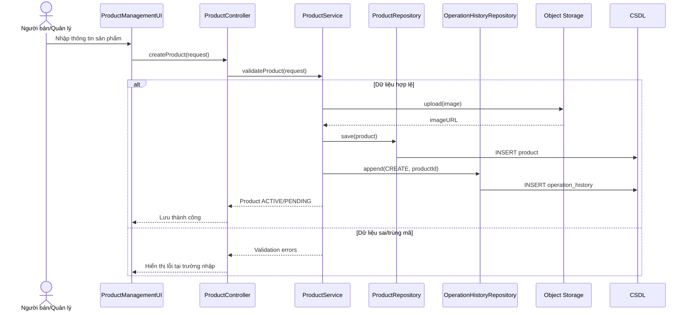
```mermaid
sequenceDiagram
    actor Seller as Người bán/Quản lý
    participant UI as ProductManagementUI
    participant PC as ProductController
    participant PS as ProductService
    participant PR as ProductRepository
    participant AR as OperationHistoryRepository
    participant Obj as Object Storage
    participant DB as CSDL

    Seller->>UI: Nhập thông tin sản phẩm
    UI->>PC: createProduct(request)
    PC->>PS: validateProduct(request)
    alt Dữ liệu hợp lệ
        PS->>Obj: upload(image)
        Obj-->>PS: imageURL
        PS->>PR: save(product)
        PR->>DB: INSERT product
        PS->>AR: append(CREATE, productId)
        AR->>DB: INSERT operation_history
        PS-->>PC: Product ACTIVE/PENDING
        PC-->>UI: Lưu thành công
    else Dữ liệu sai/trùng mã
        PS-->>PC: Validation errors
        PC-->>UI: Hiển thị lỗi tại trường nhập
    end
```

### 5.5. UC06 - Quản lý đơn hàng, hủy đơn và hoàn tiền

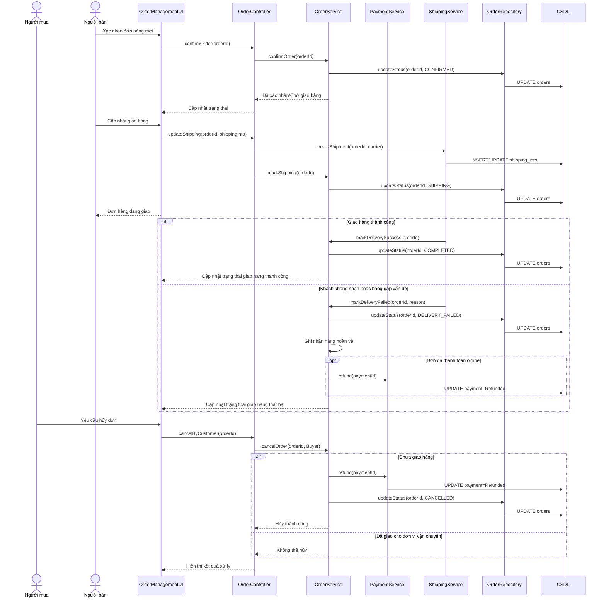
```mermaid
sequenceDiagram
    actor Buyer as Người mua
    actor Seller as Người bán
    participant UI as OrderManagementUI
    participant OC as OrderController
    participant OS as OrderService
    participant PayS as PaymentService
    participant ShipS as ShippingService
    participant OR as OrderRepository
    participant DB as CSDL

    Seller->>UI: Xác nhận đơn hàng mới
    UI->>OC: confirmOrder(orderId)
    OC->>OS: confirmOrder(orderId)
    OS->>OR: updateStatus(orderId, CONFIRMED)
    OR->>DB: UPDATE orders
    OS-->>OC: Đã xác nhận/Chờ giao hàng
    OC-->>UI: Cập nhật trạng thái

    Seller->>UI: Cập nhật giao hàng
    UI->>OC: updateShipping(orderId, shippingInfo)
    OC->>ShipS: createShipment(orderId, carrier)
    ShipS->>DB: INSERT/UPDATE shipping_info
    OC->>OS: markShipping(orderId)
    OS->>OR: updateStatus(orderId, SHIPPING)
    OR->>DB: UPDATE orders
    UI-->>Seller: Đơn hàng đang giao

    alt Giao hàng thành công
        ShipS->>OS: markDeliverySuccess(orderId)
        OS->>OR: updateStatus(orderId, COMPLETED)
        OR->>DB: UPDATE orders
        OS-->>UI: Cập nhật trạng thái giao hàng thành công
    else Khách không nhận hoặc hàng gặp vấn đề
        ShipS->>OS: markDeliveryFailed(orderId, reason)
        OS->>OR: updateStatus(orderId, DELIVERY_FAILED)
        OR->>DB: UPDATE orders
        OS->>OS: Ghi nhận hàng hoàn về
        opt Đơn đã thanh toán online
            OS->>PayS: refund(paymentId)
            PayS->>DB: UPDATE payment=Refunded
        end
        OS-->>UI: Cập nhật trạng thái giao hàng thất bại
    end

    Buyer->>UI: Yêu cầu hủy đơn
    UI->>OC: cancelByCustomer(orderId)
    OC->>OS: cancelOrder(orderId, Buyer)
    alt Chưa giao hàng
        OS->>PayS: refund(paymentId)
        PayS->>DB: UPDATE payment=Refunded
        OS->>OR: updateStatus(orderId, CANCELLED)
        OR->>DB: UPDATE orders
        OS-->>OC: Hủy thành công
    else Đã giao cho đơn vị vận chuyển
        OS-->>OC: Không thể hủy
    end
    OC-->>UI: Hiển thị kết quả xử lý
```

### 5.6. UC07 - Báo cáo doanh thu

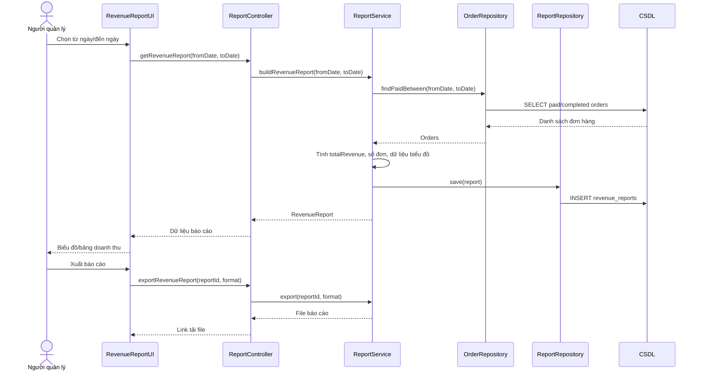
```mermaid
sequenceDiagram
    actor Manager as Người quản lý
    participant UI as RevenueReportUI
    participant RC as ReportController
    participant RS as ReportService
    participant OR as OrderRepository
    participant RR as ReportRepository
    participant DB as CSDL

    Manager->>UI: Chọn từ ngày/đến ngày
    UI->>RC: getRevenueReport(fromDate, toDate)
    RC->>RS: buildRevenueReport(fromDate, toDate)
    RS->>OR: findPaidBetween(fromDate, toDate)
    OR->>DB: SELECT paid/completed orders
    DB-->>OR: Danh sách đơn hàng
    OR-->>RS: Orders
    RS->>RS: Tính totalRevenue, số đơn, dữ liệu biểu đồ
    RS->>RR: save(report)
    RR->>DB: INSERT revenue_reports
    RS-->>RC: RevenueReport
    RC-->>UI: Dữ liệu báo cáo
    UI-->>Manager: Biểu đồ/bảng doanh thu

    Manager->>UI: Xuất báo cáo
    UI->>RC: exportRevenueReport(reportId, format)
    RC->>RS: export(reportId, format)
    RS-->>RC: File báo cáo
    RC-->>UI: Link tải file
```

## 6. Sơ đồ trạng thái quan trọng

### 6.1. Trạng thái sản phẩm

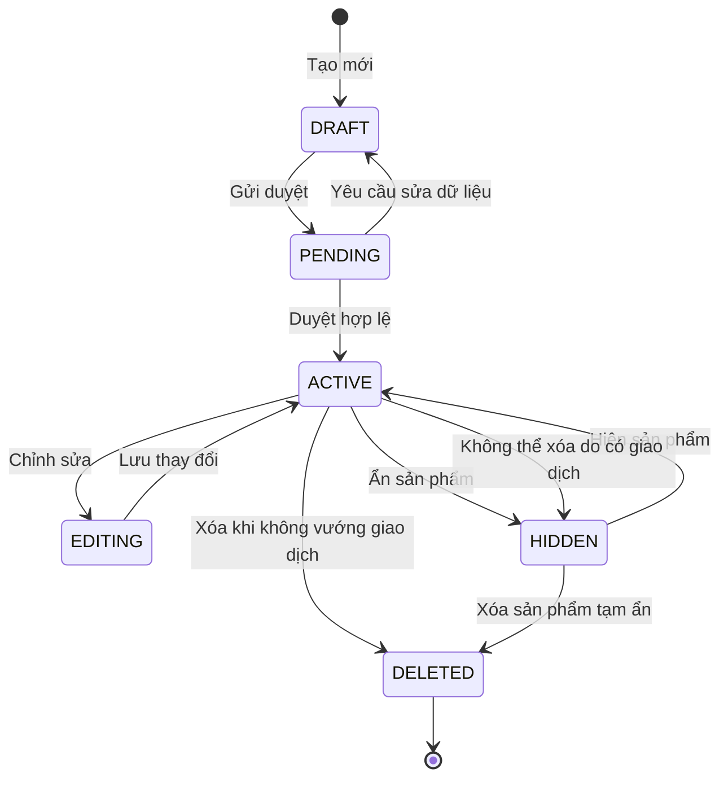
```mermaid
stateDiagram-v2
    [*] --> DRAFT: Tạo mới
    DRAFT --> PENDING: Gửi duyệt
    PENDING --> ACTIVE: Duyệt hợp lệ
    PENDING --> DRAFT: Yêu cầu sửa dữ liệu
    ACTIVE --> EDITING: Chỉnh sửa
    EDITING --> ACTIVE: Lưu thay đổi
    ACTIVE --> HIDDEN: Ẩn sản phẩm
    HIDDEN --> ACTIVE: Hiện sản phẩm
    ACTIVE --> DELETED: Xóa khi không vướng giao dịch
    HIDDEN --> DELETED: Xóa sản phẩm tạm ẩn
    ACTIVE --> HIDDEN: Không thể xóa do có giao dịch
    DELETED --> [*]
```

### 6.2. Trạng thái đơn hàng

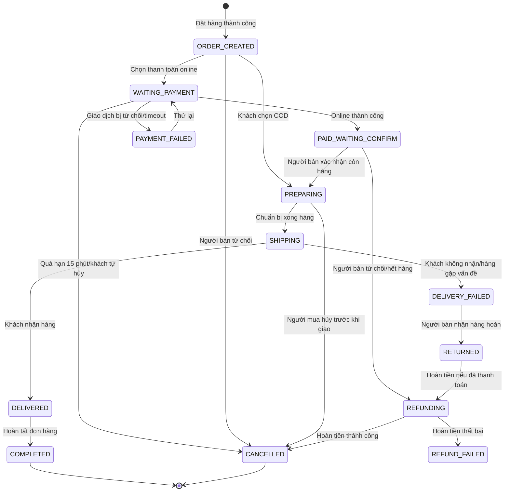
```mermaid
stateDiagram-v2
    [*] --> ORDER_CREATED: Đặt hàng thành công
    ORDER_CREATED --> WAITING_PAYMENT: Chọn thanh toán online
    ORDER_CREATED --> PREPARING: Khách chọn COD
    WAITING_PAYMENT --> PAID_WAITING_CONFIRM: Online thành công
    WAITING_PAYMENT --> PAYMENT_FAILED: Giao dịch bị từ chối/timeout
    WAITING_PAYMENT --> CANCELLED: Quá hạn 15 phút/khách tự hủy
    PAYMENT_FAILED --> WAITING_PAYMENT: Thử lại
    ORDER_CREATED --> CANCELLED: Người bán từ chối
    PAID_WAITING_CONFIRM --> PREPARING: Người bán xác nhận còn hàng
    PAID_WAITING_CONFIRM --> REFUNDING: Người bán từ chối/hết hàng
    PREPARING --> SHIPPING: Chuẩn bị xong hàng
    PREPARING --> CANCELLED: Người mua hủy trước khi giao
    SHIPPING --> DELIVERED: Khách nhận hàng
    SHIPPING --> DELIVERY_FAILED: Khách không nhận/hàng gặp vấn đề
    DELIVERY_FAILED --> RETURNED: Người bán nhận hàng hoàn
    RETURNED --> REFUNDING: Hoàn tiền nếu đã thanh toán
    DELIVERED --> COMPLETED: Hoàn tất đơn hàng
    REFUNDING --> CANCELLED: Hoàn tiền thành công
    REFUNDING --> REFUND_FAILED: Hoàn tiền thất bại
    COMPLETED --> [*]
    CANCELLED --> [*]
```

## 7. Sơ đồ cơ sở dữ liệu

Thiết kế CSDL quan hệ dưới đây ánh xạ trực tiếp từ các lớp miền và use case trong tài liệu. Các bảng `*_repositories` không tồn tại trong CSDL vì chúng thuộc tầng DAM; CSDL chỉ lưu các thực thể nghiệp vụ và lịch sử phát sinh.

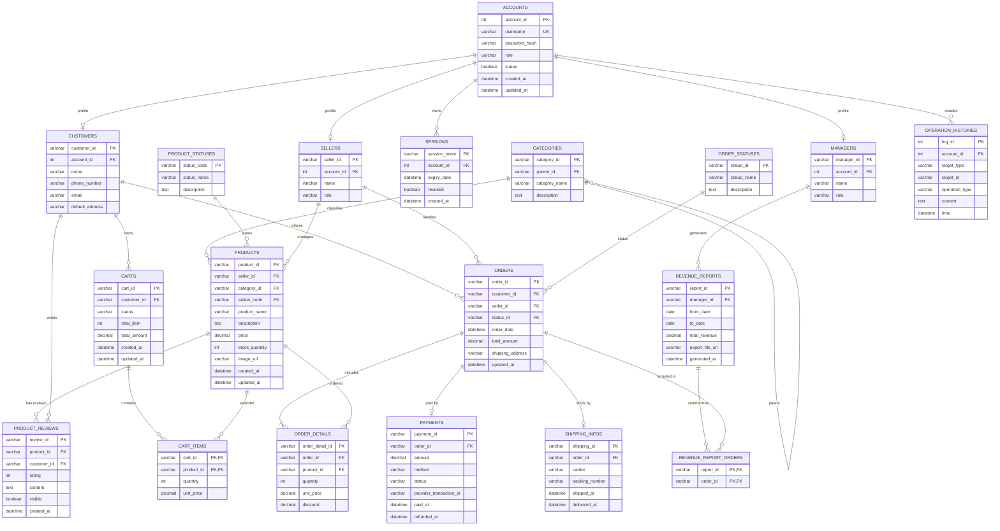
```mermaid
erDiagram
    ACCOUNTS {
        int account_id PK
        varchar username UK
        varchar password_hash
        varchar role
        boolean status
        datetime created_at
        datetime updated_at
    }

    CUSTOMERS {
        varchar customer_id PK
        int account_id FK
        varchar name
        varchar phone_number
        varchar email
        varchar default_address
    }

    SELLERS {
        varchar seller_id PK
        int account_id FK
        varchar name
        varchar role
    }

    MANAGERS {
        varchar manager_id PK
        int account_id FK
        varchar name
        varchar role
    }

    SESSIONS {
        varchar session_token PK
        int account_id FK
        datetime expiry_date
        boolean revoked
        datetime created_at
    }

    CATEGORIES {
        varchar category_id PK
        varchar parent_id FK
        varchar category_name
        text description
    }

    PRODUCT_STATUSES {
        varchar status_code PK
        varchar status_name
        text description
    }

    PRODUCTS {
        varchar product_id PK
        varchar seller_id FK
        varchar category_id FK
        varchar status_code FK
        varchar product_name
        text description
        decimal price
        int stock_quantity
        varchar image_url
        datetime created_at
        datetime updated_at
    }

    PRODUCT_REVIEWS {
        varchar review_id PK
        varchar product_id FK
        varchar customer_id FK
        int rating
        text content
        boolean visible
        datetime created_at
    }

    CARTS {
        varchar cart_id PK
        varchar customer_id FK
        varchar status
        int total_item
        decimal total_amount
        datetime created_at
        datetime updated_at
    }

    CART_ITEMS {
        varchar cart_id PK, FK
        varchar product_id PK, FK
        int quantity
        decimal unit_price
    }

    ORDER_STATUSES {
        varchar status_id PK
        varchar status_name
        text description
    }

    ORDERS {
        varchar order_id PK
        varchar customer_id FK
        varchar seller_id FK
        varchar status_id FK
        datetime order_date
        decimal total_amount
        varchar shipping_address
        datetime updated_at
    }

    ORDER_DETAILS {
        varchar order_detail_id PK
        varchar order_id FK
        varchar product_id FK
        int quantity
        decimal unit_price
        decimal discount
    }

    PAYMENTS {
        varchar payment_id PK
        varchar order_id FK
        decimal amount
        varchar method
        varchar status
        varchar provider_transaction_id
        datetime paid_at
        datetime refunded_at
    }

    SHIPPING_INFOS {
        varchar shipping_id PK
        varchar order_id FK
        varchar carrier
        varchar tracking_number
        datetime shipped_at
        datetime delivered_at
    }

    OPERATION_HISTORIES {
        int log_id PK
        int account_id FK
        varchar target_type
        varchar target_id
        varchar operation_type
        text content
        datetime time
    }

    REVENUE_REPORTS {
        varchar report_id PK
        varchar manager_id FK
        date from_date
        date to_date
        decimal total_revenue
        varchar export_file_url
        datetime generated_at
    }

    REVENUE_REPORT_ORDERS {
        varchar report_id PK, FK
        varchar order_id PK, FK
    }

    ACCOUNTS ||--o| CUSTOMERS : "profile"
    ACCOUNTS ||--o| SELLERS : "profile"
    ACCOUNTS ||--o| MANAGERS : "profile"
    ACCOUNTS ||--o{ SESSIONS : "owns"
    ACCOUNTS ||--o{ OPERATION_HISTORIES : "creates"

    CATEGORIES ||--o{ CATEGORIES : "parent"
    CATEGORIES ||--o{ PRODUCTS : "classifies"
    PRODUCT_STATUSES ||--o{ PRODUCTS : "status"
    SELLERS ||--o{ PRODUCTS : "manages"
    PRODUCTS ||--o{ PRODUCT_REVIEWS : "has reviews"
    CUSTOMERS ||--o{ PRODUCT_REVIEWS : "writes"

    CUSTOMERS ||--o{ CARTS : "owns"
    CARTS ||--o{ CART_ITEMS : "contains"
    PRODUCTS ||--o{ CART_ITEMS : "selected"

    CUSTOMERS ||--o{ ORDERS : "places"
    SELLERS ||--o{ ORDERS : "handles"
    ORDER_STATUSES ||--o{ ORDERS : "status"
    ORDERS ||--|{ ORDER_DETAILS : "includes"
    PRODUCTS ||--o{ ORDER_DETAILS : "ordered"
    ORDERS ||--o| PAYMENTS : "paid by"
    ORDERS ||--o| SHIPPING_INFOS : "ships by"

    MANAGERS ||--o{ REVENUE_REPORTS : "generates"
    REVENUE_REPORTS ||--o{ REVENUE_REPORT_ORDERS : "summarizes"
    ORDERS ||--o{ REVENUE_REPORT_ORDERS : "included in"
```

### 7.1. Ràng buộc dữ liệu chính

| Bảng | Ràng buộc |
|---|---|
| `ACCOUNTS` | `username` duy nhất; `status=false` thì không được tạo session mới |
| `PRODUCTS` | `price >= 0`, `stock_quantity >= 0`; chỉ sản phẩm `ACTIVE` được hiển thị cho khách hàng |
| `PRODUCT_REVIEWS` | `rating` trong khoảng 1-5; chỉ bản ghi `visible=true` được tải lên màn hình chi tiết |
| `CART_ITEMS` | Khóa chính ghép `cart_id + product_id`; `quantity > 0` |
| `ORDERS` | Trạng thái chỉ được chuyển theo sơ đồ trạng thái đơn hàng |
| `ORDER_DETAILS` | `unit_price` lưu giá tại thời điểm mua, không phụ thuộc giá sản phẩm sau này |
| `PAYMENTS` | Một đơn hàng có tối đa một payment hiện hành; callback cổng thanh toán phải idempotent |
| `OPERATION_HISTORIES` | Không cập nhật/xóa log nghiệp vụ, chỉ append |
| `REVENUE_REPORTS` | Tổng doanh thu lấy từ các đơn đã thanh toán/hoàn tất trong khoảng ngày lọc |

Các giá trị trạng thái đơn hàng cần có tối thiểu: `ORDER_CREATED`, `WAITING_PAYMENT`, `PAID_WAITING_CONFIRM`, `PAYMENT_FAILED`, `PREPARING`, `SHIPPING`, `DELIVERED`, `COMPLETED`, `DELIVERY_FAILED`, `RETURNED`, `REFUNDING`, `REFUND_FAILED`, `CANCELLED`.

Các giá trị trạng thái sản phẩm cần có tối thiểu: `DRAFT`, `PENDING`, `EDITING`, `ACTIVE`, `HIDDEN`, `DELETED`.

### 7.2. Chỉ mục khuyến nghị

| Chỉ mục | Mục đích |
|---|---|
| `idx_accounts_username` | Đăng nhập nhanh theo username |
| `idx_products_keyword` | Tìm kiếm theo tên/mô tả sản phẩm |
| `idx_products_category_status` | Lọc sản phẩm theo danh mục và trạng thái |
| `idx_product_reviews_product_visible` | Tải đánh giá hiển thị trên trang chi tiết sản phẩm |
| `idx_orders_customer_date` | Xem lịch sử đơn hàng của khách hàng |
| `idx_orders_seller_status` | Người bán xử lý đơn mới/chờ giao |
| `idx_orders_status_date` | Báo cáo và quản lý trạng thái đơn |
| `idx_payments_order_status` | Đối soát thanh toán/hoàn tiền |
| `idx_operation_histories_actor_time` | Truy vết thao tác quản trị |

### 7.3. Mô tả các bảng chính

| Bảng | Mô tả | Quy mô ước tính |
|---|---|---|
| `ACCOUNTS` | Thông tin định danh, mật khẩu băm, vai trò và trạng thái tài khoản | Khoảng 50.000 bản ghi |
| `CUSTOMERS` | Hồ sơ khách hàng, số điện thoại, email, địa chỉ mặc định | Khoảng 45.000 bản ghi |
| `SELLERS` | Hồ sơ người bán/nhân viên phụ trách sản phẩm và đơn hàng | Khoảng 500 bản ghi |
| `MANAGERS` | Hồ sơ quản lý có quyền xem báo cáo và quản lý người dùng | Khoảng 50 bản ghi |
| `SESSIONS` | Phiên đăng nhập, nên lưu ở Redis và đồng bộ tối thiểu về CSDL nếu cần audit | Khoảng 10.000 phiên hoạt động |
| `PRODUCTS` | Danh mục sản phẩm, giá, tồn kho, ảnh và trạng thái vòng đời | Khoảng 20.000 bản ghi |
| `PRODUCT_REVIEWS` | Đánh giá hiển thị trong trang chi tiết sản phẩm | Tăng theo giao dịch |
| `CARTS`, `CART_ITEMS` | Giỏ hàng tạm thời và từng dòng sản phẩm trong giỏ | Khoảng 5.000 giỏ hoạt động |
| `ORDERS` | Đơn hàng phát sinh từ khách hàng | Khoảng 500.000 bản ghi/năm |
| `ORDER_DETAILS` | Chi tiết từng dòng sản phẩm trong đơn | Khoảng 2.000.000 bản ghi/năm |
| `PAYMENTS` | Giao dịch thanh toán/hoàn tiền gắn với đơn hàng | Tối đa 1 payment hiện hành/đơn |
| `SHIPPING_INFOS` | Thông tin vận chuyển, mã vận đơn, trạng thái giao hàng | 0 hoặc 1 bản ghi/đơn |
| `OPERATION_HISTORIES` | Nhật ký thao tác quản trị và thay đổi dữ liệu | Khoảng 1.000.000 bản ghi/năm |
| `REVENUE_REPORTS` | Snapshot báo cáo doanh thu theo khoảng ngày | Tạo theo yêu cầu quản lý |

### 7.4. SQL index đề xuất

```sql
-- Đăng nhập nhanh theo username
CREATE UNIQUE INDEX idx_accounts_username ON ACCOUNTS (username);

-- Tìm kiếm sản phẩm theo tên và mô tả
ALTER TABLE PRODUCTS ADD FULLTEXT INDEX idx_products_search (product_name, description);

-- Lọc sản phẩm theo danh mục và trạng thái
CREATE INDEX idx_products_category_status ON PRODUCTS (category_id, status_code);

-- Tải đánh giá hiển thị của sản phẩm
CREATE INDEX idx_product_reviews_product_visible
    ON PRODUCT_REVIEWS (product_id, visible, created_at DESC);

-- Tra cứu đơn hàng theo khách hàng và ngày đặt
CREATE INDEX idx_orders_customer_date
    ON ORDERS (customer_id, order_date DESC);

-- Người bán xử lý đơn theo trạng thái
CREATE INDEX idx_orders_seller_status
    ON ORDERS (seller_id, status_id, order_date DESC);

-- Báo cáo doanh thu theo khoảng ngày và trạng thái
CREATE INDEX idx_orders_status_date
    ON ORDERS (status_id, order_date);

-- Đối soát thanh toán và callback cổng thanh toán
CREATE INDEX idx_payments_order_status
    ON PAYMENTS (order_id, status);

CREATE INDEX idx_payments_provider_ref
    ON PAYMENTS (provider_transaction_id);

-- Truy vết lịch sử thao tác quản trị
CREATE INDEX idx_operation_histories_actor_time
    ON OPERATION_HISTORIES (account_id, time DESC);
```

## 8. Thiết kế xử lý theo use case

### UC01 - Đăng nhập/Đăng ký tài khoản

1. UI gửi username/password tới `LoginController`.
2. `AuthService` lấy `Account` qua `AccountRepository.findByUsername`.
3. Kiểm tra `status`, mật khẩu băm và tạo `Session` nếu hợp lệ.
4. Nếu sai mật khẩu hoặc tài khoản bị khóa, UI hiển thị lỗi đúng như đặc tả tài liệu gốc.

### UC02 - Quản lý người dùng

1. `UserManagementUI` gọi `UserController.listUsers`.
2. `UserService` lấy danh sách qua `AccountRepository`, ghép profile `Customer/Seller/Manager`.
3. Khi thêm/sửa/xóa/khóa tài khoản, service kiểm tra trùng username và quyền thao tác.
4. `AuditService` ghi `OperationHistory` cho các thao tác quản trị.

### UC03 - Xem/Tìm kiếm sản phẩm

1. Khách hàng nhập từ khóa, danh mục hoặc tiêu chí sắp xếp.
2. `ProductService.search` chỉ trả sản phẩm `ACTIVE`, còn tồn hoặc phù hợp tiêu chí.
3. Kết quả trả về `SearchResult` gồm `totalCount`, `keyword`, `currentPage` và danh sách `Product`.
4. Khi xem chi tiết, hệ thống tải hình ảnh, mô tả và danh sách đánh giá từ `ReviewRepository`.
5. Khách hàng có thể thêm sản phẩm vào `Cart`.

### UC04 - Đặt hàng & Thanh toán

1. `OrderService` kiểm tra tồn kho trong transaction và tạo `Order/OrderDetail` khi còn hàng.
2. Hệ thống hiển thị màn hình chọn phương thức thanh toán.
3. Với COD, đơn chuyển sang trạng thái chờ người bán xác nhận và hệ thống giữ/trừ tồn kho.
4. Với online, `PaymentService` tạo giao dịch, nhận URL cổng thanh toán và xử lý webhook/return URL.
5. Callback thanh toán cập nhật `Payment.status` và `OrderStatus`; nếu thất bại hoặc timeout, khách hàng được chọn lại phương thức hoặc thử lại.

### UC05 - Quản lý sản phẩm

1. Người bán/Quản lý mở danh sách sản phẩm và chọn thêm/sửa/xóa/ẩn hiện.
2. `ProductService.validateProduct` kiểm tra rỗng, định dạng số, trùng mã/tên, ảnh tải lên.
3. Sản phẩm đang nằm trong đơn hàng không được xóa vật lý; hệ thống gợi ý chuyển sang `HIDDEN`.
4. Mọi thao tác thay đổi dữ liệu được ghi `OperationHistory`.

### UC06 - Quản lý đơn hàng

1. Người mua xem lịch sử/trạng thái đơn hàng của mình.
2. Người bán xác nhận đơn, chốt thanh toán và cập nhật vận chuyển.
3. Hủy đơn chỉ hợp lệ trước khi chuyển sang `SHIPPING`; nếu đã giao cho đơn vị vận chuyển thì hệ thống không cho hủy thủ công.
4. Nếu giao hàng thất bại, hệ thống cập nhật trạng thái `DELIVERY_FAILED`, ghi nhận hàng hoàn về và hoàn tiền nếu đơn đã thanh toán.
5. Với đơn đã thanh toán, hủy đơn hợp lệ hoặc giao thất bại đều kích hoạt `PaymentService.refund`.

### UC07 - Báo cáo doanh thu

1. Quản lý chọn khoảng ngày và yêu cầu báo cáo.
2. `ReportService` lấy các đơn đã thanh toán/hoàn tất từ `OrderRepository`.
3. Hệ thống tính tổng doanh thu, số đơn, dữ liệu biểu đồ và lưu `RevenueReport`.
4. Quản lý có thể xuất file, đường dẫn file lưu ở `export_file_url`.

## 9. Ghi chú triển khai và kết luận

- Mật khẩu chỉ lưu ở dạng `passwordHash`; không lưu mật khẩu thô.
- Các thao tác đặt hàng, trừ tồn kho, tạo payment và hủy/hoàn tiền cần dùng transaction hoặc cơ chế idempotency.
- Ảnh sản phẩm nên lưu ở object storage, CSDL chỉ lưu `image_url`.
- `OperationHistory` là dữ liệu kiểm toán, nên chỉ cho phép append.
- Báo cáo doanh thu có thể tính trực tiếp từ `ORDERS/PAYMENTS` hoặc lưu snapshot vào `REVENUE_REPORTS` để tái xuất đúng số liệu tại thời điểm tạo.
- Các trạng thái nên được chuẩn hóa ở bảng danh mục để UI và service dùng cùng một bộ giá trị.

### 9.1. Tổng hợp nội dung đã hoàn thành

| Nội dung | Chi tiết |
|---|---|
| Sơ đồ triển khai | Có node client, reverse proxy, application server, CSDL, cache, object storage và hệ thống ngoài |
| Sơ đồ lớp Domain | Bao phủ tài khoản, sản phẩm, giỏ hàng, đơn hàng, thanh toán, vận chuyển, báo cáo và lịch sử thao tác |
| Sơ đồ lớp DAL/DAM | Có repository interface, repository implementation, UnitOfWork và TransactionManager |
| Sơ đồ lớp Service | Có Auth, UserManagement, Product, Cart, Order, Payment, Shipping, Report |
| Sơ đồ lớp Controller | Có các REST controller chính tương ứng với UC01-UC07 |
| Sơ đồ CSDL | Có ERD, PK/FK, bảng review, báo cáo, ràng buộc và index khuyến nghị |
| Nguyên mẫu giao diện | Có màn hình đăng nhập, tìm kiếm sản phẩm, giỏ hàng/thanh toán, quản lý sản phẩm, đơn hàng, báo cáo |
| Luồng tương tác | Có sequence/flow cho đăng nhập, tìm kiếm, đặt hàng/thanh toán, quản lý sản phẩm, quản lý đơn hàng, báo cáo |

### 9.2. Hướng phát triển tiếp theo

- Triển khai backend bằng Spring Boot 3/JPA hoặc Node.js 20 với ORM, MySQL 8 và Redis 7.
- Dùng JWT Bearer Token, HTTPS/TLS, rate limiting và phân quyền theo vai trò `Customer`, `Seller`, `Manager`.
- Kết nối VNPay/MoMo hoặc API ngân hàng theo chuẩn callback idempotent để tránh cập nhật thanh toán lặp.
- Bổ sung kiểm thử unit, integration và kịch bản tải cao cho tìm kiếm sản phẩm, đặt hàng, thanh toán.
- Xây dựng pipeline CI/CD bằng GitHub Actions, Docker và môi trường staging.
- Theo dõi vận hành bằng log tập trung, metric, dashboard Prometheus/Grafana và cảnh báo lỗi thanh toán/giao hàng.
